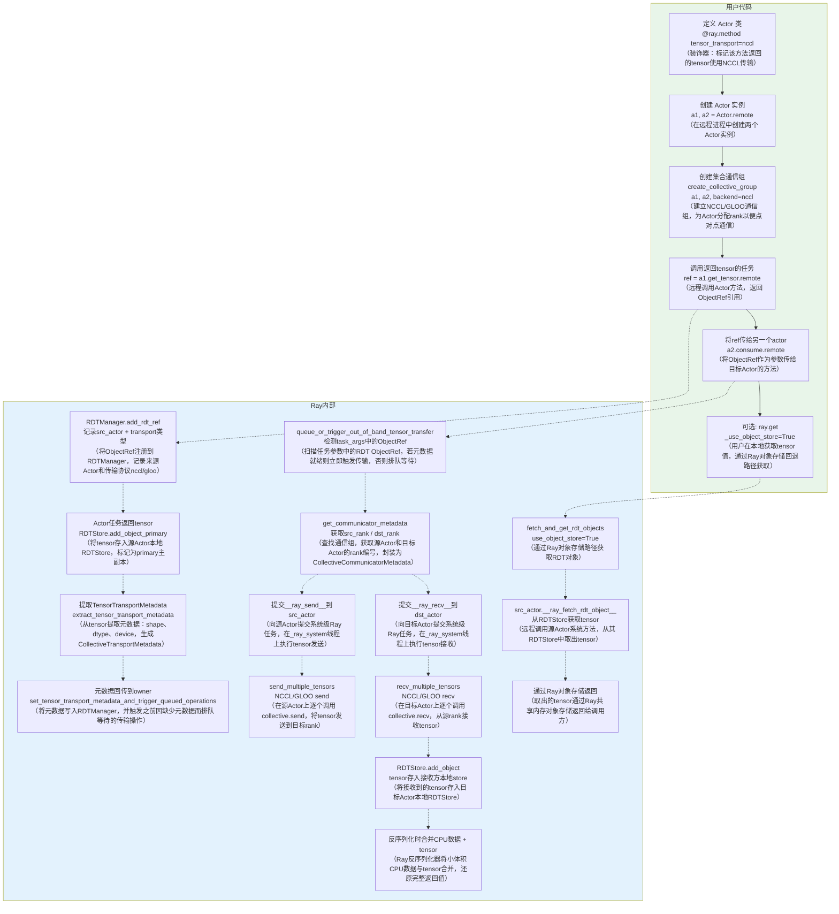
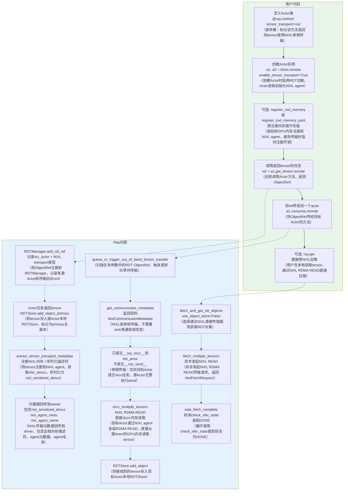
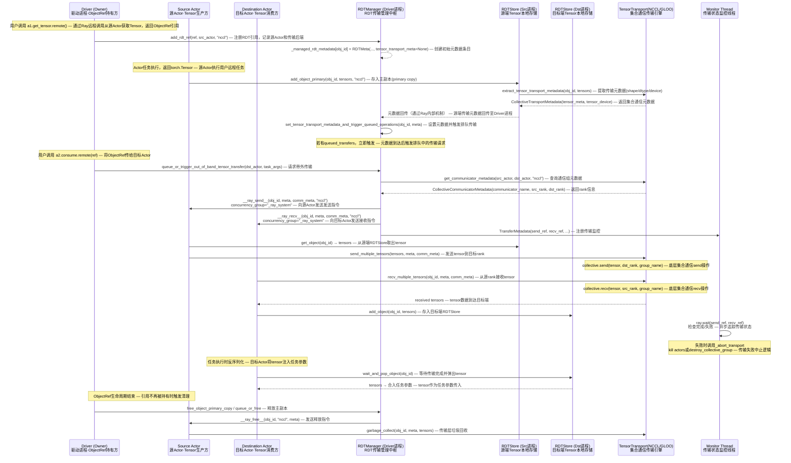
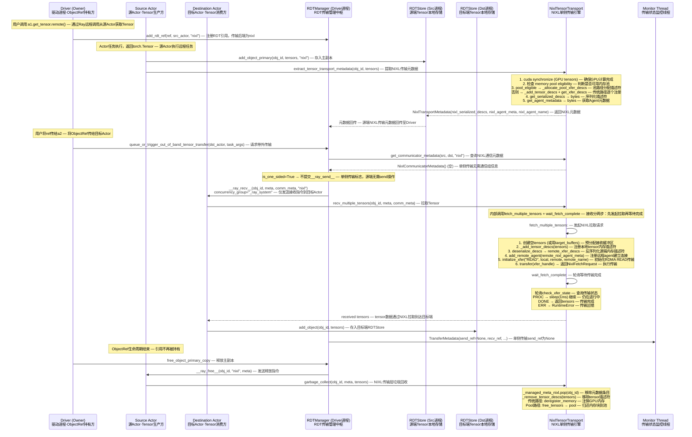
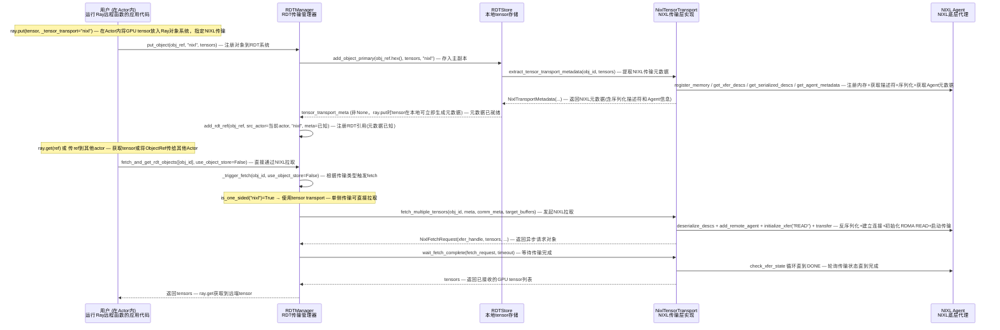
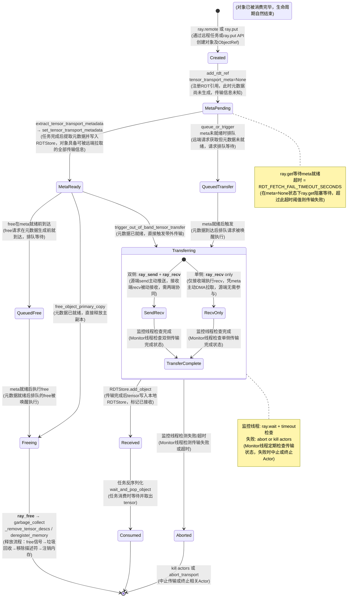
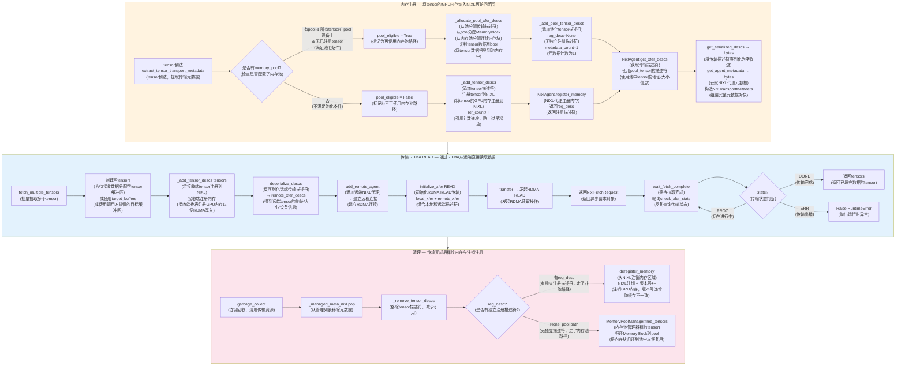

# Ray Direct Transport (RDT) 代码级深度解析

> 源码位置: `python/ray/experimental/rdt/`
> 文档位置: `doc/source/ray-core/direct-transport/`

---

## 1. 类图 — 核心类继承关系

```mermaid
classDiagram
    direction TB

    class TensorTransportManager["TensorTransportManager — 张量传输管理器（抽象基类）"] {
        <<abstract>>
        +tensor_transport_backend() str
        +is_one_sided() bool$
        +can_abort_transport() bool$
        +actor_has_tensor_transport(actor) bool
        +extract_tensor_transport_metadata(obj_id, rdt_object) TensorTransportMetadata
        +get_communicator_metadata(src_actor, dst_actor, backend) CommunicatorMetadata
        +recv_multiple_tensors(obj_id, meta, comm_meta, target_buffers) List
        +fetch_multiple_tensors(obj_id, meta, comm_meta, target_buffers) FetchRequest
        +wait_fetch_complete(fetch_request, timeout) List
        +send_multiple_tensors(tensors, meta, comm_meta)
        +garbage_collect(obj_id, meta, tensors)
        +abort_transport(obj_id, comm_meta)
    }

    class CommunicatorMetadata["CommunicatorMetadata — 通信器元数据基类"] {
        <<dataclass>>
    }

    class TensorTransportMetadata["TensorTransportMetadata — 张量传输元数据基类"] {
        <<dataclass>>
        +tensor_meta List~Tuple~
        +tensor_device Optional~str~
    }

    class FetchRequest["FetchRequest — 异步拉取请求基类"] {
        <<dataclass>>
        +obj_id str
        +tensors List
    }

    class CollectiveTensorTransport["CollectiveTensorTransport — 集合通信传输（双侧NCCL/GLOO）"] {
        +is_one_sided() bool$ False
        +can_abort_transport() bool$ False
        +extract_tensor_transport_metadata(obj_id, rdt_object) CollectiveTransportMetadata
        +get_communicator_metadata(src, dst, backend) CollectiveCommunicatorMetadata
        +recv_multiple_tensors(...) List
        +send_multiple_tensors(...)
    }

    class NCCLTensorTransport["NCCLTensorTransport — NCCL GPU集合通信传输后端"] {
        +tensor_transport_backend() "NCCL"
    }

    class GLOOTensorTransport["GLOOTensorTransport — GLOO CPU/GPU集合通信传输后端"] {
        +tensor_transport_backend() "GLOO"
    }

    class NixlTensorTransport["NixlTensorTransport — NIXL单侧RDMA传输后端"] {
        +is_one_sided() bool$ True
        +can_abort_transport() bool$ True
        -_nixl_agent Any
        -_tensor_desc_cache Dict
        -_managed_meta_nixl Dict
        -_remote_agents OrderedDict
        -_memory_pool MemoryPoolManager
        +get_nixl_agent() nixl_agent
        +register_nixl_memory(tensor)
        +register_nixl_memory_pool(size, device)
        +fetch_multiple_tensors(...) NixlFetchRequest
        +wait_fetch_complete(fetch_request, timeout) List
        +recv_multiple_tensors(...) List
    }

    class CudaIpcTransport["CudaIpcTransport — CUDA IPC同节点GPU直传后端"] {
        +is_one_sided() bool$ True
        +can_abort_transport() bool$ False
        +recv_multiple_tensors(...) List
    }

    class CollectiveCommunicatorMetadata["CollectiveCommunicatorMetadata — 集合通信器元数据（含rank）"] {
        +communicator_name str
        +src_rank Optional~int~
        +dst_rank Optional~int~
    }

    class CollectiveTransportMetadata["CollectiveTransportMetadata — 集合通信传输元数据（含tensor描述）"] {
    }

    class NixlCommunicatorMetadata["NixlCommunicatorMetadata — NIXL通信器元数据（空，单侧无需通信组）"] {
    }

    class NixlTransportMetadata["NixlTransportMetadata — NIXL传输元数据（含序列化描述符+Agent信息）"] {
        +nixl_serialized_descs Optional~bytes~
        +nixl_agent_meta Optional~bytes~
        +nixl_agent_name Optional~str~
        +nixl_agent_meta_version Optional~int~
    }

    class CudaIpcCommunicatorMetadata["CudaIpcCommunicatorMetadata — CUDA IPC通信器元数据（空）"] {
    }

    class CudaIpcTransportMetadata["CudaIpcTransportMetadata — CUDA IPC传输元数据（含IPC handle）"] {
        +cuda_ipc_handles Optional~List~
        +cuda_ipc_event_ipc_handle Optional~bytes~
        +ray_gpu_idx Optional~int~
        +ray_node_id Optional~str~
    }

    class NixlFetchRequest["NixlFetchRequest — NIXL异步拉取请求（含传输句柄）"] {
        +xfer_handle Any
        +nixl_agent Any
        +remote_name Optional~str~
        +remove_tensor_descs bool
        +transport Any
        +__del__()
    }

    class RDTManager["RDTManager — RDT传输中央管理器（Driver进程）"] {
        -_lock threading.Lock
        -_managed_rdt_metadata Dict~str, RDTMeta~
        -_queued_transfers Dict~str, List~
        -_queued_frees Set~str~
        -_rdt_store Optional~RDTStore~
        -_unmonitored_transfers Queue
        -_monitor_failures_thread Thread
        -actor_id_to_transports_registered Dict
        +add_rdt_ref(obj_ref, src_actor, tensor_transport, meta)
        +set_rdt_metadata(obj_id, rdt_meta)
        +get_rdt_metadata(obj_id) Optional~RDTMeta~
        +trigger_out_of_band_tensor_transfer(dst_actor, obj_id)
        +queue_or_trigger_out_of_band_tensor_transfer(dst_actor, task_args)
        +fetch_and_get_rdt_objects(object_ids, timeout, use_object_store) Dict
        +_trigger_fetch(obj_id, use_object_store) FetchRequest
        +_wait_fetch(obj_id, fetch_request, timeout) List
        +get_rdt_objects(object_ids) Dict
        +put_object(obj_ref, tensor_transport, tensors)
        +free_object_primary_copy(object_id)
        +queue_or_free_object_primary_copy(object_id)
        +set_target_buffers_for_ref(ref, target_buffers)
        +start_monitor_thread_if_needed()
        +shutdown()
    }

    class RDTStore["RDTStore — Actor本地张量存储仓库"] {
        -_rdt_store Dict~str, deque~_RDTObject~~
        -_tensor_to_object_ids Dict~int, Set~str~~
        -_lock threading.RLock
        -_object_present_cv threading.Condition
        -_object_freed_cv threading.Condition
        +has_object(obj_id) bool
        +get_object(obj_id) Optional~List~
        +add_object(obj_id, rdt_object, is_primary)
        +add_object_primary(obj_id, tensors, tensor_transport) TensorTransportMetadata
        +wait_and_get_object(obj_id, timeout) List
        +wait_and_pop_object(obj_id, timeout) List
        +pop_object(obj_id) List
        +wait_tensor_freed(tensor, timeout)
    }

    class RDTMeta["RDTMeta — 单个RDT对象的元数据记录"] {
        <<NamedTuple>>
        +src_actor ActorHandle
        +tensor_transport_backend str
        +tensor_transport_meta Optional~TensorTransportMetadata~
        +sent_dest_actors Set~str~
        +sent_to_src_actor_and_others_warned bool
        +target_buffers Optional~List~
    }

    class TransferMetadata["TransferMetadata — 单次传输的元数据记录"] {
        <<NamedTuple>>
        +src_actor ActorHandle
        +dst_actor ActorHandle
        +send_ref Optional~ObjectRef~
        +recv_ref ObjectRef
        +communicator_meta CommunicatorMetadata
        +backend str
        +obj_id str
        +timeout float
    }

    class MemoryPoolManager["MemoryPoolManager — NIXL GPU内存池管理器"] {
        -_pool_tensor torch.Tensor
        -_free_blocks List~MemoryBlock~
        -_allocated_blocks Dict~int, MemoryBlock~
        +allocate_for_tensors(tensors) List~Tensor~
        +free_tensors(tensors)
        +has_block(tensor) bool
    }

    TensorTransportManager <|-- CollectiveTensorTransport
    TensorTransportManager <|-- NixlTensorTransport
    TensorTransportManager <|-- CudaIpcTransport
    CollectiveTensorTransport <|-- NCCLTensorTransport
    CollectiveTensorTransport <|-- GLOOTensorTransport

    CommunicatorMetadata <|-- CollectiveCommunicatorMetadata
    CommunicatorMetadata <|-- NixlCommunicatorMetadata
    CommunicatorMetadata <|-- CudaIpcCommunicatorMetadata
    TensorTransportMetadata <|-- CollectiveTransportMetadata
    TensorTransportMetadata <|-- NixlTransportMetadata
    TensorTransportMetadata <|-- CudaIpcTransportMetadata
    FetchRequest <|-- NixlFetchRequest

    RDTManager --> RDTStore : owns lazily（惰性持有，首次访问时创建）
    RDTManager --> RDTMeta : manages metadata（管理元数据）
    RDTManager --> TransferMetadata : monitors transfers（监控传输）
    RDTStore --> _RDTObject : stores objects（存储对象）
    NixlTensorTransport --> MemoryPoolManager : owns lazily（惰性持有）
    NixlTensorTransport --> NixlTransportMetadata : caches _managed_meta_nixl（缓存元数据）
    NixlTensorTransport --> TensorDesc : caches _tensor_desc_cache（缓存描述符）
```



### 1.1 术语注释表

#### 核心类

| 类名 | 中文说明 |
|---|---|
| **TensorTransportManager** | 张量传输管理器，所有传输后端的抽象基类。定义统一接口：提取传输元数据、获取通信器元数据、发送/接收/拉取多个张量、等待拉取完成、垃圾回收、中止传输。各传输后端（NCCL、GLOO、NIXL、CUDA IPC）继承此类实现具体逻辑 |
| **CollectiveTensorTransport** | 集合通信传输，继承 TensorTransportManager，实现双侧传输（NCCL/GLOO）。需要预建通信组（`create_collective_group`），通过 rank 编号配对执行 send/recv。`is_one_sided=False`，`can_abort_transport=False` |
| **NCCLTensorTransport** | NCCL传输后端，基于 NVIDIA Collective Communications Library 的 GPU 集合通信。支持 CUDA tensor 的点对点 send/recv，需预建 NCCL 通信组 |
| **GLOOTensorTransport** | GLOO传输后端，基于 Facebook GLOO 库的集合通信。支持 CPU tensor 传输，同样需预建通信组 |
| **NixlTensorTransport** | NIXL传输后端，基于 NVIDIA Infinity Exchange Library 的单侧 RDMA 传输。`is_one_sided=True`，接收方可直接从源端内存 RDMA READ，无需源端配合。支持 CPU/CUDA，维护内部缓存（描述符、元数据、远程Agent映射）和可选内存池 |
| **CudaIpcTransport** | CUDA IPC传输后端，通过 CUDA Inter-Process Communication handle 在同节点同 GPU 的进程间共享 GPU 内存。`is_one_sided=True` 但 `can_abort_transport=False`（IPC handle一旦打开无法撤回） |
| **RDTManager** | RDT传输中央管理器，每个 Driver/Worker 进程持有一个实例。管理所有 RDT 对象的元数据（`_managed_rdt_metadata`）、排队传输请求、排队释放请求、异步拉取、监控线程、Actor传输注册等。是 RDT 系统的调度中枢 |
| **RDTStore** | Actor本地张量存储仓库，线程安全。存储键为 object_id，值为 deque（支持同一对象多副本）。管理 tensor 与 object_id 的双向映射，提供条件变量等待对象到达/释放 |
| **RDTMeta** | 单个 RDT 对象的元数据记录（NamedTuple）。包含：src_actor（源端Actor句柄）、tensor_transport_backend（传输后端名）、tensor_transport_meta（传输元数据，初始为None）、sent_dest_actors（已发送到的目标Actor集合）、target_buffers（目标缓冲区） |
| **TransferMetadata** | 单次传输的元数据记录（NamedTuple）。包含：src_actor/dst_actor、send_ref/recv_ref（发送/接收端 ObjectRef）、communicator_meta（通信器元数据）、backend（传输后端名）、obj_id、timeout。注册到监控线程追踪传输状态 |
| **MemoryPoolManager** | NIXL GPU内存池管理器，管理预分配的连续 GPU 内存（pool_tensor），将内存划分为 MemoryBlock 块供分配/回收，减少频繁 GPU 内存分配开销 |

#### 元数据类

| 类名 | 中文说明 |
|---|---|
| **CommunicatorMetadata** | 通信器元数据基类（dataclass），各传输后端的通信器元数据子类继承此类 |
| **CollectiveCommunicatorMetadata** | 集合通信器元数据，包含 communicator_name（通信组名称）、src_rank（源端rank编号）、dst_rank（目标端rank编号） |
| **NixlCommunicatorMetadata** | NIXL通信器元数据，空对象（单侧传输无需通信组信息） |
| **CudaIpcCommunicatorMetadata** | CUDA IPC通信器元数据，空对象 |
| **TensorTransportMetadata** | 张量传输元数据基类（dataclass），包含 tensor_meta（每个tensor的shape+dtype列表）和 tensor_device（设备类型） |
| **CollectiveTransportMetadata** | 集合通信传输元数据，继承 TensorTransportMetadata，无额外字段 |
| **NixlTransportMetadata** | NIXL传输元数据，额外包含：nixl_serialized_descs（序列化的远程内存描述符）、nixl_agent_meta（源端Agent元数据）、nixl_agent_name（源端Agent名称）、nixl_agent_meta_version（元数据版本号） |
| **CudaIpcTransportMetadata** | CUDA IPC传输元数据，额外包含：cuda_ipc_handles（CUDA IPC内存句柄列表）、cuda_ipc_event_ipc_handle（CUDA IPC事件句柄）、ray_gpu_idx（GPU索引）、ray_node_id（节点ID） |
| **FetchRequest** | 异步拉取请求基类（dataclass），包含 obj_id 和 tensors |
| **NixlFetchRequest** | NIXL异步拉取请求，额外包含：xfer_handle（传输句柄）、nixl_agent（本地Agent引用）、remote_name（远程Agent名称）、remove_tensor_descs（是否清理描述符）、transport（NixlTransport引用）、`__del__`（析构时清理资源） |

#### TensorTransportManager 方法详解

| 方法 | 中文说明 |
|---|---|
| **tensor_transport_backend()** | 返回传输后端名称字符串，如 "NCCL"、"GLOO"、"NIXL"，用于标识当前传输类型 |
| **is_one_sided()** | 类方法（$标记），返回是否为单侧传输。NIXL/CUDA IPC=True，NCCL/GLOO=False。决定是否需要提交 `__ray_send__` |
| **can_abort_transport()** | 类方法（$标记），返回是否可中止传输。NIXL=True（RDMA可取消），其他=False |
| **actor_has_tensor_transport(actor)** | 检查指定 Actor 是否已注册了 tensor transport 能力 |
| **extract_tensor_transport_metadata(obj_id, rdt_object)** | 从 tensor 中提取传输元数据。CollectiveTransport 提取 shape/dtype/device；NIXL 提取序列化描述符+Agent信息；CUDA IPC 提取 IPC handle |
| **get_communicator_metadata(src_actor, dst_actor, backend)** | 获取通信器元数据。CollectiveTransport 返回 rank 信息；NIXL 返回空；CUDA IPC 返回空 |
| **recv_multiple_tensors(...)** | 接收多个 tensor。CollectiveTransport 执行 collective.recv；NIXL 执行 fetch+wait 组合；CUDA IPC 通过 IPC handle 映射内存 |
| **fetch_multiple_tensors(...)** | 异步拉取多个 tensor，返回 FetchRequest。仅 NIXL 实现：发起 RDMA READ |
| **wait_fetch_complete(fetch_request, timeout)** | 等待异步拉取完成。仅 NIXL 实现：轮询 check_xfer_state 直到 DONE |
| **send_multiple_tensors(tensors, meta, comm_meta)** | 发送多个 tensor。仅 CollectiveTransport 实现：执行 collective.send |
| **garbage_collect(obj_id, meta, tensors)** | 传输层垃圾回收。CollectiveTransport 释放通信缓冲区；NIXL 注销内存/归还池块；CUDA IPC 关闭 IPC handle |
| **abort_transport(obj_id, comm_meta)** | 中止传输。仅 NIXL 实现：取消 RDMA 传输 |

#### RDTManager 方法详解

| 方法 | 中文说明 |
|---|---|
| **add_rdt_ref(obj_ref, src_actor, tensor_transport, meta)** | 注册 RDT 引用。将 ObjectRef 注册到管理器，记录源Actor和传输后端，创建初始 RDTMeta（meta可能为None） |
| **set_rdt_metadata(obj_id, rdt_meta)** | 设置指定对象的 RDT 元数据 |
| **get_rdt_metadata(obj_id)** | 获取指定对象的 RDT 元数据，不存在则返回 None |
| **trigger_out_of_band_tensor_transfer(dst_actor, obj_id)** | 触发带外传输。获取通信器元数据，提交 `__ray_send__`/`__ray_recv__` 到 Actor，注册到监控线程 |
| **queue_or_trigger_out_of_band_tensor_transfer(dst_actor, task_args)** | 扫描任务参数中的 RDT ObjectRef，元数据就绪则立即触发传输，否则排队等待 |
| **fetch_and_get_rdt_objects(object_ids, timeout, use_object_store)** | ray.get 路径。NIXL 直接 RDMA 拉取；NCCL/GLOO 通过对象存储中转获取 |
| **_trigger_fetch(obj_id, use_object_store)** | 内部方法，根据传输类型触发具体的 fetch 操作 |
| **_wait_fetch(obj_id, fetch_request, timeout)** | 内部方法，等待 fetch 完成 |
| **get_rdt_objects(object_ids)** | 从本地 RDTStore 直接获取已有对象，不触发传输 |
| **put_object(obj_ref, tensor_transport, tensors)** | ray.put 路径。将 tensor 存入本地 RDTStore 作为主副本，提取元数据并注册 RDT 引用 |
| **free_object_primary_copy(object_id)** | 释放源端 tensor 主副本，发送 `__ray_free__` 到源Actor |
| **queue_or_free_object_primary_copy(object_id)** | 源Actor存活则直接释放，否则排队等待 |
| **set_target_buffers_for_ref(ref, target_buffers)** | 为指定 ObjectRef 设置目标缓冲区，后续传输直接写入这些预分配 buffer |
| **start_monitor_thread_if_needed()** | 启动监控线程（若尚未启动），追踪传输完成/失败状态 |
| **shutdown()** | 关闭 RDTManager，停止监控线程，清理资源 |

#### RDTManager 内部属性详解

| 属性 | 中文说明 |
|---|---|
| **_lock** | 线程锁，保护 RDTManager 内部状态的并发访问 |
| **_managed_rdt_metadata** | 字典，键=obj_id，值=RDTMeta。存储所有被 RDT 管理的对象的元数据 |
| **_queued_transfers** | 字典，键=obj_id，值=排队传输请求列表。元数据未就绪时排队等待 |
| **_queued_frees** | 集合，存储排队等待的释放请求 obj_id |
| **_rdt_store** | 惰性创建的 RDTStore 实例，Driver 进程中的本地 tensor 存储 |
| **_unmonitored_transfers** | 队列，存储不需要监控的传输请求 |
| **_monitor_failures_thread** | 监控线程，异步追踪传输完成/失败状态 |
| **actor_id_to_transports_registered** | 字典，记录每个 Actor 已注册的传输后端类型 |

#### RDTStore 方法详解

| 方法 | 中文说明 |
|---|---|
| **has_object(obj_id)** | 检查本地是否存储了指定对象 |
| **get_object(obj_id)** | 从本地存储获取指定对象的 tensor 列表（不弹出） |
| **add_object(obj_id, rdt_object, is_primary)** | 存入对象，is_primary=False 为接收副本 |
| **add_object_primary(obj_id, tensors, tensor_transport)** | 存入主副本，同时调用 extract_tensor_transport_metadata 提取元数据并返回 |
| **wait_and_get_object(obj_id, timeout)** | 阻塞等待对象到达，然后获取（不弹出） |
| **wait_and_pop_object(obj_id, timeout)** | 阻塞等待对象到达，然后弹出（取出并移除） |
| **pop_object(obj_id)** | 弹出指定对象（取出并移除，不等待） |
| **wait_tensor_freed(tensor, timeout)** | 阻塞等待指定 tensor 被释放（引用计数归零） |

#### NixlTensorTransport 内部属性详解

| 属性 | 中文说明 |
|---|---|
| **_nixl_agent** | NIXL Agent 实例，负责所有 NIXL 底层操作（内存注册、描述符管理、传输发起） |
| **_tensor_desc_cache** | 缓存字典，存储已注册的 tensor 描述符，避免重复注册 |
| **_managed_meta_nixl** | 字典，键=obj_id，值=NixlTransportMetadata。缓存当前被 NIXL 管理的传输元数据 |
| **_remote_agents** | OrderedDict，缓存已注册的远程 NIXL Agent 映射（名称→Agent信息） |
| **_memory_pool** | MemoryPoolManager 实例，管理预分配的 GPU 内存池 |

#### MemoryPoolManager 方法详解

| 方法 | 中文说明 |
|---|---|
| **allocate_for_tensors(tensors)** | 为 tensor 列表从内存池分配 MemoryBlock，将 tensor 数据复制到池内存 |
| **free_tensors(tensors)** | 将 tensor 对应的 MemoryBlock 归还到池中 |
| **has_block(tensor)** | 检查指定 tensor 是否在内存池的已分配块中 |

---

## 2. 传输分类对比

> 表头说明：
> - **传输后端**：底层通信库名称，决定 tensor 的实际传输方式
> - **类型**：传输模式——双侧（双方均需主动操作）或单侧（仅接收方主动拉取）
> - **is_one_sided**：是否为单侧传输，True=接收方可直接 RDMA READ，无需源端配合
> - **can_abort_transport**：传输过程中是否可中止，True=可取消进行中的 RDMA 传输
> - **需要集体组**：是否需预建集合通信组（`create_collective_group`）分配 rank
> - **支持设备**：支持的计算设备类型
> - **ray.get 直接使用**：是否可直接通过 tensor transport 获取 tensor，无需经 Ray 对象存储中转

| 传输后端（底层通信库） | 类型（传输模式） | `is_one_sided`（是否单侧） | `can_abort_transport`（是否可中止） | 需要集体组（是否需预建通信组） | 支持设备（可用设备类型） | `ray.get` 直接使用（是否可直接拉取） |
|---------|------|----------------|----------------------|-----------|---------|------------------|
| **GLOO**（Facebook集合通信库，CPU/GPU通用） | 双侧（双方均需send+recv） | False（非单侧） | False（不可中止） | 是（需`create_collective_group`分配rank） | CPU（仅支持CPU tensor） | 否（需 `_use_object_store=True` 经Ray对象存储中转获取） |
| **NCCL**（NVIDIA GPU集合通信库） | 双侧（双方均需send+recv） | False（非单侧） | False（不可中止） | 是（需`create_collective_group`分配rank） | CUDA（仅支持GPU tensor） | 否（需 `_use_object_store=True` 经Ray对象存储中转获取） |
| **NIXL**（NVIDIA IO加速库，支持RDMA单侧传输） | 单侧（仅接收方RDMA READ拉取） | True（单侧传输） | True（可中止RDMA传输） | 否（无需预建通信组） | CPU/CUDA（同时支持CPU和GPU） | 是（可直接通过RDMA拉取tensor） |
| **CUDA_IPC**（CUDA进程间通信，同节点同GPU共享内存） | 单侧（接收方直接映射内存） | True（单侧传输） | False（IPC handle不可撤回） | 否（无需通信组） | CUDA（同节点同GPU，仅限单GPU跨进程） | 是（可直接映射共享内存获取tensor） |

---

## 3. 用户使用流程图 — 双侧传输 (GLOO/NCCL)



### 3.1 术语注释表 — 双侧传输

| 术语 | 中文说明 |
|---|---|
| **@ray.method(tensor_transport=nccl)** | Ray方法装饰器，标记该Actor方法的返回值中的tensor不走Ray共享内存对象存储，而是通过指定的tensor传输协议（如nccl、gloo）在Actor间直接传输 |
| **Actor.remote** | Ray创建远程Actor的API，在远程进程中启动Actor实例，返回ActorHandle |
| **create_collective_group** | `ray.experimental.collective.create_collective_group`，将一组Actor注册到集合通信组中，为每个Actor分配rank（编号），并初始化底层通信后端的communicator |
| **NCCL** | NVIDIA Collective Communications Library，GPU高性能集合通信库，支持GPU间点对点send/recv |
| **GLOO** | Facebook开发的集合通信库，支持CPU和GPU通信，常用于无GPU或调试场景 |
| **ObjectRef** | Ray的远程对象引用，类似future/promise。调用远程方法返回ObjectRef，实际数据在分布式对象存储中 |
| **RDTManager** | 每个Ray worker进程持有的RDT管理器实例，负责管理所有RDT对象的元数据、触发带外传输、排队等待操作等 |
| **add_rdt_ref** | 将ObjectRef注册到RDTManager，记录src_actor和传输协议，创建初始RDTMeta（tensor_transport_meta初始为None） |
| **RDTStore** | 每个Actor进程持有的线程安全本地tensor存储，键为object_id，值为deque |
| **add_object_primary** | 将tensor作为主副本存入RDTStore，同时调用extract_tensor_transport_metadata提取元数据并返回 |
| **extract_tensor_transport_metadata** | 从tensor中提取传输元数据，CollectiveTransport返回CollectiveTransportMetadata（包含tensor_meta和tensor_device） |
| **CollectiveTransportMetadata** | 双侧传输元数据，包含tensor_meta（每个tensor的shape+dtype列表）和tensor_device（设备类型） |
| **set_tensor_transport_metadata_and_trigger_queued_operations** | 将元数据写入RDTManager，替换None，检查并触发排队中的传输请求 |
| **queue_or_trigger_out_of_band_tensor_transfer** | 扫描任务参数中的RDT ObjectRef，元数据就绪则立即触发传输，否则排队等待 |
| **get_communicator_metadata** | 查询通信组元数据，返回CollectiveCommunicatorMetadata（含communicator_name、src_rank、dst_rank） |
| **__ray_send__** | Ray内部系统方法，在源Actor的_ray_system并发组线程上执行send_multiple_tensors |
| **__ray_recv__** | Ray内部系统方法，在目标Actor的_ray_system并发组线程上执行recv_multiple_tensors并将tensor存入RDTStore |
| **_ray_system并发组** | Ray Actor的后台线程并发组，执行系统级任务，与用户任务线程隔离 |
| **send_multiple_tensors** | CollectiveTransport方法，逐个调用collective.send将tensor发送到目标rank |
| **recv_multiple_tensors** | CollectiveTransport方法，逐个调用collective.recv从源rank接收tensor |
| **collective.send/recv** | Ray collective通信库的底层send/recv操作，NCCL/GLOO底层API的封装 |
| **add_object** | RDTStore方法，将接收到的tensor存入本地RDTStore（非主副本） |
| **反序列化合并** | Ray反序列化器将小体积CPU数据（经对象存储）与tensor（经带外传输）合并，还原完整返回值 |
| **fetch_and_get_rdt_objects** | ray.get路径，通过Ray对象存储获取RDT对象（use_object_store=True） |
| **__ray_fetch_rdt_object__** | 源Actor系统方法，从RDTStore取出tensor并通过Ray对象存储返回 |
| **use_object_store** | ray.get参数，True=经Ray对象存储中转获取，False=直接通过tensor transport获取 |
| **带外传输(out-of-band)** | tensor数据不走Ray共享内存对象存储，而是通过专用通信协议在Actor间直接传输 |

---

## 4. 用户使用流程图 — 单侧传输 (NIXL)



### 4.1 术语注释表 — 单侧传输 (NIXL)

| 术语 | 中文说明 |
|---|---|
| **@ray.method(tensor_transport=nixl)** | 装饰器，标记方法返回值使用NIXL协议传输，NIXL是单侧传输，接收方可直接RDMA READ |
| **enable_tensor_transport=True** | 创建Actor时的参数，启用RDT功能，Actor进程启动时初始化NIXL agent |
| **NIXL** | NVIDIA IO acceleration Library，NVIDIA的IO加速库，支持RDMA单侧传输 |
| **register_nixl_memory** | 将单个tensor的GPU内存提前注册到NIXL agent，缓存描述符减少后续注册开销，引用计数管理 |
| **register_nixl_memory_pool** | 预分配并注册指定大小的GPU内存池，tensor落在池范围内时可直接使用池描述符 |
| **nixl_serialized_descs** | NIXL序列化的传输描述符（bytes），包含源端tensor的内存地址、大小、设备信息编码形式，接收方反序列化后得到remote_xfer_descs |
| **nixl_agent_meta** | 源端NIXL Agent的元数据（bytes），接收方通过add_remote_agent注册远程agent，建立RDMA连接 |
| **nixl_agent_name** | 源端NIXL Agent的名称标识符，用于远程agent映射中查找和管理 |
| **NixlCommunicatorMetadata** | NIXL通信器元数据，空对象（单侧传输无需通信组） |
| **is_one_sided** | 类方法，NIXL返回True，Ray据此决定不提交`__ray_send__`，仅提交`__ray_recv__` |
| **RDMA READ** | Remote Direct Memory Access READ，接收方NIXL agent直接从源端已注册GPU内存读取数据，绕过两端CPU |
| **fetch_multiple_tensors** | NIXL异步拉取方法：创建缓冲区→反序列化远程描述符→注册远程agent→初始化READ传输→启动transfer，返回NixlFetchRequest |
| **NixlFetchRequest** | NIXL异步传输请求对象，包含xfer_handle、tensors、remote_name等，用于wait_fetch_complete等待和清理 |
| **wait_fetch_complete** | 循环调用check_xfer_state直到DONE（完成）或ERR（出错），完成后执行_cleanup_transfer清理资源 |
| **check_xfer_state** | NIXL agent方法，返回DONE/PROC/ERR三种传输状态 |
| **use_object_store=False** | ray.get参数，NIXL单侧传输可直接通过RDMA拉取，无需经Ray对象存储中转 |

---

## 5. 时序图 — 双侧传输完整流程 (NCCL/GLOO)

> 双侧传输（Two-sided Transport）：源端与目标端均需主动参与——源端执行send，目标端执行recv，双方通过集合通信组配对同步。



### 5.1 术语注释表 — 双侧传输时序图

#### 参与者

| 术语 | 中文说明 |
|---|---|
| **Driver (Owner)** | 驱动进程，用户Python主进程。作为ObjectRef的Owner，负责发起远程调用、管理引用生命周期、触发传输和释放资源 |
| **Source Actor** | 源Actor，Tensor生产方。执行远程任务返回torch.Tensor，持有主副本(primary copy) |
| **Destination Actor** | 目标Actor，Tensor消费方。接收从源端传输过来的Tensor，注入自身任务参数 |
| **RDTManager (Driver进程)** | RDT传输管理中枢，运行在Driver进程。负责注册引用、管理元数据、触发/排队传输、监控状态 |
| **RDTStore (Src/Dst进程)** | 源端/目标端本地tensor存储，提供add_object_primary/get_object/add_object/wait_and_pop_object等接口 |
| **TensorTransport (NCCL/GLOO)** | 集合通信传输引擎，提供send/recv双侧通信、元数据提取、通信组管理、垃圾回收 |
| **Monitor Thread** | 传输监控线程，使用ray.wait追踪send/recv完成状态，失败时调用_abort_transport |

#### 方法/函数

| 术语 | 中文说明 |
|---|---|
| **add_rdt_ref** | 将ObjectRef注册到RDTManager，记录源Actor和传输后端，创建初始RDTMeta |
| **_managed_rdt_metadata** | RDTManager内部字典，键=obj_id，值=RDTMeta，存储所有RDT管理对象的元数据 |
| **add_object_primary** | RDTStore方法，将Tensor作为主副本存入本地存储，标记原始持有者 |
| **extract_tensor_transport_metadata** | 从Tensor提取传输元数据（shape/dtype/device），返回CollectiveTransportMetadata |
| **set_tensor_transport_metadata_and_trigger_queued_operations** | 将元数据写入RDTMeta，检查并触发排队中的传输请求 |
| **queue_or_trigger_out_of_band_tensor_transfer** | 请求带外传输，元数据就绪则立即触发，否则排队 |
| **get_communicator_metadata** | 查询源Actor与目标Actor的集合通信组元数据，返回rank编号 |
| **__ray_send__** | Ray内部RPC方法，在源Actor的_ray_system并发组执行send_multiple_tensors |
| **__ray_recv__** | Ray内部RPC方法，在目标Actor的_ray_system并发组执行recv_multiple_tensors |
| **get_object** | RDTStore方法，根据obj_id取出Tensor |
| **send_multiple_tensors** | CollectiveTransport方法，逐个调用collective.send发送tensor |
| **collective.send** | Ray collective通信库底层send操作，将tensor发送到指定dst_rank |
| **recv_multiple_tensors** | CollectiveTransport方法，逐个调用collective.recv接收tensor |
| **collective.recv** | Ray collective通信库底层recv操作，从指定src_rank接收tensor |
| **add_object** | RDTStore方法，将接收到的Tensor存入目标端本地存储（非主副本） |
| **ray.wait** | Ray核心API，异步等待ObjectRef完成，Monitor线程用它追踪传输状态 |
| **_abort_transport** | Monitor线程中止方法，可能kill Actor或销毁通信组 |
| **destroy_collective_group** | 释放NCCL/GLOO通信组的GPU/CPU资源 |
| **wait_and_pop_object** | RDTStore方法，等待对象到达后取出并移除 |
| **free_object_primary_copy** | 释放源端Tensor主副本 |
| **queue_or_free** | 源Actor存活则直接释放，否则排队等待 |
| **__ray_free__** | Ray内部RPC方法，向源Actor发送释放指令 |
| **garbage_collect** | 释放传输相关资源：通信缓冲区、注册内存、元数据条目 |

#### 数据结构/概念

| 术语 | 中文说明 |
|---|---|
| **RDTMeta** | RDT对象元数据，含tensor_transport_meta（初始None）、引用计数、排队传输列表 |
| **CollectiveTransportMetadata** | 含tensor_meta（shape+dtype描述）和tensor_device，告知接收方准备何种缓冲区 |
| **CollectiveCommunicatorMetadata** | 含communicator_name、src_rank、dst_rank，send/recv通过rank指定通信对象 |
| **TransferMetadata** | 含send_ref/recv_ref，注册到Monitor线程追踪传输状态 |
| **obj_id** | Object ID，Ray中每个对象的唯一标识符 |
| **ObjectRef** | Ray远程对象引用，Owner负责管理其生命周期 |
| **out-of-band (带外)** | 绕过Ray常规序列化通道，直接通过底层通信库传输tensor |
| **primary copy (主副本)** | Tensor原始存储副本，生命周期由Owner管理 |
| **concurrency_group="_ray_system"** | Ray预留的系统并发组，确保系统操作在独立线程池执行 |

---

## 6. 时序图 — 单侧传输完整流程 (NIXL)

> 单侧传输（One-sided Transport）：仅目标端主动发起数据拉取——源端无需执行send操作，目标端通过NIXL直接从源端内存拉取Tensor。



### 6.1 术语注释表 — 单侧传输 (NIXL)

#### 参与者

| 术语 | 中文说明 |
|---|---|
| **Driver (Owner)** | 驱动进程，ObjectRef的Owner，角色与双侧传输相同 |
| **Source Actor** | 源Actor，Tensor生产方，单侧传输中不主动发送数据，仅注册内存描述符 |
| **Destination Actor** | 目标Actor，Tensor消费方，通过NIXL主动从源端拉取Tensor |
| **RDTManager** | RDT管理中枢，单侧传输中仅发送`__ray_recv__`指令，TransferMetadata中send_ref=None |
| **NixlTensorTransport** | NIXL单侧传输引擎，封装内存注册/注销、描述符序列化/反序列化、RDMA READ传输、状态轮询、内存池管理 |

#### 方法/函数

| 术语 | 中文说明 |
|---|---|
| **add_rdt_ref** | 注册RDT引用，传输后端为"nixl" |
| **add_object_primary** | 存入主副本，标记NIXL传输后端 |
| **extract_tensor_transport_metadata (NIXL)** | 提取NIXL传输元数据：CUDA同步→检查内存池资格→分配描述符(池路径或传统路径)→序列化→获取Agent元数据 |
| **cuda synchronize** | 对GPU Tensor执行torch.cuda.synchronize()，确保GPU计算完成 |
| **_allocate_pool_xfer_descs** | 内存池路径方法，通过预注册池分配传输描述符 |
| **_add_tensor_descs** | 将tensor内存地址/大小/设备信息添加到NIXL Agent描述符列表 |
| **get_xfer_descs** | 获取当前已注册的所有传输描述符集合 |
| **get_serialized_descs** | 将传输描述符序列化为bytes字节串，供跨进程传输 |
| **get_agent_metadata** | 获取NIXL Agent元数据（名称、连接信息），供远程端建立连接 |
| **NixlTransportMetadata** | 含nixl_serialized_descs（序列化内存描述符）、nixl_agent_meta（Agent元数据）、nixl_agent_name（Agent名称）、nixl_agent_meta_version（版本号） |
| **get_communicator_metadata (NIXL)** | 返回空的NixlCommunicatorMetadata，单侧传输无需通信组 |
| **is_one_sided** | NIXL返回True，RDTManager据此不提交`__ray_send__` |
| **recv_multiple_tensors (NIXL)** | 内部调用fetch_multiple_tensors + wait_fetch_complete组合 |
| **fetch_multiple_tensors** | 异步发起NIXL READ：创建缓冲区→注册本地描述符→反序列化远程描述符→注册远程Agent→初始化READ传输→执行transfer |
| **deserialize_descs** | 反序列化源端nixl_serialized_descs为remote_xfer_descs |
| **add_remote_agent** | 将源端Agent元数据注册到本地Agent，建立RDMA连接 |
| **initialize_xfer("READ")** | 初始化RDMA READ传输操作，指定本地缓冲区和远程数据源 |
| **transfer** | 执行已初始化的RDMA传输，返回NixlFetchRequest |
| **NixlFetchRequest** | 异步传输请求，含xfer_handle（传输句柄）、tensors、remote_name等 |
| **wait_fetch_complete** | 轮询check_xfer_state直到DONE或ERR |
| **check_xfer_state** | 查询传输状态，返回PROC/DONE/ERR |
| **garbage_collect (NIXL)** | 移除元数据→移除描述符→deregister_memory(传统路径)或free_tensors→pool(池路径) |
| **deregister_memory** | 从NIXL Agent注销GPU内存区域 |
| **_managed_meta_nixl.pop** | 从NIXL元数据字典中移除obj_id条目 |
| **_remove_tensor_descs** | 从NIXL Agent移除tensor内存描述符 |

#### 概念

| 术语 | 中文说明 |
|---|---|
| **NIXL** | NVIDIA Infinity Exchange Library，高性能单侧数据传输库，支持RDMA操作 |
| **One-sided Transport** | 单侧传输，仅接收方主动拉取，源端仅注册内存描述符 |
| **xfer_desc** | NIXL内存区域描述符，记录地址、大小、设备类型 |
| **NIXL Agent** | NIXL在每个进程中的代理服务，管理本地内存注册和传输执行 |
| **memory pool eligibility** | 判断tensor是否适合内存池复用传输的条件 |
| **READ transfer** | NIXL传输类型，表示从远程Agent拉取数据到本地 |
| **xfer_handle** | NIXL传输操作唯一标识符，用于transfer和check_xfer_state |
| **RDMA READ** | 远程直接内存访问读取，接收方直接从源端GPU内存读取，绕过两端CPU |

---

## 7. 时序图 — ray.put / ray.get (NIXL 单侧)



### 7.1 术语注释表 — ray.put/ray.get

| 术语 | 中文说明 |
|---|---|
| **用户 (在Actor内)** | 运行在Ray Actor或远程函数内的应用程序代码，发起ray.put/ray.get |
| **RDTManager** | 每个Actor进程持有的RDT管理器，管理rdt_ref引用、协调传输 |
| **RDTStore** | 本地tensor存储，保存主副本和传输元数据 |
| **NixlTensorTransport** | NIXL传输层Ray适配实现，封装所有NIXL Agent交互 |
| **NIXL Agent** | NIXL底层代理，直接与GPU/NIC硬件交互，负责内存注册、DMA传输 |
| **ray.put** | Ray API，将本地对象放入Ray对象系统，返回ObjectRef |
| **ray.get** | Ray API，通过ObjectRef获取对象值，阻塞直到可用 |
| **_tensor_transport="nixl"** | ray.put内部参数，指定使用NIXL传输tensor |
| **put_object** | RDTManager方法，将对象注册到RDT系统 |
| **add_object_primary** | RDTStore方法，将对象标记为主副本存入本地存储 |
| **obj_ref.hex()** | ObjectRef的十六进制字符串形式，作为RDTStore主键 |
| **extract_tensor_transport_metadata** | NixlTransport方法，生成传输元数据（内存描述符+Agent信息） |
| **register_memory** | NIXL Agent操作，将GPU内存注册到NIXL使其可被DMA访问 |
| **get_xfer_descs** | NIXL Agent操作，获取已注册内存的传输描述符 |
| **get_serialized_descs** | NIXL Agent操作，将描述符序列化为可跨进程传输的bytes格式 |
| **get_agent_metadata** | NIXL Agent操作，获取本地Agent连接元数据（IP、端口、设备ID） |
| **NixlTransportMetadata** | NIXL元数据数据类，含serialized_descs和agent_metadata |
| **tensor_transport_meta (非None)** | ray.put时tensor在本地，NIXL Agent可立即生成元数据，对比ray.remote创建的对象meta初始为None |
| **add_rdt_ref (meta=已知)** | ray.put路径创建的rdt_ref，元数据在put时就已知 |
| **fetch_and_get_rdt_objects** | RDTManager方法，获取指定对象ID列表对应的tensor |
| **use_object_store=False** | 不经过Ray对象存储(Plasma)，直接通过tensor transport获取 |
| **_trigger_fetch** | RDTManager内部方法，根据传输类型触发fetch操作 |
| **is_one_sided** | 检查传输类型是否支持单侧操作，NIXL=True |
| **fetch_multiple_tensors** | NixlTransport方法，发起RDMA READ拉取 |
| **deserialize_descs** | NIXL操作，反序列化源端内存描述符 |
| **add_remote_agent** | NIXL操作，注册远端Agent建立RDMA连接 |
| **initialize_xfer("READ")** | NIXL操作，初始化RDMA READ传输 |
| **transfer** | NIXL操作，启动DMA传输 |
| **NixlFetchRequest** | 异步请求对象，含xfer_handle和目标buffer |
| **xfer_handle** | NIXL传输操作唯一句柄 |
| **wait_fetch_complete** | 阻塞等待fetch完成，超时则abort |
| **check_xfer_state** | NIXL操作，查询传输状态(INIT/ACTIVE/DONE/ERROR) |
| **DONE** | NIXL传输状态，表示DMA数据搬运已完成 |

---

## 8. 对象生命周期状态图



### 8.1 术语注释表 — 状态图

| 状态 | 中文说明 |
|---|---|
| **Created** | 对象刚被创建，通过ray.remote（远程任务）或ray.put（本地放入）产生ObjectRef |
| **MetaPending** | 已注册rdt_ref但tensor_transport_meta=None，元数据尚未生成。ray.remote创建的对象meta需等任务完成；ray.put的对象meta在put时即可提取，此状态可能被跳过 |
| **MetaReady** | tensor_transport_meta已生成，对象具备完整传输信息，可被远端fetch |
| **QueuedTransfer** | 远端请求获取但meta未就绪，请求排队等待。meta就绪后排队请求被唤醒 |
| **QueuedFree** | free请求在meta就绪前到达，排队等待meta就绪后再执行，确保NIXL内存能正确注销 |
| **Transferring** | tensor正在进行带外传输，含SendRecv（双侧）和RecvOnly（单侧）两种子模式 |
| **SendRecv** | 双侧传输子状态，源端send+接收端recv，需两端Actor协同 |
| **RecvOnly** | 单侧传输子状态（NIXL），仅接收端recv，凭meta主动DMA拉取，源端无需参与 |
| **TransferComplete** | 传输子状态中的完成状态，DMA搬运已完成 |
| **Received** | tensor已写入本地RDTStore，可被消费 |
| **Consumed** | 对象已被wait_and_pop_object取出消费，生命周期自然结束 |
| **Freeing** | 正在释放主副本和传输资源 |
| **Aborted** | 传输失败/超时被中止，后续通过abort_transport或kill actors处理 |

| 转换/方法 | 中文说明 |
|---|---|
| **add_rdt_ref** | 创建rdt_ref引用记录，初始tensor_transport_meta=None |
| **extract_tensor_transport_metadata** | 为给定对象提取传输元数据 |
| **set_tensor_transport_metadata** | 将元数据写入RDTStore，使meta从None变为可用 |
| **queue_or_trigger** | meta未就绪时排队，已就绪时直接触发 |
| **trigger_out_of_band_tensor_transfer** | 触发绕过Ray对象存储的直接tensor传输 |
| **__ray_send__ / __ray_recv__** | 双侧传输的发送/接收方法 |
| **RDTStore.add_object** | 传输完成后将tensor存入本地存储 |
| **wait_and_pop_object** | 等待对象可用并取出消费 |
| **free_object_primary_copy** | 释放主副本 |
| **__ray_free__** | Ray核心系统发出的对象释放信号 |
| **garbage_collect** | 垃圾回收，清理传输资源 |
| **_remove_tensor_descs** | 移除NIXL tensor描述符 |
| **deregister_memory** | 从NIXL注销GPU内存 |
| **abort_transport** | 取消正在进行的传输 |
| **RDT_FETCH_FAIL_TIMEOUT_SECONDS** | fetch操作最大超时时间配置 |

---

## 9. NIXL 内存管理流程图



### 9.1 术语注释表 — NIXL内存管理

| 术语 | 中文说明 |
|---|---|
| **tensor** | 张量/多维数组，通常指GPU上的PyTorch tensor，需要跨actor传输的数据载体 |
| **extract_tensor_transport_metadata** | 从tensor提取传输元数据，是tensor进入RDT系统的第一步 |
| **memory_pool** | 预分配的连续GPU内存区域，由MemoryPoolManager管理，减少频繁GPU内存分配开销 |
| **pool_eligible** | 布尔标志，表示当前tensor是否可使用内存池路径。条件：所有tensor在pool设备上且无已注册tensor |
| **_allocate_pool_xfer_descs** | 为可池化的tensor分配传输描述符，从MemoryPoolManager获取MemoryBlock，将tensor数据复制到池内存 |
| **MemoryBlock** | 内存池中分配出的连续内存块，有固定偏移和大小，可被RDMA直接访问 |
| **_add_tensor_descs** | 将tensor的GPU内存信息添加到NIXL描述符列表，增加引用计数防止内存被回收 |
| **ref_count** | 引用计数，记录有多少传输任务正在使用该tensor的内存注册，归零时才可注销 |
| **_add_pool_tensor_descs** | 为已复制到池的tensor添加描述符，reg_desc=None表示无需独立注册 |
| **reg_desc** | 注册描述符，NIXL返回的对象，标识已注册的GPU内存区域 |
| **NixlAgent.register_memory** | 将指定GPU内存区域注册到NIXL，使其可被RDMA访问，返回reg_desc |
| **NixlAgent.get_xfer_descs** | 根据已注册内存描述符生成传输描述符 |
| **get_serialized_descs** | 将传输描述符序列化为bytes，以便跨进程传输 |
| **get_agent_metadata** | 获取NIXL代理元数据（名称、设备信息等） |
| **NixlTransportMetadata** | 封装NIXL传输所需的全部元数据（序列化描述符+Agent元数据） |
| **fetch_multiple_tensors** | 批量拉取入口方法，在接收端调用 |
| **target_buffers** | 预分配的GPU tensor缓冲区，RDMA数据直接写入，避免额外拷贝 |
| **deserialize_descs** | 将远端序列化的传输描述符反序列化为NIXL可用格式 |
| **remote_xfer_descs** | 远端传输描述符列表，描述远端tensor的内存地址/大小/设备 |
| **add_remote_agent** | 将远端NIXL Agent信息注册到本地Agent，建立RDMA连接 |
| **initialize_xfer READ** | 初始化RDMA READ传输操作，组合本地和远端描述符 |
| **local_xfer / remote_xfer** | 本地/远端传输描述符，分别描述接收端和发送端tensor的GPU内存位置 |
| **transfer** | 发起实际的RDMA数据传输操作 |
| **RDMA READ** | 接收端主动从远端GPU内存直接读取数据，无需发送端CPU参与 |
| **NixlFetchRequest** | 异步请求对象，含传输句柄，用于后续轮询完成状态 |
| **wait_fetch_complete** | 等待异步RDMA传输完成，内部循环轮询check_xfer_state |
| **check_xfer_state** | 查询指定传输请求的当前状态（PROC/DONE/ERR） |
| **DONE / PROC / ERR** | 传输状态：已完成/进行中/出错 |
| **garbage_collect** | 传输完成后清理NIXL侧资源 |
| **_managed_meta_nixl.pop** | 从管理字典中移除指定tensor的元数据记录 |
| **_remove_tensor_descs** | 从NIXL描述符列表中移除tensor，减少ref_count |
| **deregister_memory** | 从NIXL注销GPU内存区域，递增版本号防缓存不一致 |
| **版本号++** | 内存注册版本号递增，防止已注销内存的缓存描述符被错误使用 |
| **MemoryPoolManager.free_tensors** | 将已使用的MemoryBlock归还到池中，供后续传输复用 |

---

## 10. 关键数据流路径总结

### 10.1 元数据流转

```
src_actor:                                                # 源端actor（数据持有方）
  task 返回 tensor                                        # Ray task执行完毕返回GPU tensor
    → RDTStore.add_object_primary                         # 将tensor作为主副本存入RDTStore，触发元数据提取
      → TensorTransportManager.extract_tensor_transport_metadata  # 从tensor提取传输元数据(shape/dtype/device/传输特定字段)
        → TensorTransportMetadata                         # 输出：封装tensor描述+传输后端特定元数据(如NIXL序列化描述符)

driver (owner):                                           # driver进程（ObjectRef持有方）
  RDTManager.set_tensor_transport_metadata_and_trigger_queued_operations  # 将元数据注册到ref映射表，触发排队传输
    → 触发 queued_transfers (如有)                        # 此前有actor请求但元数据未就绪，现在立即发起传输

driver (owner):                                           # driver进程
  RDTManager.trigger_out_of_band_tensor_transfer          # 发起绕过Ray对象存储的直接tensor传输
    → TensorTransportManager.get_communicator_metadata    # 获取通信后端元数据(如NIXL代理名称/设备信息)
      → CommunicatorMetadata                              # 输出：通信后端元数据
    → 提交 __ray_send__ / __ray_recv__ 到 actors (携带 meta + comm_meta)  # 向两端actor提交Ray task
```

### 10.2 数据流转 (双侧)

```
src_actor.__ray_send__:   RDTStore.get                   # 源端发送task：从RDTStore取出tensor主副本
                          → send_multiple_tensors         # 通过集合通信后端(NCCL/GLOO)发送tensor
                          → [NCCL/GLOO send]              # 底层集合通信send操作

dst_actor.__ray_recv__:   recv_multiple_tensors           # 目标端接收task：接收tensor
                          → [NCCL/GLOO recv]              # 底层集合通信recv操作，与send配对
                          → RDTStore.add_object           # 将接收tensor存入目标端RDTStore
```

### 10.3 数据流转 (单侧 NIXL)

```
dst_actor.__ray_recv__:   recv_multiple_tensors           # 目标端接收task：仅目标端参与，源端无需执行task
                          → fetch_multiple_tensors         # 发起批量RDMA READ，直接从源端内存拉取
                          → NIXL RDMA READ (直接读取src内存)  # RDMA操作：目标端GPU直接读取源端GPU内存
                          → wait_fetch_complete           # 轮询等待RDMA传输完成(状态DONE)
                          → RDTStore.add_object           # 将拉取到的tensor存入目标端RDTStore
```

### 10.4 ray.get 路径

```
# NIXL (单侧):                                           # NIXL单侧模式：仅接收端发起RDMA读取
RDTManager.fetch_and_get_rdt_objects                      # 在driver端发起异步拉取并等待完成
  → _trigger_fetch → fetch_multiple_tensors               # 异步发起NIXL RDMA READ
  → _wait_fetch → wait_fetch_complete                     # 轮询直到传输完成(状态DONE)

# NCCL/GLOO (双侧) - 必须用object store:                 # 非RDMA后端无法单侧拉取，必须通过Ray对象存储中转
RDTManager.fetch_and_get_rdt_objects(use_object_store=True)  # 使用Ray对象存储模式
  → src_actor.__ray_fetch_rdt_object__                    # 源端actor从RDTStore取出tensor并通过Ray对象存储返回
  → ray.get(object_ref) → 通过Ray对象存储返回tensor        # driver通过ray.get获取序列化的tensor
```

---

## 11. 关键源码位置索引

| 功能 | 文件 | 关键行 | 功能说明 |
|------|------|--------|----------|
| 公共API导出 | `__init__.py` | L1-29 | 模块入口文件，导出RDTManager、register_nixl_memory、register_nixl_memory_pool等公共API |
| RDTManager核心 | `rdt_manager.py` | L140-958 | RDTManager类主体，包含tensor引用管理、元数据注册、传输触发、异步拉取、垃圾回收等所有核心逻辑 |
| RDTMeta定义 | `rdt_manager.py` | L60-73 | RDTMeta数据类，记录每个tensor引用的元数据信息(ref、transport_metadata、communicator_metadata) |
| TransferMetadata | `rdt_manager.py` | L77-86 | TransferMetadata数据类，封装单次传输所需的完整元数据(tensor元数据+通信元数据+传输方向) |
| wait_tensor_freed | `rdt_manager.py` | L89-116 | 等待源端tensor被释放(引用计数归零)，确保源端内存可被安全回收 |
| set_target_for_ref | `rdt_manager.py` | L118-138 | 为指定tensor引用设置目标actor，后续传输直接发送到该actor |
| add_rdt_ref | `rdt_manager.py` | L393-421 | 注册新的RDT tensor引用到RDTManager，初始化RDTMeta记录 |
| trigger_out_of_band_tensor_transfer | `rdt_manager.py` | L622-742 | 发起绕过Ray对象存储的直传tensor传输，提交__ray_send__/__ray_recv__到两端actor |
| fetch_and_get_rdt_objects | `rdt_manager.py` | L775-875 | 异步拉取远端tensor并返回本地tensor对象，NIXL用RDMA READ，NCCL/GLOO用Ray对象存储中转 |
| 监控线程 | `rdt_manager.py` | L265-391 | 后台监控线程，定期检查传输完成/失败状态，执行中止逻辑 |
| __ray_send__ / __ray_recv__ | `rdt_store.py` | L19-108 | Ray actor上的远程方法，分别执行tensor发送和接收，是双侧传输入口 |
| __ray_free__ | `rdt_store.py` | L118-141 | Ray actor上的远程方法，释放指定tensor引用的本地副本 |
| __ray_fetch_rdt_object__ | `rdt_store.py` | L144-150 | Ray actor上的远程方法，将本地tensor通过Ray对象存储返回给driver(非RDMA后端ray.get路径) |
| RDTStore类 | `rdt_store.py` | L163-370 | 每个actor上的本地tensor存储，管理tensor主副本和副本的增删查 |
| TensorTransportManager抽象接口 | `tensor_transport_manager.py` | L58-295 | 所有tensor传输后端的抽象基类，定义统一接口 |
| FetchRequest基类 | `tensor_transport_manager.py` | L38-55 | 异步拉取请求基类，封装拉取状态和完成回调 |
| CollectiveTensorTransport | `collective_tensor_transport.py` | L34-193 | 集合通信传输后端(NCCL/GLOO)实现，双侧send+recv模式 |
| NixlTensorTransport | `nixl_tensor_transport.py` | L94-666 | NIXL传输后端实现，单侧RDMA模式，含内存注册/描述符管理/RDMA READ/异步轮询/池化路径等全部逻辑 |
| NIXL fetch (async) | `nixl_tensor_transport.py` | L279-389 | NixlTensorTransport的异步拉取方法(fetch_multiple_tensors)，发起RDMA READ |
| NIXL wait | `nixl_tensor_transport.py` | L391-447 | NixlTensorTransport的等待方法(wait_fetch_complete)，轮询直到DONE或ERR |
| CudaIpcTransport | `cuda_ipc_transport.py` | L35-214 | CUDA IPC传输后端实现，通过CUDA IPC handle在同节点GPU间共享tensor内存 |
| MemoryPoolManager | `nixl_memory_pool.py` | L32-288 | 内存池管理器，管理预分配的GPU连续内存(MemoryBlock)，提供allocate/free接口 |
| 传输注册机制 | `util.py` | L34-216 | 传输后端注册与发现机制，维护可用后端列表，根据tensor设备类型自动选择后端 |
| register_nixl_memory | `util.py` | L218-261 | 将指定GPU内存区域注册到NIXL代理(非池化路径) |
| register_nixl_memory_pool | `util.py` | L293-336 | 创建并注册NIXL内存池，分配连续GPU内存并注册到NIXL(池化传输路径) |