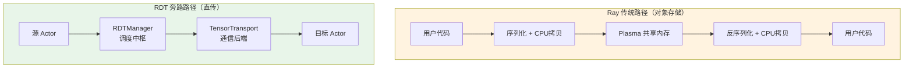
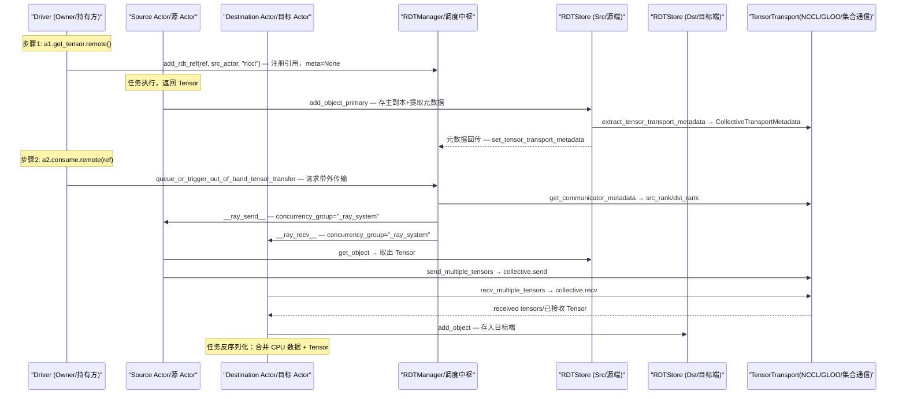
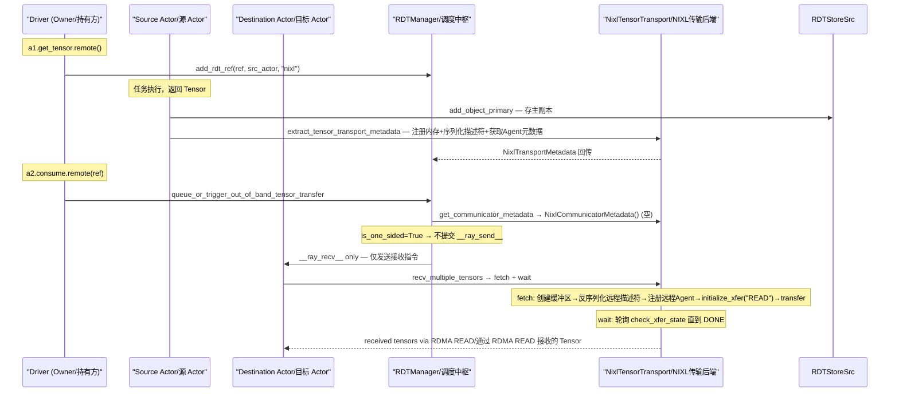
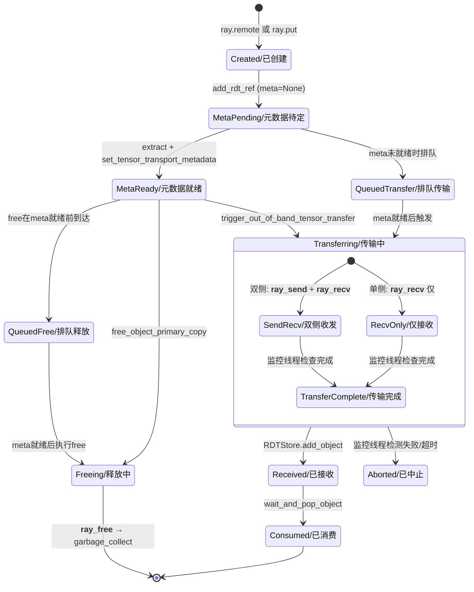

# Ray Direct Transport (RDT) 架构概览

> 本文档与 Ray 核心架构文档互补：核心架构文档关注 Ray 的调度、对象存储和 Actor 模型；本文档专注 **GPU/CPU Tensor 如何绕过 Ray 共享内存对象存储，在 Actor 间直接传输**这一专题。建议先阅读核心架构文档建立 Ray 全局认知，再读本文档理解 Tensor 旁路机制。

## 本章导读

RDT（Ray Direct Transport）是 Ray 为大规模 AI 训练和推理场景设计的 Tensor 直传框架。读完本章，你将建立三层认知：

1. **是什么**——一套绕过 Ray 对象存储的 Tensor 旁路传输系统，支持四种通信后端；
2. **为什么这样设计**——Ray 对象存储为通用数据设计，GPU Tensor 走它要经历两次 CPU 拷贝，对训练场景而言是性能灾难；
3. **具体怎么运转**——从用户写下 `@ray.method(tensor_transport="nixl")` 到 Tensor 到达目标 Actor，每一步发生了什么。

---

## 1.1 分层架构设计

### What：RDT 是什么？

RDT 是一个**旁路传输层**（bypass transport layer），插在 Ray 对象存储和用户代码之间。它的职责很简单：让 GPU/CPU Tensor 在 Actor 间移动时，不走 Ray 共享内存（Plasma）的序列化通道，而是通过专用通信后端直接搬运。

下面的架构鸟瞰图展示了 RDT 在 Ray 数据路径中的位置——它是对象存储旁边的一条"快车道"：



从图中可以看到关键差异：传统路径中 Tensor 要经历"序列化→共享内存→反序列化"三步，每步都涉及 CPU 拷贝；RDT 旁路中 Tensor 直接从源端 GPU 内存搬到目标端 GPU 内存，CPU 几乎不参与。

### Why：为什么需要旁路传输？

Ray 对象存储（Plasma）为通用 Python 对象设计——小数据经共享内存零拷贝传递，大数据经序列化传输。这对 CPU 数据工作良好，但对 GPU Tensor 有三个致命问题：

1. **双拷贝开销**：Tensor 从 GPU 拷到 CPU（序列化），再从 CPU 拷到 GPU（反序列化），每次拷贝都是数百毫秒级延迟；
2. **CPU 瓶颈**：GPU 间传输本可绕过 CPU（RDMA、NCCL），强制走 CPU 序列化等于白白浪费 GPU 直连能力；
3. **内存浪费**：Plasma 为 CPU 共享内存设计，Tensor 在其中只是临时"过客"，却要占用宝贵的共享内存空间。

RDT 的设计动机正是消除这三层浪费：让 Tensor 走"快车道"，小体积 CPU 数据仍走对象存储的"慢车道"，两条路并行，最终在目标端合并还原完整返回值。

既然旁路传输解决了"怎么搬"的问题，那么"谁来调度搬、搬到哪里存"就需要一套管理层和存储层来配合。接下来看这三层如何分工。

### How：分层如何协同？

RDT 的架构分三层，自上而下协作：

```
RDT 分层架构
├── 管理层 (RDTManager)         → 谁来调度：管理元数据、触发传输、监控状态
├── 存储层 (RDTStore)           → 搬到哪里存：本地 Tensor 仓库，主副本和接收副本
└── 传输层 (TensorTransportManager) → 怎么搬：四种后端实现具体搬运
    ├── NCCL (双侧 GPU 集合通信)
    ├── GLOO (双侧 CPU 集合通信)
    ├── NIXL (单侧 RDMA)
    └── CUDA IPC (单侧同节点直传)
```

三层之间的关系：管理层决定"何时搬、搬给谁"，存储层负责"搬前暂存、搬后入库"，传输层执行"实际搬运"。管理层不接触 Tensor 数据本身，只操作元数据；存储层持有数据但不决定去向；传输层最纯粹——拿到地址和描述符，执行搬移。

理解了分层分工后，接下来深入每一层的内部构造。

---

## 1.2 核心组件介绍

### 全局视角与角色类比

在深入每个组件之前，先用一张角色类比表建立直觉——类比对象和组件在**功能角色**上高度相似：

| 组件 | 角色类比 | 核心职责 |
|------|---------|---------|
| **RDTManager** | 总部调度中心 | 掌握全局信息（谁有 Tensor、谁需要 Tensor），做调度决策，监控运输状态，不亲自搬运 |
| **RDTStore** | 仓库管理员 | 管理本地 Tensor 的存入取出，保证线程安全，通知等待者"货到了" |
| **TensorTransportManager** | 运输公司（抽象） | 定义运输服务接口——提货单、送货单、货运状态查询 |
| **CollectiveTransport** | 签收快递 | 双方必须同时在场：源端"签字发货"，目标端"签字收货"，缺一不可 |
| **NixlTransport** | 自提柜取货 | 源端只需把货放进自提柜（注册内存），目标端凭取件码（描述符）自行取走，源端不用在场 |
| **CudaIpcTransport** | 同小区邻居递物 | 住同一小区（同节点同一 GPU）的邻居直接开门递物，快但范围有限 |

类比的选择标准是职责相似而非名字相似——RDTManager 不"搬运"但"调度"，和总部指挥中心的角色完全吻合；NIXL 的 RDMA 单侧传输和"自提柜取货"一样——放货方只需放入，取货方自行取走。带着这些直觉，接下来逐个深入。

### RDTManager —— 总部调度中心

#### What：是什么？

RDTManager 是每个 Driver/Worker 进程持有的 RDT 传输管理器实例，是整个 RDT 系统的调度中枢。

> 核心定义位于 `python/ray/experimental/rdt/rdt_manager.py`（L140-958）：

它管理所有 RDT 对象的元数据、触发带外传输、排队未就绪的请求、异步拉取、监控传输完成/失败状态。每个 Ray 进程有一个 RDTManager，它不接触 Tensor 数据本身，只操作元数据和调度指令。

#### 内部结构

```
RDTManager 内部结构
├── _managed_rdt_metadata       → Dict[obj_id, RDTMeta]，所有 RDT 对象的元数据档案
├── _queued_transfers           → Dict[obj_id, List]，元数据未就绪时的排队等候区
├── _queued_frees               → Set[obj_id]，排队等待的释放请求
├── _rdt_store                  → RDTStore，惰性创建的本地 Tensor 仓库
├── _unmonitored_transfers      → Queue，不需要监控的传输请求队列
├── _monitor_failures_thread    → Thread，后台监控线程，追踪传输状态
├── _lock                       → threading.Lock，保护并发访问
└── actor_id_to_transports_registered → Dict，每个 Actor 已注册的传输后端类型
```

#### Why：为什么需要调度中枢？

如果没有 RDTManager，每个 Actor 得自己决定"何时传、传给谁"。这会导致几个问题：

- **元数据时序问题**：Tensor 的传输元数据（描述符、IPC handle 等）在任务完成后才生成，但消费方可能在元数据就绪前就请求传输。需要有人排队等待、就绪后触发，否则请求会丢失。
- **监控责任**：传输可能失败（网络中断、Actor 崩溃），需要后台线程持续监控并在失败时中止传输或清理资源。Actor 自己做这件事不够可靠，因为崩溃的 Actor 已经无法自清理。
- **全局视角**：只有 Driver 进程知道"哪些 Actor 拿了哪些 ObjectRef"，它最适合做调度决策。

RDTManager 带来的好处：将"何时传、传给谁、传失败了怎么办"的复杂性集中到一个地方，Actor 只需执行简单的 send/recv 操作。

#### How：如何工作？

RDTManager 的核心工作循环分四个阶段：

1. **注册阶段**：用户调用 `a1.get_tensor.remote()` 后，Driver 的 RDTManager 调用 `add_rdt_ref`，创建初始 RDTMeta（此时 `tensor_transport_meta=None`，因为元数据还没生成）。

2. **元数据就绪阶段**：源 Actor 任务完成返回 Tensor 时，通过 Ray 内部机制将元数据回传到 Driver。RDTManager 收到后调用 `set_tensor_transport_metadata_and_trigger_queued_operations`，替换 None 并触发此前排队等待的传输。

3. **触发传输阶段**：用户将 ObjectRef 传给目标 Actor 时（`a2.consume.remote(ref)`），RDTManager 调用 `queue_or_trigger_out_of_band_tensor_transfer`——元数据就绪则立即触发，否则排队。触发时，根据后端类型决定提交 `__ray_send__` + `__ray_recv__`（双侧）或仅 `__ray_recv__`（单侧）。

4. **监控与清理阶段**：传输提交后，RDTManager 将 TransferMetadata 注册到监控线程。监控线程用 `ray.wait` 异步追踪完成状态，失败时调用 `_abort_transport`。ObjectRef 生命周期结束时，RDTManager 通过 `__ray_free__` 通知源 Actor 执行 `garbage_collect`。

理解了调度中枢的角色后，接下来看它调度的对象——本地 Tensor 仓库 RDTStore。

---

### RDTStore —— 仓库管理员

#### What：是什么？

RDTStore 是每个 Actor 进程持有的线程安全本地 Tensor 存储。

> 核心定义位于 `python/ray/experimental/rdt/rdt_store.py`（L163-370）：

它存储键为 `object_id` 的 Tensor 列表（deque，支持同一对象多副本），管理 Tensor 与 object_id 的双向映射，提供条件变量让等待者阻塞直到"货到了"或"货被释放"。

#### 内部结构

```
RDTStore 内部结构
├── _rdt_store             → Dict[str, deque]，object_id → Tensor 列表
├── _tensor_to_object_ids  → Dict[int, Set[str]]，Tensor → 关联的 object_id 集合
├── _lock                  → threading.RLock，可重入锁保护并发访问
├── _object_present_cv     → Condition，通知等待者"对象已到达"
└── _object_freed_cv       → Condition，通知等待者"对象已释放"
```

#### Why：为什么需要本地仓库？

传输的本质是"从一个进程的内存搬到另一个进程的内存"。搬运前后，Tensor 都需要暂存：

- **源端**：任务返回 Tensor 后，在传输触发前需要暂存（传输可能排队等待）。这就是"主副本"（primary copy）。
- **目标端**：传输完成后，在任务消费前需要暂存（任务可能还没开始执行）。

如果没有 RDTStore，Tensor 在传输前无处存放，或者需要在 Python 层用普通 dict 管理——既不线程安全，也没有"等待到达"的阻塞机制。RDTStore 的条件变量让"等货到"变得高效——不需要轮询，Tensor 到达时自动唤醒等待者。

#### How：如何工作？

RDTStore 有两种存入路径：

- **`add_object_primary`**：源端存入主副本，同时调用 `extract_tensor_transport_metadata` 提取元数据并返回。这是"入库+贴标签"一步完成。
- **`add_object`**：目标端存入接收副本，不提取元数据。这是纯"入库"。

取出路径也有两种：

- **`wait_and_pop_object`**：目标端任务消费时使用，阻塞等待传输完成，然后取出并移除。这是"等货到→取走"。
- **`get_object`**：源端 `__ray_send__` 发送时使用，取出但不移除（主副本可能被多次发送到不同目标）。这是"看一眼货在哪"。

仓库解决了"搬前暂存、搬后入库"的问题，但实际搬运由传输层执行。接下来深入四种运输后端。

---

### TensorTransportManager —— 运输公司（抽象接口）

#### What：是什么？

TensorTransportManager 是所有传输后端的抽象基类，定义统一的运输服务接口。

> 核心定义位于 `python/ray/experimental/rdt/tensor_transport_manager.py`（L58-295）：

它定义了七项服务：提取传输元数据、获取通信器元数据、接收多个 Tensor、异步拉取、等待拉取完成、发送多个 Tensor、垃圾回收。每项服务由具体后端实现。

#### Why：为什么需要抽象接口？

四种后端（NCCL、GLOO、NIXL、CUDA IPC）的底层通信机制完全不同，但 RDTManager 需要统一调度它们——不关心底层是 RDMA 还是集合通信，只关心"能不能传、怎么传"。抽象接口让管理层和传输层解耦，新增后端时只需实现接口，RDTManager 无需改动。

#### How：接口如何设计？

接口设计围绕两个关键属性展开：

- **`is_one_sided()`**：是否单侧传输。这个属性决定了 RDTManager 是否提交 `__ray_send__`——单侧传输不需要源端参与，仅提交 `__ray_recv__`。
- **`can_abort_transport()`**：是否可中止传输。这个属性决定了监控线程在失败时能否取消进行中的传输——RDMA 可取消，集合通信和 IPC 无法取消。

其余方法按传输阶段分布：

- **准备阶段**：`extract_tensor_transport_metadata`（生成提货单）、`get_communicator_metadata`（获取通信组信息）
- **执行阶段**：`send_multiple_tensors`（发货）、`recv_multiple_tensors`（收货）、`fetch_multiple_tensors`（异步拉取）、`wait_fetch_complete`（等待拉取完成）
- **清理阶段**：`garbage_collect`（释放资源）、`abort_transport`（取消传输）

理解了抽象接口的设计动机后，接下来看四种具体后端如何实现这套接口。

---

### CollectiveTensorTransport —— 签收快递（双侧传输）

#### What：是什么？

CollectiveTensorTransport 是集合通信传输的基类，NCCL 和 GLOO 继承它实现双侧传输。

> 集合通信基类位于 `python/ray/experimental/rdt/collective_tensor_transport.py`（L34-193）；NCCL 后端位于 `nccl_tensor_transport.py`；GLOO 后端位于 `gloo_tensor_transport.py`：

双侧传输意味着源端必须执行 `send`，目标端必须执行 `recv`，双方配对才能完成传输。`is_one_sided()` 返回 `False`，`can_abort_transport()` 返回 `False`。

#### 内部结构

```
CollectiveTensorTransport 内部结构
├── tensor_transport_backend() → "NCCL" 或 "GLOO"
├── extract_tensor_transport_metadata → 提取 shape/dtype/device，生成 CollectiveTransportMetadata
├── get_communicator_metadata → 查询通信组，返回 src_rank/dst_rank
├── send_multiple_tensors → 逐个调用 collective.send(tensor, dst_rank)
└── recv_multiple_tensors → 逐个调用 collective.recv(tensor, src_rank)
```

#### Why：为什么双侧传输需要预建通信组？

集合通信库（NCCL/GLOO）的点对点 send/recv 要求两端在同一通信组内，通过 rank 编号标识彼此。没有预建通信组，send 和 recv 无法配对——就像快递必须双方都在同一快递网络中才能签收。

预建通信组的代价是初始化开销和 Actor 耦合——通信组一旦建立，组内 Actor 不能随意退出（否则全组崩溃）。但换来的是成熟的 GPU 直连能力（NCCL 是 GPU 集合通信的事实标准）。

#### How：如何工作？

双侧传输的流程分三步：

1. **建组**：用户调用 `create_collective_group([a1, a2], backend="nccl")`，为 Actor 分配 rank 并初始化 NCCL/GLOO communicator。
2. **元数据提取**：`extract_tensor_transport_metadata` 从 Tensor 提取 shape/dtype/device，生成 `CollectiveTransportMetadata`。通信器元数据 `CollectiveCommunicatorMetadata` 包含 communicator_name、src_rank、dst_rank。
3. **发送+接收**：RDTManager 向源 Actor 提交 `__ray_send__`（执行 `send_multiple_tensors`），向目标 Actor 提交 `__ray_recv__`（执行 `recv_multiple_tensors`）。两端在 `_ray_system` 并发组线程上配对执行。

双侧传输可靠性高（两端都有确认），但代价是源端必须参与每次传输，即使它正忙于计算。接下来看一种源端无需参与的传输方式。

---

### NixlTensorTransport —— 自提柜取货（单侧 RDMA）

#### What：是什么？

NixlTensorTransport 基于 NVIDIA Infinity Exchange Library（NIXL）实现单侧 RDMA 传输，是 RDT 四种后端中性能潜力最大的。

> 核心定义位于 `python/ray/experimental/rdt/nixl_tensor_transport.py`（L94-666）：

`is_one_sided()` 返回 `True`——接收方可直接 RDMA READ 拉取数据，源端无需执行任何操作。`can_abort_transport()` 返回 `True`——RDMA 传输可取消。

#### 内部结构

```
NixlTensorTransport 内部结构
├── _nixl_agent          → NIXL Agent 实例，所有底层操作的入口
├── _tensor_desc_cache   → Dict，缓存已注册 Tensor 的描述符，避免重复注册
├── _managed_meta_nixl   → Dict[obj_id, NixlTransportMetadata]，缓存传输元数据
├── _remote_agents        → OrderedDict，缓存远程 NIXL Agent 映射
├── _memory_pool          → MemoryPoolManager，惰性创建的 GPU 内存池
├── fetch_multiple_tensors → 异步发起 RDMA READ，返回 NixlFetchRequest
├── wait_fetch_complete   → 轮询 check_xfer_state 直到 DONE/ERR
├── recv_multiple_tensors → fetch + wait 组合，一步到位
└── garbage_collect       → 注销内存/归还池块/清理缓存
```

#### Why：为什么单侧传输是更优选择？

双侧传输的核心问题是**源端阻塞**——源端必须执行 `send` 操作，这意味着源端的一个线程被占用，直到 send 完成。如果源端正在做密集计算（如前向传播），send 操作要么等计算完成，要么抢占 GPU——两者都不理想。

单侧 RDMA 解决了这个问题：源端只需提前注册内存描述符（一次性的低成本操作），此后接收方直接从源端内存 RDMA READ——源端的 GPU 和 CPU 完全不参与传输。这对训练场景尤其重要：一个 Actor 可以同时被多个目标 Actor 拉取 Tensor，而源端计算不受影响。

NIXL 同时支持 CPU 和 CUDA 设备，不需要预建通信组（零初始化开销），这些都是双侧传输做不到的。

#### How：如何工作？

NIXL 传输分三个阶段：

**注册阶段**（源端，一次性）：

`extract_tensor_transport_metadata` 在源端执行。对于 GPU Tensor，先 `cuda synchronize` 确保计算完成，然后判断是否可用内存池。池路径（`_allocate_pool_xfer_descs`）从 MemoryPoolManager 分配 MemoryBlock、复制数据到池内存；传统路径（`_add_tensor_descs`）将 Tensor 注册到 NIXL Agent、缓存描述符。最后序列化描述符（`get_serialized_descs`）和获取 Agent 元数据（`get_agent_metadata`），组装成 `NixlTransportMetadata`。

**拉取阶段**（目标端，每次传输）：

`fetch_multiple_tensors` 在目标端执行。创建空 Tensor（或用 target_buffers），注册本地描述符，反序列化源端描述符得到 `remote_xfer_descs`，注册远程 Agent 建立 RDMA 连接，初始化 READ 传输（`initialize_xfer("READ")`），执行传输（`transfer`），返回 `NixlFetchRequest`。

`wait_fetch_complete` 轮询 `check_xfer_state`：PROC 则 sleep 1ms 继续，DONE 则返回 Tensor，ERR 则抛 RuntimeError。

**清理阶段**（源端或目标端，传输结束后）：

`garbage_collect` 移除元数据条目、移除 Tensor 描述符。池路径归还 MemoryBlock 到池，传统路径 `deregister_memory` 注销 GPU 内存。

NIXL 的内存池机制值得单独展开——它进一步优化了频繁传输场景下的 GPU 内存管理。接下来深入内存池。

---

### MemoryPoolManager —— GPU 内存池

#### What：是什么？

MemoryPoolManager 是 NixlTensorTransport 惰性持有的 GPU 内存池管理器，管理预分配的连续 GPU 内存。

> 核心定义位于 `python/ray/experimental/rdt/nixl_memory_pool.py`（L32-288）：

它将预分配的 GPU Tensor（pool_tensor）划分为 MemoryBlock 块供分配/回收，减少频繁 GPU 内存分配的开销。

#### Why：为什么需要内存池？

GPU 内存分配是昂贵操作——每次 `torch.cuda.alloc` 都要向 CUDA 运行时申请，涉及内核调用和内存映射。频繁传输场景下（如每轮迭代都传输梯度），如果每次都分配→注册→注销→释放，GPU 内存分配器会成为瓶颈。

内存池的动机是**将分配变成池内复用**：预分配一次大块连续内存，后续传输只在池内划块和归还，不触及 CUDA 分配器。池路径还带来一个附带好处：连续内存的 RDMA 描述符更简洁，传输效率更高。

#### How：如何工作？

```
MemoryPoolManager 工作流程
├── allocate_for_tensors(tensors) → 为 Tensor 列表分配 MemoryBlock，复制数据到池
├── free_tensors(tensors)         → 将 MemoryBlock 归还到池，可被后续传输复用
└── has_block(tensor)             → 检查 Tensor 是否在池的已分配块中
```

池路径的资格判断（`pool_eligible`）条件严格：所有 Tensor 必须在池设备上且无已注册的 Tensor 描述符。这是因为池路径和传统路径不能混用——池 Tensor 的描述符来自池内存，传统路径的描述符来自独立注册。

内存池解决了频繁分配的瓶颈，但还有一种更特殊的传输方式——同节点直传。接下来看 CUDA IPC。

---

### CudaIpcTransport —— 同小区邻居递物

#### What：是什么？

CudaIpcTransport 通过 CUDA Inter-Process Communication handle 在同节点同一 GPU 的进程间共享 GPU 内存。

> 核心定义位于 `python/ray/experimental/rdt/cuda_ipc_transport.py`（L35-214）：

`is_one_sided()` 返回 `True`——接收方直接映射共享内存获取 Tensor。但 `can_abort_transport()` 返回 `False`——IPC handle 一旦打开无法撤回，就像邻居开门递物后无法"收回"。

#### Why：为什么需要 CUDA IPC？

当源端和目标端在同一节点、同一 GPU 上时，RDMA 和 NCCL 都要经过网络协议栈（即使是本地回环），而 CUDA IPC 直接共享 GPU 内存句柄——零拷贝、零协议开销。这是同节点同 GPU 场景下最快的传输方式。

代价是范围极窄：仅限同节点同 GPU。跨节点或跨 GPU 无法使用 CUDA IPC。因此它是一个**场景特化**的后端——适用条件苛刻，但满足条件时性能最优。

#### How：如何工作？

CUDA IPC 的流程简洁：

1. 源端 `extract_tensor_transport_metadata` 从 Tensor 获取 CUDA IPC handle（内存句柄 + 事件句柄）和 GPU 索引/节点 ID，封装为 `CudaIpcTransportMetadata`。
2. 目标端 `recv_multiple_tensors` 用 IPC handle 映射源端 GPU 内存到自己的地址空间，直接读取 Tensor。

IPC handle 的限制决定了 `can_abort_transport=False`——句柄一旦映射，源端无法控制目标端何时解除映射。

四种后端各有适用场景，接下来看它们的横向对比与背后的设计哲学。

---

## 1.3 传输后端对比与设计哲学

### 四种后端横向对比

下面的对比表聚焦于**设计决策的差异**而非功能罗列——每种差异背后都有明确的动机：

| | GLOO | NCCL | NIXL | CUDA IPC |
|---|------|------|------|----------|
| **传输模式** | 双侧 | 双侧 | 单侧 | 单侧 |
| **源端参与** | 必须执行 send | 必须执行 send | 无需参与 | 无需参与 |
| **初始化要求** | 需建通信组 | 需建通信组 | 零初始化 | 零初始化 |
| **可中止** | 否 | 否 | 是 | 否 |
| **适用设备** | CPU | CUDA | CPU/CUDA | CUDA（同节点同 GPU） |
| **ray.get 路径** | 经对象存储 | 经对象存储 | RDMA 直拉 | 内存映射直取 |
| **类比** | 签收快递 | 签收快递 | 自提柜取货 | 同小区邻居递物 |

从表中可以提取几个关键设计决策：

1. **双侧 vs 单侧**：这是最根本的分歧。双侧传输牺牲源端计算资源换取配对可靠性；单侧传输释放源端但依赖 RDMA/IPC 硬件支持。
2. **初始化要求**：双侧传输需要预建通信组，这是集合通信库的硬性要求，不是 RDT 的设计选择。NIXL 和 CUDA IPC 不需要，降低了使用门槛。
3. **可中止性**：只有 NIXL 可中止，因为 RDMA 操作有明确的句柄可取消。集合通信一旦发起无法取消，IPC handle 无法撤回。

### 设计哲学

RDT 的传输层设计遵循三条原则：

**原则一：旁路而非替代**。RDT 不替代 Ray 对象存储，而是在旁边建一条快车道。CPU 数据仍走对象存储，只有 Tensor 走旁路。两条路在目标端合并还原完整返回值。这个选择保证了向后兼容——不使用 RDT 的代码不受影响。

**原则二：场景特化而非通用最优**。四种后端各有适用场景——NCCL 在 GPU 集合通信场景最优，NIXL 在 RDMA 可用场景最优，CUDA IPC 在同节点同 GPU 场景最优，GLOO 在无 GPU 或调试场景可用。没有"通用最优"后端，选择取决于硬件拓扑和计算模式。

**原则三：数据面与控制面分离**。Tensor 数据（传输层）和调度指令（RDTManager）走不同路径——数据走通信后端直传，指令走 Ray RPC 提交 `__ray_send__`/`__ray_recv__`。这种分离让数据路径和控制路径独立优化，避免大 Tensor 拖慢小指令。

理解了设计哲学后，接下来从具体代码出发，追踪一次完整传输的每一步。

---

## 1.4 从用户代码看执行路径

### 双侧传输执行路径（NCCL/GLOO）

以下面的用户代码为例，追踪从 API 调用到 Tensor 到达目标端的完整路径：

```python
import ray
from ray.experimental.collective import create_collective_group

ray.init()

@ray.remote
class ModelActor:
    @ray.method(tensor_transport="nccl")
    def get_tensor(self):
        return torch.randn(1024, 1024, device="cuda")

    def consume(self, tensor_ref):
        # ref 在此处自动触发 RDT 带外传输
        pass

a1 = ModelActor.remote()
a2 = ModelActor.remote()
create_collective_group([a1, a2], backend="nccl")

ref = a1.get_tensor.remote()       # 步骤 1
a2.consume.remote(ref)             # 步骤 2
```

下面的时序图展示了步骤 1 和步骤 2 触发的完整内部流程：



从时序图可以看到关键步骤：

1. **注册在调用时发生**：`get_tensor.remote()` 触发 `add_rdt_ref`，此时 meta=None——因为 Tensor 还没产生。
2. **元数据在任务完成后生成**：源 Actor 执行任务、存入 RDTStore、提取元数据，回传到 Driver。
3. **传输在传参时触发**：`consume.remote(ref)` 扫描参数中的 RDT ObjectRef，触发带外传输。
4. **两端配对执行**：`__ray_send__` 和 `__ray_recv__` 在各自的 `_ray_system` 线程上配对执行 send/recv。
5. **反序列化合并**：目标端将小体积 CPU 数据（经对象存储）和 Tensor（经带外传输）合并还原完整返回值。

如果用户需要 `ray.get(ref)` 获取 Tensor，双侧传输只能走对象存储中转路径——因为源端必须参与 send，而 Driver 端没有通信组。这就是为什么 NCCL/GLOO 的 `ray.get` 必须设 `use_object_store=True`。

接下来看单侧传输的执行路径——流程更简洁，因为源端不参与。

---

### 单侧传输执行路径（NIXL）

同样以用户代码为例，但切换到 NIXL 后端：

```python
import ray

ray.init()

@ray.remote
class ModelActor:
    @ray.method(tensor_transport="nixl")
    def get_tensor(self):
        return torch.randn(1024, 1024, device="cuda")

    def consume(self, tensor_ref):
        pass

a1 = ModelActor.remote(enable_tensor_transport=True)
a2 = ModelActor.remote(enable_tensor_transport=True)

ref = a1.get_tensor.remote()
a2.consume.remote(ref)

# ray.get 也可直接 RDMA 拉取：
tensors = ray.get(ref)  # 不经对象存储，NIXL RDMA 直拉
```

下面的时序图展示了 NIXL 单侧传输的完整流程：



从时序图可以看到关键差异：

1. **源端不参与传输**：`is_one_sided=True` 让 RDTManager 仅提交 `__ray_recv__`，不提交 `__ray_send__`。源端只需注册内存描述符（一次性的低成本操作）。
2. **目标端主动拉取**：`recv_multiple_tensors` 内部是 `fetch_multiple_tensors` + `wait_fetch_complete` 的组合——目标端凭描述符直接 RDMA READ。
3. **ray.get 可直接拉取**：NIXL 单侧传输让 Driver 端也能通过 RDMA READ 直接获取 Tensor，不需要源端参与，也不需要经对象存储中转。

两种传输模式的执行路径到此清晰。接下来看一个贯穿两种模式的核心机制——对象生命周期。

---

## 1.5 对象生命周期

### What：RDT 对象经历哪些状态？

每个 RDT 瀑路传输的 Tensor，从创建到销毁经历以下状态流转：



从状态图可以看到几个关键设计：

### Why：状态机背后的设计动机

**MetaPending → QueuedTransfer 的排队机制**。元数据在任务完成后才生成，但传输请求可能先到达。排队等待避免了请求丢失，元数据就绪后自动触发——这是 RDTManager 作为调度中枢的核心价值。

**QueuedFree 的排队释放**。free 请求可能在元数据就绪前到达（比如 ObjectRef 生命周期很短）。如果直接释放，NIXL 的内存还未注册就无法正确注销。排队等待保证了释放操作的正确性。

**Transferring 内的 SendRecv vs RecvOnly 分流**。`is_one_sided` 属性在传输阶段分流——双侧走 SendRecv，单侧走 RecvOnly。这个分流点正是前面"数据面与控制面分离"原则的具体体现。

**Aborted 状态**。只有 NIXL（`can_abort_transport=True`）能从 Aborted 状态恢复——取消 RDMA 传输后可以重试。NCCL/GLOO 和 CUDA IPC 的传输一旦发起无法取消，失败只能终止 Actor 或销毁通信组。

---

## 1.6 核心设计模式

### 惰性初始化（Lazy Initialization）

RDTStore 和 MemoryPoolManager 都采用惰性创建——首次访问时才实例化，而非进程启动时。

**为什么**：并非所有 Actor 都会参与 Tensor 传输。提前创建 RDTStore 和内存池会浪费资源（特别是 GPU 内存池可能很大）。惰性创建确保只有实际需要传输的 Actor 才承担这些开销。

**具体实现**：RDTManager 的 `_rdt_store` 初始为 None，首次调用存储方法时创建；NixlTensorTransport 的 `_memory_pool` 初始为 None，首次判断池路径时创建。

### 排队-触发模式（Queue-Then-Trigger）

RDTManager 的 `_queued_transfers` 和 `_queued_frees` 实现了排队-触发模式：请求到达时如果前置条件（元数据就绪）未满足，排队等待；条件满足后自动触发。

**为什么**：Tensor 传输的元数据生成和传输请求到达之间存在时序不确定——元数据可能先到（任务很快完成），也可能后到（任务耗时较长）。排队-触发模式解决了这个异步时序问题，保证请求不丢失。

**具体实现**：`set_tensor_transport_metadata_and_trigger_queued_operations` 是这个模式的枢纽——元数据写入后立即检查 `_queued_transfers[obj_id]`，有排队请求则逐个触发。

### 监控线程模式（Monitor Thread）

RDTManager 的 `_monitor_failures_thread` 是后台守护线程，用 `ray.wait` 异步追踪传输完成状态。

**为什么**：传输可能耗时较长或失败。如果 Driver 主线程同步等待，会阻塞后续操作。后台监控让主线程继续调度，同时持续追踪传输健康状态。

**具体实现**：传输触发后，TransferMetadata（含 send_ref/recv_ref）注册到监控线程。监控线程定期 `ray.wait` 检查完成状态，超时或失败时调用 `_abort_transport`（NIXL 可取消）或 kill Actor（双侧传输）。

### 元数据-数据分离（Metadata-Data Separation）

Tensor 的元数据（描述符、通信组信息）经 Ray 内部机制回传到 Driver，Tensor 数据经通信后端直传到目标 Actor。两条路径并行，最终在目标端合并。

**为什么**：元数据体积小（几百字节），走 Ray 对象存储几乎零开销；Tensor 体积大（几 MB 到几 GB），走对象存储是性能灾难。分离让两种数据各走最优路径。

**具体实现**：源 Actor 任务返回时，小体积 CPU 数据经 Ray 序列化通道传递，Tensor 的元数据也经此通道回传。Tensor 数据本身经 NCCL/GLOO/NIXL/CUDA IPC 直传。目标端反序列化器将两者合并还原完整返回值。

---

## 1.7 源码目录导航

```
python/ray/experimental/rdt/
├── __init__.py                    → 公共 API 导出（RDTManager, register_nixl_memory, ...）
├── rdt_manager.py                 → RDTManager 核心（L140-958），调度中枢
│   ├── RDTMeta (L60-73)          → 对象元数据记录
│   ├── TransferMetadata (L77-86) → 传输元数据记录
│   ├── add_rdt_ref (L393-421)    → 注册引用
│   ├── trigger_out_of_band_tensor_transfer (L622-742) → 触发传输
│   ├── fetch_and_get_rdt_objects (L775-875) → ray.get 路径
│   └── 监控线程 (L265-391)       → 传输状态追踪
├── rdt_store.py                   → RDTStore（L163-370），本地 Tensor 存储
│   ├── __ray_send__ / __ray_recv__ (L19-108) → Actor 系统方法
│   ├── __ray_free__ (L118-141)   → 释放方法
│   └── __ray_fetch_rdt_object__ (L144-150) → ray.get 回退路径
├── tensor_transport_manager.py    → 抽象基类（L58-295）
├── collective_tensor_transport.py → NCCL/GLOO 双侧传输（L34-193）
├── nixl_tensor_transport.py       → NIXL 单侧 RDMA（L94-666）
│   ├── fetch_multiple_tensors (L279-389) → 异步拉取
│   └── wait_fetch_complete (L391-447)  → 等待完成
├── cuda_ipc_transport.py          → CUDA IPC 同节点直传（L35-214）
├── nixl_memory_pool.py            → MemoryPoolManager（L32-288）
└── util.py                        → 传输注册机制 + register_nixl_memory/memory_pool
```

**推荐阅读路径**：

1. `rdt_manager.py` → 理解调度中枢的核心循环
2. `rdt_store.py` → 理解本地存储的存取机制
3. `tensor_transport_manager.py` → 理解抽象接口设计
4. `nixl_tensor_transport.py` → 理解单侧 RDMA 的完整实现（最复杂也最有价值）
5. `collective_tensor_transport.py` → 理解双侧传输的简洁实现

---

## 本章总结

RDT 是 Ray 为 Tensor 旁路传输设计的分层框架，核心思想是"快车道与慢车道并行"——Tensor 赫专用通信后端直传，CPU 数据走对象存储，两条路在目标端合并。

本章覆盖了三层认知：

1. **是什么**：旁路传输层，三层架构（管理层→存储层→传输层），四种后端（NCCL/GLOO/NIXL/CUDA IPC）
2. **为什么**：消除双拷贝、CPU 瓶颈、内存浪费；场景特化而非通用最优；数据面与控制面分离
3. **怎么运转**：注册→元数据就绪→触发传输→监控清理的完整循环；双侧需配对 send+recv，单侧仅 recv

| 知识点 | 核心要点 |
|--------|---------|
| **旁路设计** | Tensor 不走 Plasma，走专用后端直传；CPU 数据仍走对象存储 |
| **三种角色** | RDTManager（调度）→ RDTStore（存储）→ TensorTransport（搬运） |
| **双侧 vs 单侧** | 双侧需两端配对（send+recv），单侧仅接收方主动（RDMA READ） |
| **排队-触发** | 元数据未就绪时排队，就绪后自动触发，保证请求不丢失 |
| **监控线程** | 后台追踪传输完成/失败，NIXL 可取消，双侧只能 kill Actor |
| **NIXL 内存池** | 预分配 GPU 连续内存，池内复用减少动态分配开销 |
| **对象生命周期** | Created→MetaPending→MetaReady→Transferring→Received→Consumed→Freeing |
| **四种后端** | NCCL(GPU双侧)、GLOO(CPU双侧)、NIXL(RDMA单侧)、CUDA IPC(同节点单侧) |

---

## 附录：生僻术语速查

| 术语 | 简述 |
|------|------|
| NIXL | NVIDIA Infinity Exchange Library，RDMA 单侧传输库 |
| RDMA READ | 远程直接内存访问读取，接收方直接从源端内存拉取，绕过两端 CPU |
| CUDA IPC handle | CUDA 进程间通信句柄，同节点同 GPU 进程间共享 GPU 内存 |
| Plasma | Ray 共享内存对象存储，CPU 数据的常规传输通道 |
| `_ray_system` 并发组 | Ray Actor 的后台线程并发组，执行系统级任务，与用户任务线程隔离 |
| CollectiveCommunicatorMetadata | 集合通信器元数据，含通信组名称和 rank 编号 |
| NixlTransportMetadata | NIXL 传输元数据，含序列化描述符和 Agent 元数据 |
| pool_eligible | 内存池资格标志，判断 Tensor 是否可走池路径 |