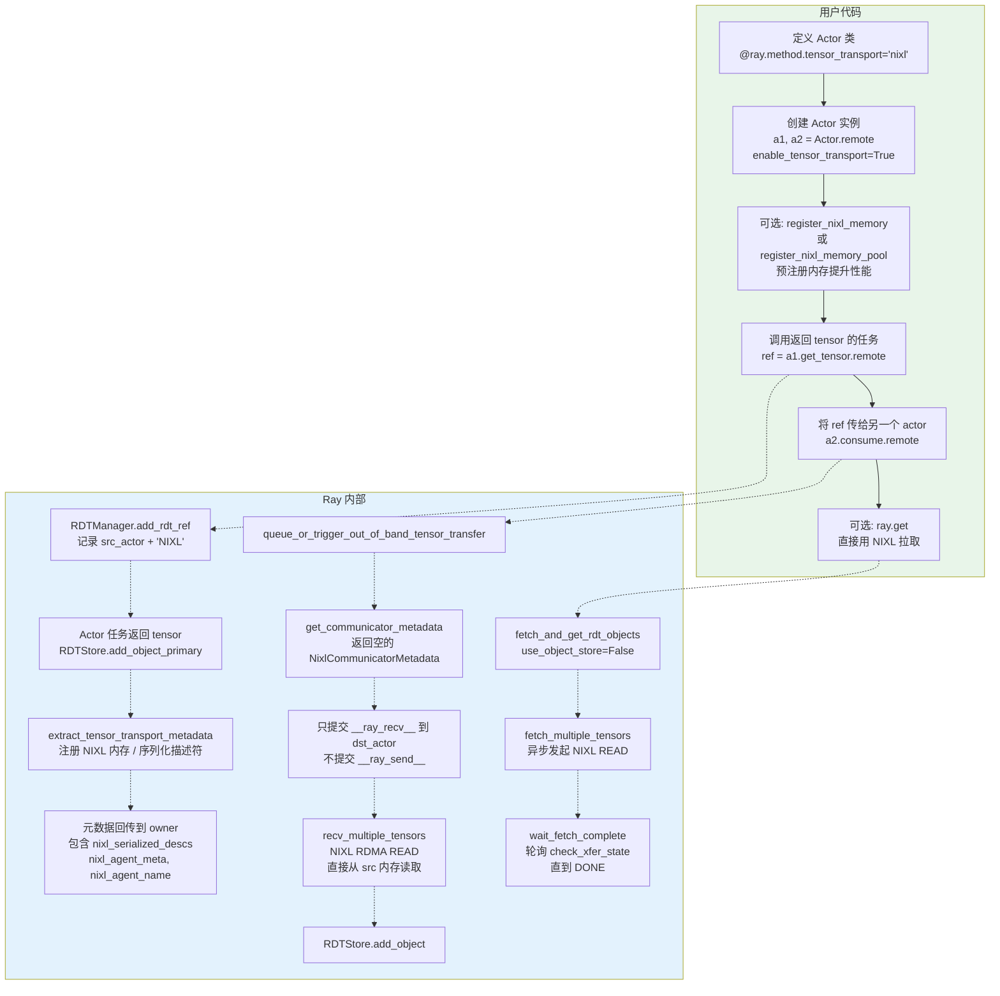
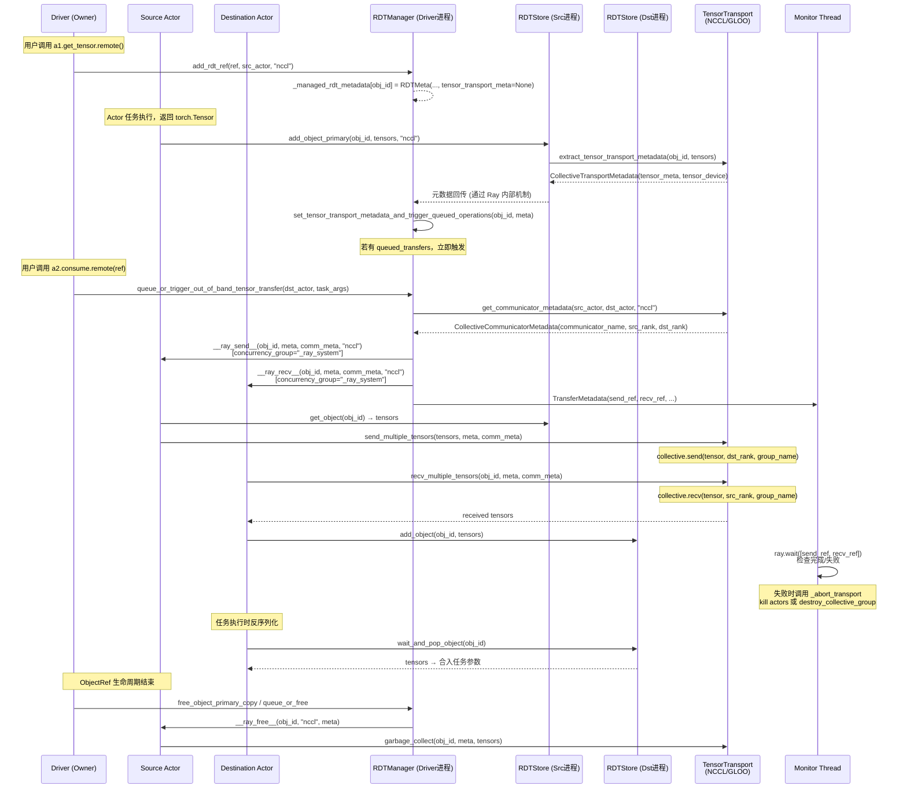
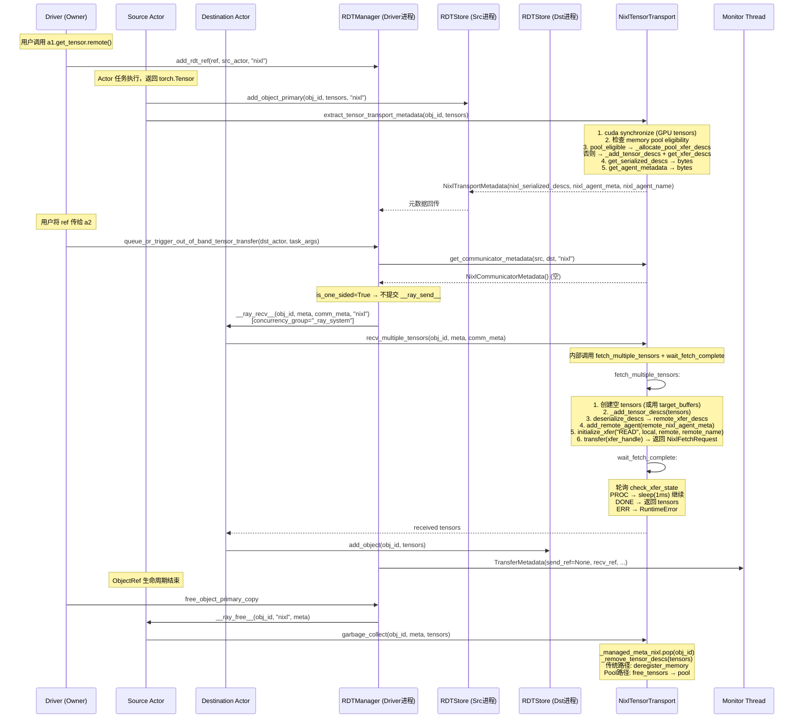
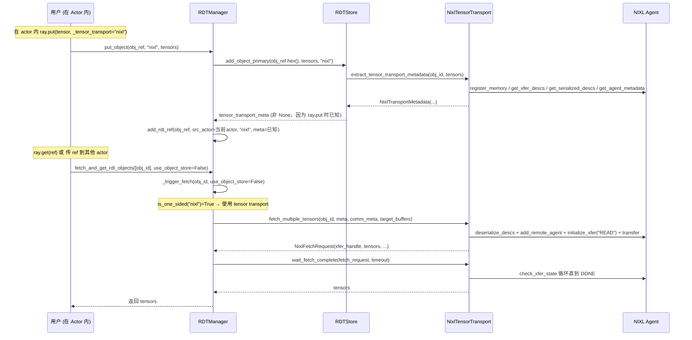
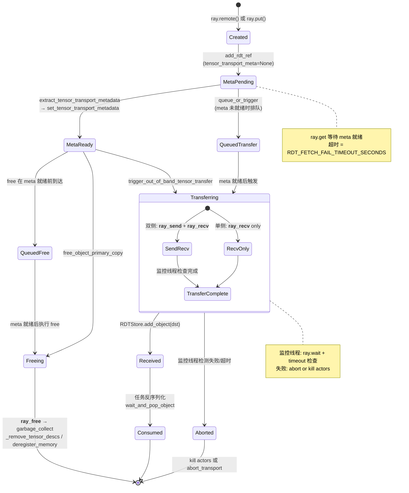

# Ray Direct Transport (RDT) 代码级深度解析

> 源码位置: `python/ray/experimental/rdt/`
> 文档位置: `doc/source/ray-core/direct-transport/`

---

## 1. 类图 — 核心类继承关系

```mermaid
classDiagram
    direction TB

    class TensorTransportManager {
        <<abstract>>
        +tensor_transport_backend() str
        +is_one_sided() bool$
        +can_abort_transport() bool$
        +actor_has_tensor_transport(actor) bool
        +extract_tensor_transport_metadata(obj_id, rdt_object) TensorTransportMetadata
        +get_communicator_metadata(src_actor, dst_actor, backend) CommunicatorMetadata
        +recv_multiple_tensors(obj_id, meta, comm_meta, target_buffers) List
        +fetch_multiple_tensors(obj_id, meta, comm_meta, target_buffers) FetchRequest
        +wait_fetch_complete(fetch_request, timeout) List
        +send_multiple_tensors(tensors, meta, comm_meta)
        +garbage_collect(obj_id, meta, tensors)
        +abort_transport(obj_id, comm_meta)
    }

    class CommunicatorMetadata {
        <<dataclass>>
    }

    class TensorTransportMetadata {
        <<dataclass>>
        +tensor_meta List~Tuple~
        +tensor_device Optional~str~
    }

    class FetchRequest {
        <<dataclass>>
        +obj_id str
        +tensors List
    }

    class CollectiveTensorTransport {
        +is_one_sided() bool$ False
        +can_abort_transport() bool$ False
        +extract_tensor_transport_metadata(obj_id, rdt_object) CollectiveTransportMetadata
        +get_communicator_metadata(src, dst, backend) CollectiveCommunicatorMetadata
        +recv_multiple_tensors(...) List
        +send_multiple_tensors(...)
    }

    class NCCLTensorTransport {
        +tensor_transport_backend() "NCCL"
    }

    class GLOOTensorTransport {
        +tensor_transport_backend() "GLOO"
    }

    class NixlTensorTransport {
        +is_one_sided() bool$ True
        +can_abort_transport() bool$ True
        -_nixl_agent Any
        -_tensor_desc_cache Dict
        -_managed_meta_nixl Dict
        -_remote_agents OrderedDict
        -_memory_pool MemoryPoolManager
        +get_nixl_agent() nixl_agent
        +register_nixl_memory(tensor)
        +register_nixl_memory_pool(size, device)
        +fetch_multiple_tensors(...) NixlFetchRequest
        +wait_fetch_complete(fetch_request, timeout) List
        +recv_multiple_tensors(...) List
    }

    class CudaIpcTransport {
        +is_one_sided() bool$ True
        +can_abort_transport() bool$ False
        +recv_multiple_tensors(...) List
    }

    class CollectiveCommunicatorMetadata {
        +communicator_name str
        +src_rank Optional~int~
        +dst_rank Optional~int~
    }

    class CollectiveTransportMetadata {
    }

    class NixlCommunicatorMetadata {
    }

    class NixlTransportMetadata {
        +nixl_serialized_descs Optional~bytes~
        +nixl_agent_meta Optional~bytes~
        +nixl_agent_name Optional~str~
        +nixl_agent_meta_version Optional~int~
    }

    class CudaIpcCommunicatorMetadata {
    }

    class CudaIpcTransportMetadata {
        +cuda_ipc_handles Optional~List~
        +cuda_ipc_event_ipc_handle Optional~bytes~
        +ray_gpu_idx Optional~int~
        +ray_node_id Optional~str~
    }

    class NixlFetchRequest {
        +xfer_handle Any
        +nixl_agent Any
        +remote_name Optional~str~
        +remove_tensor_descs bool
        +transport Any
        +__del__()
    }

    class RDTManager {
        -_lock threading.Lock
        -_managed_rdt_metadata Dict~str, RDTMeta~
        -_queued_transfers Dict~str, List~
        -_queued_frees Set~str~
        -_rdt_store Optional~RDTStore~
        -_unmonitored_transfers Queue
        -_monitor_failures_thread Thread
        -actor_id_to_transports_registered Dict
        +add_rdt_ref(obj_ref, src_actor, tensor_transport, meta)
        +set_rdt_metadata(obj_id, rdt_meta)
        +get_rdt_metadata(obj_id) Optional~RDTMeta~
        +trigger_out_of_band_tensor_transfer(dst_actor, obj_id)
        +queue_or_trigger_out_of_band_tensor_transfer(dst_actor, task_args)
        +fetch_and_get_rdt_objects(object_ids, timeout, use_object_store) Dict
        +_trigger_fetch(obj_id, use_object_store) FetchRequest
        +_wait_fetch(obj_id, fetch_request, timeout) List
        +get_rdt_objects(object_ids) Dict
        +put_object(obj_ref, tensor_transport, tensors)
        +free_object_primary_copy(object_id)
        +queue_or_free_object_primary_copy(object_id)
        +set_target_buffers_for_ref(ref, target_buffers)
        +start_monitor_thread_if_needed()
        +shutdown()
    }

    class RDTStore {
        -_rdt_store Dict~str, deque~_RDTObject~~
        -_tensor_to_object_ids Dict~int, Set~str~~
        -_lock threading.RLock
        -_object_present_cv threading.Condition
        -_object_freed_cv threading.Condition
        +has_object(obj_id) bool
        +get_object(obj_id) Optional~List~
        +add_object(obj_id, rdt_object, is_primary)
        +add_object_primary(obj_id, tensors, tensor_transport) TensorTransportMetadata
        +wait_and_get_object(obj_id, timeout) List
        +wait_and_pop_object(obj_id, timeout) List
        +pop_object(obj_id) List
        +wait_tensor_freed(tensor, timeout)
    }

    class RDTMeta {
        <<NamedTuple>>
        +src_actor ActorHandle
        +tensor_transport_backend str
        +tensor_transport_meta Optional~TensorTransportMetadata~
        +sent_dest_actors Set~str~
        +sent_to_src_actor_and_others_warned bool
        +target_buffers Optional~List~
    }

    class TransferMetadata {
        <<NamedTuple>>
        +src_actor ActorHandle
        +dst_actor ActorHandle
        +send_ref Optional~ObjectRef~
        +recv_ref ObjectRef
        +communicator_meta CommunicatorMetadata
        +backend str
        +obj_id str
        +timeout float
    }

    class MemoryPoolManager {
        -_pool_tensor torch.Tensor
        -_free_blocks List~MemoryBlock~
        -_allocated_blocks Dict~int, MemoryBlock~
        +allocate_for_tensors(tensors) List~Tensor~
        +free_tensors(tensors)
        +has_block(tensor) bool
    }

    TensorTransportManager <|-- CollectiveTensorTransport
    TensorTransportManager <|-- NixlTensorTransport
    TensorTransportManager <|-- CudaIpcTransport
    CollectiveTensorTransport <|-- NCCLTensorTransport
    CollectiveTensorTransport <|-- GLOOTensorTransport

    CommunicatorMetadata <|-- CollectiveCommunicatorMetadata
    CommunicatorMetadata <|-- NixlCommunicatorMetadata
    CommunicatorMetadata <|-- CudaIpcCommunicatorMetadata
    TensorTransportMetadata <|-- CollectiveTransportMetadata
    TensorTransportMetadata <|-- NixlTransportMetadata
    TensorTransportMetadata <|-- CudaIpcTransportMetadata
    FetchRequest <|-- NixlFetchRequest

    RDTManager --> RDTStore : owns lazily
    RDTManager --> RDTMeta : manages metadata
    RDTManager --> TransferMetadata : monitors transfers
    RDTStore --> _RDTObject : stores objects
    NixlTensorTransport --> MemoryPoolManager : owns lazily
    NixlTensorTransport --> NixlTransportMetadata : caches _managed_meta_nixl
    NixlTensorTransport --> TensorDesc : caches _tensor_desc_cache
```



---

## 2. 传输分类对比

| 传输后端 | 类型 | `is_one_sided` | `can_abort_transport` | 需要集体组 | 支持设备 | `ray.get` 直接使用 |
|---------|------|----------------|----------------------|-----------|---------|------------------|
| **GLOO** | 双侧 | False | False | 是 | CPU | 否 (需 `_use_object_store=True`) |
| **NCCL** | 双侧 | False | False | 是 | CUDA | 否 (需 `_use_object_store=True`) |
| **NIXL** | 单侧 | True | True | 否 | CPU/CUDA | 是 |
| **CUDA_IPC** | 单侧 | True | False | 否 | CUDA (同节点同GPU) | 是 |

---

## 3. 用户使用流程图 — 双侧传输 (GLOO/NCCL)

```mermaid
flowchart TB
    subgraph UserCode["用户代码"]
        A[定义 Actor 类<br>@ray.method.tensor_transport='nccl'] --> B[创建 Actor 实例<br>a1, a2 = Actor.remote]
        B --> C[创建集合通信组<br>create_collective_group<br>[a1, a2], backend='nccl']
        C --> D[调用返回 tensor 的任务<br>ref = a1.get_tensor.remote]
        D --> E[将 ref 传给另一个 actor<br>a2.consume.remote]
        E --> F[可选: ray.get<br>_use_object_store=True]
    end

    subgraph RayInternals["Ray 内部"]
        D -.-> D1[RDTManager.add_rdt_ref<br>记录 src_actor + transport 类型]
        D1 -.-> D2[Actor 任务返回 tensor<br>RDTStore.add_object_primary]
        D2 -.-> D3[提取 TensorTransportMetadata<br>extract_tensor_transport_metadata]
        D3 -.-> D4[元数据回传到 owner<br>set_tensor_transport_metadata_and_trigger_queued_operations]
        E -.-> E1[queue_or_trigger_out_of_band_tensor_transfer<br>检测 task_args 中的 ObjectRef]
        E1 -.-> E2[get_communicator_metadata<br>获取 src_rank / dst_rank]
        E2 -.-> E3[提交 __ray_send__ 到 src_actor]
        E2 -.-> E4[提交 __ray_recv__ 到 dst_actor]
        E3 -.-> E5[send_multiple_tensors<br>NCCL/GLOO send]
        E4 -.-> E6[recv_multiple_tensors<br>NCCL/GLOO recv]
        E6 -.-> E7[RDTStore.add_object<br>tensor 存入接收方本地 store]
        E7 -.-> E8[反序列化时合并 CPU 数据 + tensor]
        F -.-> F1[fetch_and_get_rdt_objects<br>use_object_store=True]
        F1 -.-> F2[src_actor.__ray_fetch_rdt_object__<br>从 RDTStore 获取 tensor]
        F2 -.-> F3[通过 Ray 对象存储返回]
    end

    style UserCode fill:#e8f5e9
    style RayInternals fill:#e3f2fd
```

---

## 4. 用户使用流程图 — 单侧传输 (NIXL)



---

## 5. 时序图 — 双侧传输完整流程 (NCCL/GLOO)



---

## 6. 时序图 — 单侧传输完整流程 (NIXL)



---

## 7. 时序图 — ray.put / ray.get (NIXL 单侧)



---

## 8. 对象生命周期状态图



---

## 9. NIXL 内存管理流程图

```mermaid
flowchart TB
    subgraph Registration["内存注册"]
        A[tensor 到达 extract_tensor_transport_metadata] --> B{是否有 memory_pool?}
        B -->|有 pool & 所有 tensor 在 pool 设备上<br>& 无已注册 tensor| C[pool_eligible = True]
        B -->|否| D[pool_eligible = False]
        C --> E[_allocate_pool_xfer_descs<br>从 pool 分配 MemoryBlock<br>复制 tensor 数据到 pool]
        D --> F[_add_tensor_descs<br>注册 tensor 到 NIXL<br>ref_count++]
        E --> G[_add_pool_tensor_descs<br>reg_desc=None, metadata_count=1]
        F --> H[NixlAgent.register_memory<br>返回 reg_desc]
        G --> I[NixlAgent.get_xfer_descs<br>使用 pool_tensor 的描述符]
        H --> I
        I --> J[get_serialized_descs → bytes<br>get_agent_metadata → bytes<br>构造 NixlTransportMetadata]
    end

    subgraph Transfer["传输 (RDMA READ)"]
        K[fetch_multiple_tensors] --> L[创建空 tensors<br>或使用 target_buffers]
        L --> M[_add_tensor_descs(tensors)<br>接收端注册内存]
        M --> N[deserialize_descs<br>→ remote_xfer_descs]
        N --> O[add_remote_agent<br>→ 建立远程连接]
        O --> P[initialize_xfer READ<br>local_xfer + remote_xfer]
        P --> Q[transfer → 发起 RDMA READ]
        Q --> R[返回 NixlFetchRequest]
        R --> S[wait_fetch_complete<br>轮询 check_xfer_state]
        S --> T{state?}
        T -->|DONE| U[返回 tensors]
        T -->|PROC| S
        T -->|ERR| V[Raise RuntimeError]
    end

    subgraph Cleanup["清理"]
        W[garbage_collect] --> X[_managed_meta_nixl.pop]
        X --> Y[_remove_tensor_descs]
        Y --> Z{reg_desc?}
        Z -->|有 reg_desc| AA[deregister_memory<br>NIXL 注销 + 版本号++]
        Z -->|None (pool)| AB[MemoryPoolManager.free_tensors<br>归还 MemoryBlock 到 pool]
    end

    Registration --> Transfer --> Cleanup

    style Registration fill:#fff3e0
    style Transfer fill:#e3f2fd
    style Cleanup fill:#fce4ec
```

---

## 10. 关键数据流路径总结

### 10.1 元数据流转

```
src_actor:
  task 返回 tensor → RDTStore.add_object_primary
    → TensorTransportManager.extract_tensor_transport_metadata
      → TensorTransportMetadata (含 tensor shape/dtype/device + 传输特定字段)

driver (owner):
  RDTManager.set_tensor_transport_metadata_and_trigger_queued_operations
    → 触发 queued_transfers (如有)

driver (owner):
  RDTManager.trigger_out_of_band_tensor_transfer
    → TensorTransportManager.get_communicator_metadata
      → CommunicatorMetadata
    → 提交 __ray_send__ / __ray_recv__ 到 actors (携带 meta + comm_meta)
```

### 10.2 数据流转 (双侧)

```
src_actor.__ray_send__:  RDTStore.get → send_multiple_tensors → [NCCL/GLOO send]
dst_actor.__ray_recv__:  recv_multiple_tensors → [NCCL/GLOO recv] → RDTStore.add_object
```

### 10.3 数据流转 (单侧 NIXL)

```
dst_actor.__ray_recv__:  recv_multiple_tensors → fetch_multiple_tensors
  → NIXL RDMA READ (直接读取 src 内存) → wait_fetch_complete → RDTStore.add_object
```

### 10.4 ray.get 路径

```
# NIXL (单侧):
RDTManager.fetch_and_get_rdt_objects
  → _trigger_fetch → fetch_multiple_tensors (异步 NIXL READ)
  → _wait_fetch → wait_fetch_complete (轮询直到 DONE)

# NCCL/GLOO (双侧) - 必须用 object store:
RDTManager.fetch_and_get_rdt_objects(use_object_store=True)
  → src_actor.__ray_fetch_rdt_object__
  → ray.get(object_ref) → 通过 Ray 对象存储返回 tensor
```

---

## 11. 关键源码位置索引

| 功能 | 文件 | 关键行 |
|------|------|--------|
| 公共 API 导出 | `__init__.py` | L1-29 |
| RDTManager 核心 | `rdt_manager.py` | L140-958 |
| RDTMeta 定义 | `rdt_manager.py` | L60-73 |
| TransferMetadata | `rdt_manager.py` | L77-86 |
| wait_tensor_freed | `rdt_manager.py` | L89-116 |
| set_target_for_ref | `rdt_manager.py` | L118-138 |
| add_rdt_ref | `rdt_manager.py` | L393-421 |
| trigger_out_of_band_tensor_transfer | `rdt_manager.py` | L622-742 |
| fetch_and_get_rdt_objects | `rdt_manager.py` | L775-875 |
| 监控线程 | `rdt_manager.py` | L265-391 |
| __ray_send__ / __ray_recv__ | `rdt_store.py` | L19-108 |
| __ray_free__ | `rdt_store.py` | L118-141 |
| __ray_fetch_rdt_object__ | `rdt_store.py` | L144-150 |
| RDTStore 类 | `rdt_store.py` | L163-370 |
| TensorTransportManager 抽象接口 | `tensor_transport_manager.py` | L58-295 |
| FetchRequest 基类 | `tensor_transport_manager.py` | L38-55 |
| CollectiveTensorTransport | `collective_tensor_transport.py` | L34-193 |
| NixlTensorTransport | `nixl_tensor_transport.py` | L94-666 |
| NIXL fetch (async) | `nixl_tensor_transport.py` | L279-389 |
| NIXL wait | `nixl_tensor_transport.py` | L391-447 |
| CudaIpcTransport | `cuda_ipc_transport.py` | L35-214 |
| MemoryPoolManager | `nixl_memory_pool.py` | L32-288 |
| 传输注册机制 | `util.py` | L34-216 |
| register_nixl_memory | `util.py` | L218-261 |
| register_nixl_memory_pool | `util.py` | L293-336 |