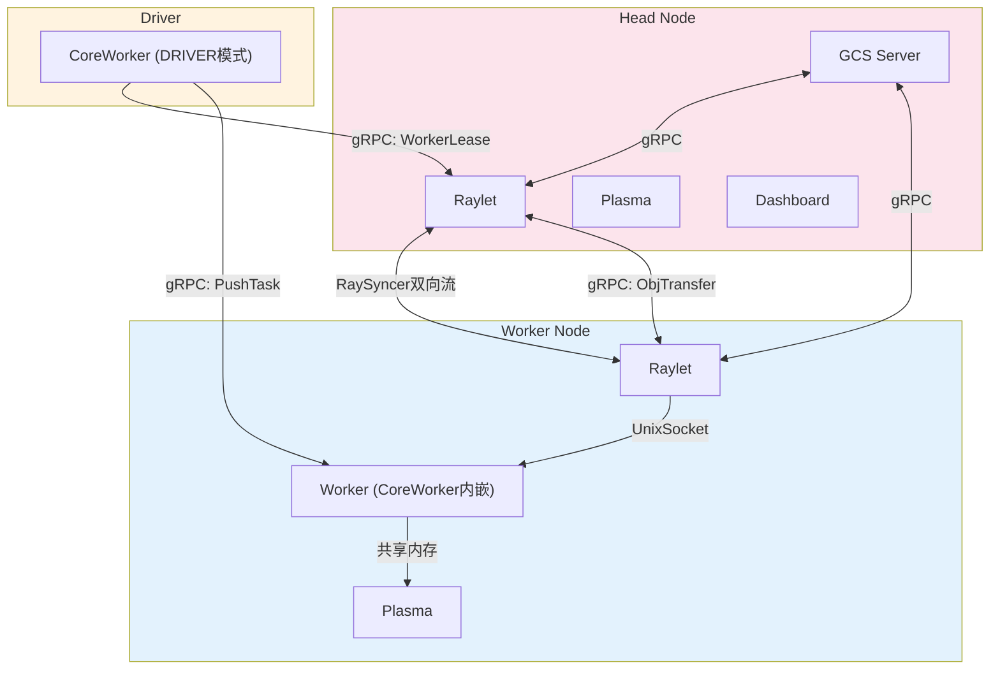
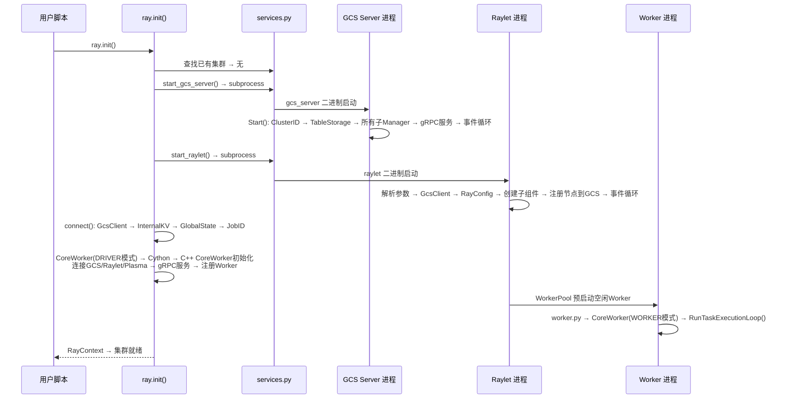
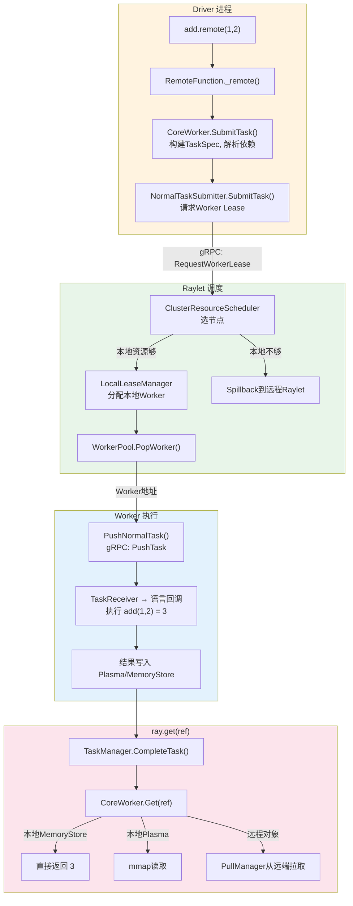
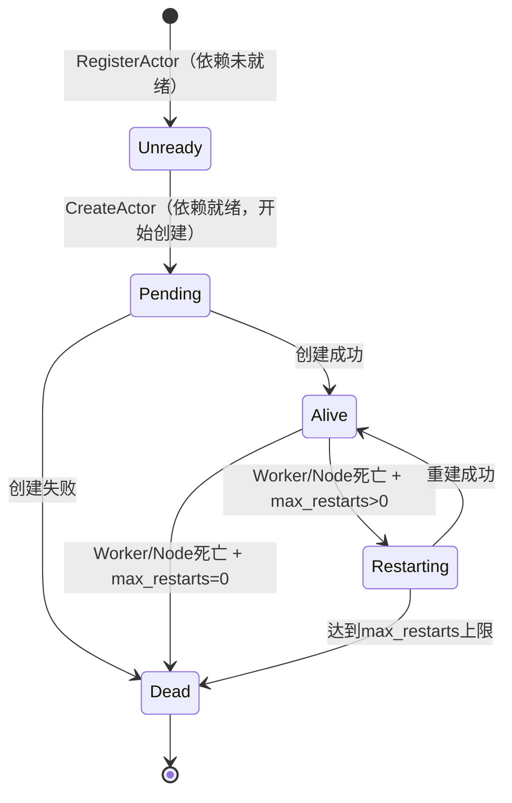
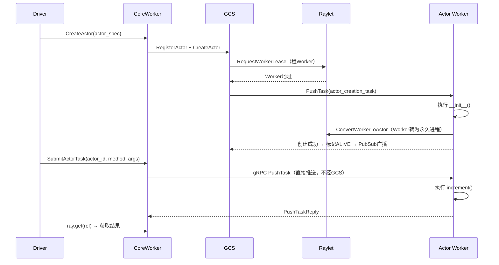
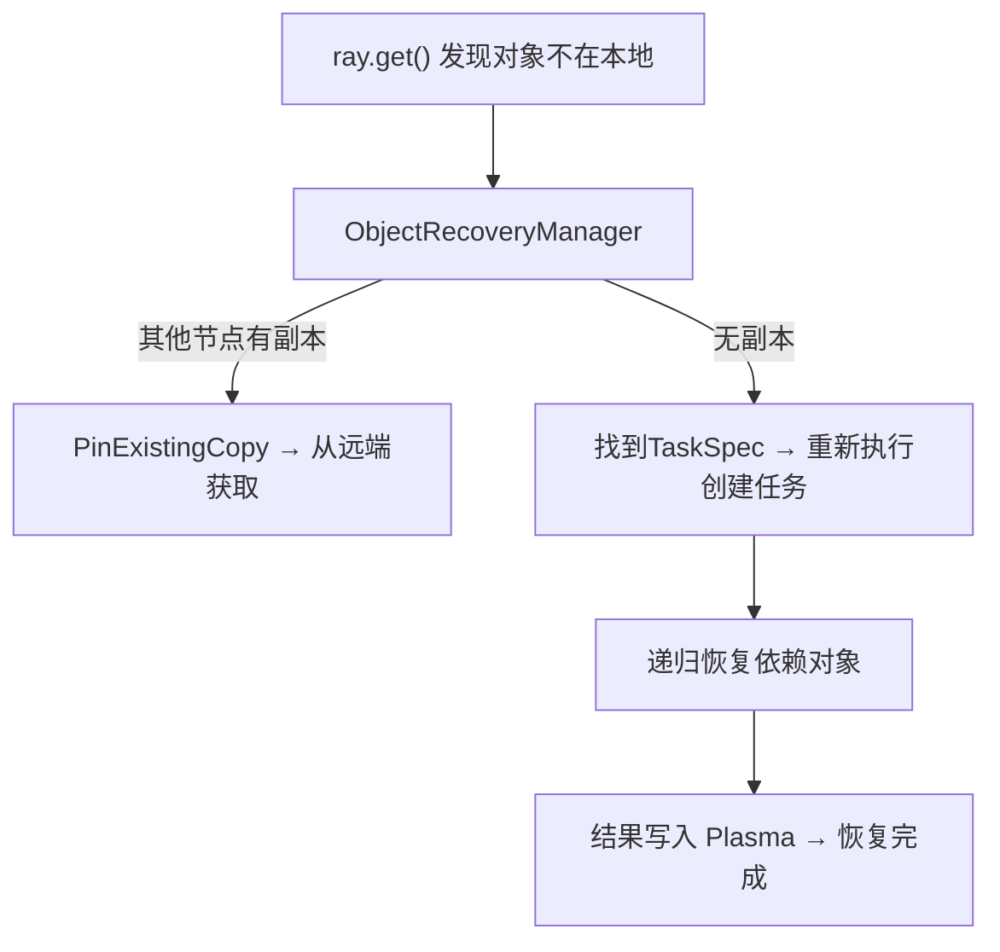

# Ray 核心运行时架构概览

> 与 [RDT 代码级深度解析](direct-transport/rdt-architecture-analysis.md) 互补：本文是全局视角，RDT 文档是局部深度。建议先读本文再读 RDT。

---

## 导读

Ray 把单机 Python 程序扩展到集群的代价压到了极低——一个 `@ray.remote` 装饰器就够了。但这份极简背后是一套相当精密的分布式基础设施：GCS 管全局状态、Raylet 管每节点调度和资源、CoreWorker 管每进程的任务执行和引用计数、Plasma 管跨进程的零拷贝数据共享。这些组件通过 gRPC、共享内存、Unix Socket 三种通道交织在一起，构成了 Ray 的运行时骨架。

本文的目标是帮你把这副骨架看清楚：每个组件做什么、为什么这样分工、它们之间怎么通信、从 `ray.init()` 到 `ray.get()` 走了哪些路径。弄清楚这些，后续读 RDT 这种子系统深挖的文档才有锚点。

---

## 1 整体架构：从集群到进程的纵向切分

### 1.1 四层分工

Ray 的架构可以纵向切成四层，每一层解决不同维度的问题：

```
┌─────────────────────────────────────────────────────────┐
│                  应用库层（Ray Data / Train / Serve / Tune / RLlib）               │
│           面向 ML 工作负载的高级抽象，开箱即用                                  │
├─────────────────────────────────────────────────────────┤
│                   编程模型层（Tasks / Actors / Objects / Placement Groups）     │
│           分布式计算的四个基本原语，用户直接交互的 API                      │
├─────────────────────────────────────────────────────────┤
│                   进程运行库层（CoreWorker）                                    │
│           每进程 C++ 引擎，桥接 Python API 到底层基础设施                    │
├─────────────────────────────────────────────────────────┤
│                   集群基础设施层（GCS + Raylet + Plasma + RPC）              │
│           节点管理、全局状态、对象存储、进程间通信                            │
└─────────────────────────────────────────────────────────┘
```

最底层是集群基础设施——GCS 做全局元数据管理、Raylet 做每节点调度、Plasma 做共享内存对象存储、gRPC 承载所有控制面通信。这一层全部用 C++ 实现，追求路径最短、延迟最低。

中间是 CoreWorker 运行库——每个 Worker 和 Driver 进程内嵌一个 CoreWorker 实例。它把 Python 层的 `ray.remote()`、`ray.get()`、`ray.put()` 通过 Cython 桥接转发到 C++ 层。Python 只是个薄代理，真正的提交、执行、引用计数、对象存取逻辑全在 C++ CoreWorker 里。

再上面是编程模型层——Tasks（无状态远程函数）、Actors（有状态实体）、Objects（通过 ObjectRef 访问的分布式共享对象）、Placement Groups（资源组协调放置）。这是用户直接写代码打交道的地方。

最顶是应用库层——Ray Data、Train、Serve、Tune、RLlib 各自封装了特定 ML 场景的复杂逻辑，内部用 Core 层的 Task/Actor/Object 来实现分布式，用户不需要关心调度和通信细节。

### 1.2 为什么这样分层？

分层的本质是**把不同变化速率的东西隔离开**。集群基础设施层的变化最慢（C++ 二进制，部署后基本不动）；编程模型层中等（API 稳定但语义可能演进）；应用库层变化最快（新库、新功能、新参数）。把它们缠在一起写会耦合到互相拖慢。

另一个好处是**不同人只需要理解不同层**。用 Ray Serve 部署模型的工程师可以只关心应用库层；做分布式调度算法的研究者需要深入编程模型层和集群基础设施层。分层让认知负担可控。

---

## 2 五大核心组件

### 2.1 全局关系

先建立五大组件的角色直觉，再逐个深入：

| 组件 | 一句话职责 | 它关心什么 | 它不关心什么 |
|---|---|---|---|
| **GCS** | 全局元数据的权威来源 | 哪些节点活着、哪些 Actor 存在、集群资源分布 | 数据传输、任务执行 |
| **Raylet** | 单节点调度和资源管家 | 本节点有哪些资源、哪些 Worker、任务该分给谁 | 全局调度、跨节点状态 |
| **CoreWorker** | 每进程的计算引擎 | 任务提交/执行、对象存取、引用计数 | 节点级资源管理 |
| **Object Store** | 跨进程零拷贝数据共享 | 对象在哪里、怎么传、何时淘汰 | 任务逻辑、调度决策 |
| **RPC 层** | 进程间通信基础设施 | gRPC 服务端/客户端、认证、限流 | 业务语义 |

GCS 是全集群唯一知道"全局真相"的组件——其他组件通过订阅 GCS 的 PubSub 来获得局部视角的更新。Raylet 是"本地优先"调度的执行者——大多数任务在本地 Raylet 就能调度完成，只有资源不足时才溢出到别的节点。CoreWorker 是直接和用户代码打交道的那层——Python 调 `f.remote()` 最终由 C++ CoreWorker 的 NormalTaskSubmitter 发出去。Object Store 把同节点的数据传输成本压到零（共享内存），跨节点的通过 ObjectManager 分块 gRPC 传输。RPC 层是所有组件的通信底座。

### 2.2 GCS — 全局元数据的权威来源

#### 它是什么

GCS 运行在头节点，是整个集群唯一维护全局一致性状态的组件。它不参与数据传输和任务执行——它的职责纯粹是元数据管理：节点注册与存活检测、Actor 生命周期状态机、Job 管理、Placement Group 调度、资源视图聚合、内部 KV 存储。

GCS Server 的核心入口在 `src/ray/gcs/gcs_server.h`：

```cpp
class GcsServer {
 public:
  GcsServer(const GcsServerConfig &config, ...);
  void Start();
  void Stop();
};
```

它内部按领域拆成多个子管理器，每个负责一个独立的状态空间：

```
GCS Server 内部
├── GcsNodeManager         → 节点注册 + 心跳 + 故障检测
├── GcsActorManager        → Actor 生命周期状态机
│   └── GcsActorScheduler  → 调度 Actor 创建（向 Raylet 租 Worker）
├── GcsJobManager          → Job 提交与完成
├── GcsPlacementGroupManager → PG 创建与 bundle 调度
│   └── GcsPGScheduler     → 在 Raylet 上预留 bundle 资源
├── GcsResourceManager     → 聚合各节点资源报告
├── GcsKVManager           → 内部 KV（配置、ClusterID）
├── GcsPublisher           → PubSub 广播状态变更
└── GcsHealthCheckManager  → 心跳检测节点存活
```

#### 为什么需要一个集中的元数据服务

分布式系统中，如果每个节点只掌握局部信息，做出全局最优决策几乎不可能——比如调度器不知道哪些节点有空闲 GPU，就无法把 GPU 任务路由到正确位置。GCS 的存在让"谁在哪儿、有什么资源、哪些 Actor 还活着"这些信息有了单一事实来源。

代价是 GCS 成为潜在瓶颈和单点。Ray 的缓解策略：GCS 只管元数据（控制面），数据传输路径完全绕过它；生产环境可配 Redis 持久化做高可用。

#### 它怎么工作

GCS 通过 gRPC 对外提供服务，CoreWorker 和 Raylet 通过 `GcsClient` 连接。它同时运行 PubSub 机制——当 Actor 从 ALIVE 变成 RESTARTING、当新节点加入集群、当 Job 结束，GCS 会把事件广播给所有订阅者。这让其他组件不需要轮询就能实时感知状态变更。

存储后端有两种选择：纯内存（默认，测试用）和 Redis 持久化（生产推荐）。元数据通过 `GcsTableStorage` 抽象存取，上层管理器不需要知道底层用的是内存还是 Redis。

### 2.3 Raylet — 单节点调度和资源管家

#### 它是什么

Raylet 是每个节点上的守护进程，职责是本节点的资源管理、任务调度（Worker 租用）和对象管理。一个 Raylet 实例包含两大子系统：NodeManager（调度+资源）和 ObjectManager（跨节点数据传输）。

核心类定义在 `src/ray/raylet/node_manager.h`：

```cpp
class NodeManager : public rpc::NodeManagerServiceHandler,
                     public syncer::ReporterInterface,
                     public syncer::ReceiverInterface {
 public:
  NodeManager(instrumented_io_context &io_service,
              const NodeID &self_node_id,
              const NodeManagerConfig &config,
              gcs::GcsClient &gcs_client,
              ClusterResourceScheduler &cluster_resource_scheduler,
              LocalLeaseManagerInterface &local_lease_manager,
              ClusterLeaseManagerInterface &cluster_lease_manager,
              WorkerPoolInterface &worker_pool,
              ...);
};
```

注意构造函数的参数列表——NodeManager 通过依赖注入接收所有子组件，自身只做协调。这种设计让子组件可以独立测试和替换。

内部子系统：

```
Raylet 内部
├── ClusterResourceScheduler → 评估集群资源，选最佳节点
│   ├── LocalResourceManager  → 管理本节点资源实例
│   └── CompositeSchedulingPolicy → 路由到具体策略
│       ├── HybridPolicy      → 默认：冷启动惩罚 + 利用率优先
│       ├── SpreadPolicy      → 均匀散布
│       ├── NodeAffinityPolicy → 指定节点亲和
│       └── NodeLabelPolicy   → 标签匹配
├── ClusterLeaseManager     → 跨节点租约管理（溢回调度）
├── LocalLeaseManager       → 本地租约分配
├── LeaseDependencyManager  → 等待依赖对象变本地后分发
├── WorkerPool              → Worker 进程生命周期
├── ObjectManager           → 跨节点 Pull/Push
├── LocalObjectManager      → 本地 Pin/Spill/Free
├── RaySyncer                → 双向流同步资源视图
└── AgentManager             → 子进程（Dashboard Agent + RuntimeEnv Agent）
```

#### 为什么调度要分散到每个 Raylet

如果所有调度请求都打到 GCS，GCS 会成为吞吐瓶颈。Ray 的设计是"本地优先"——CoreWorker 提交任务时先请求本地 Raylet，本地资源够就直接分配 Worker，不够才溢出到别的 Raylet。这意味着大部分调度决策在本地完成，GCS 只在 Actor 创建、Placement Group 这些需要全局协调的场景才介入。

这种分散调度让 Ray 的任务吞吐量可以做到每秒百万级——调度决策不在单点上排队。

#### 它怎么工作

核心机制是**Lease（租约）**：CoreWorker 向 Raylet 请求一个 Worker Lease → Raylet 评估资源 → 本地够则分配本地 Worker → 不够则 ClusterLeaseManager 把请求溢出到资源充足的远程 Raylet → 远程 Raylet 分配 Worker 并回复地址 → CoreWorker 拿到 Worker 地址后直接 gRPC PushTask。

租约到期或 Worker 空闲后，CoreWorker 归还租约（ReturnWorkerLease），Worker 回到 WorkerPool 等待下一个任务。空闲 Worker 可以被同一提交者复用，省掉重新租用的开销。

### 2.4 CoreWorker — 每进程的计算引擎

#### 它是什么

CoreWorker 是嵌入在每个 Worker 和 Driver 进程中的 C++ 运行库。它是 Python 用户代码和底层集群基础设施之间的桥梁——Python 层的 `ray.remote()`、`ray.get()`、`ray.put()` 通过 Cython（`python/ray/_raylet.pyx`）转发到 C++ CoreWorker，后者才真正做任务提交、对象存取、引用计数这些重活。

核心类在 `src/ray/core_worker/core_worker.h`：

```cpp
class CoreWorker : public std::enable_shared_from_this<CoreWorker> {
 public:
  std::vector<rpc::ObjectReference> SubmitTask(...);
  Status Put(const RayObject &object, ...);
  Status Get(const std::vector<ObjectID> &ids, ...);
  void RunTaskExecutionLoop();
};
```

#### 双重身份

CoreWorker 在 Driver 进程里只做"提交者"——序列化参数、构建 TaskSpec、通过 TaskSubmitter 发出去、管理返回的 ObjectRef 引用。在 Worker 进程里还做"执行者"——接收 PushTask RPC、反序列化参数、通过语言回调执行 Python 函数、把结果写入对象存储。

```
CoreWorker 内部
├── NormalTaskSubmitter    → 普通任务提交（租 Worker → PushTask）
├── ActorTaskSubmitter     → Actor 任务提交（直接 PushTask 到 Actor Worker）
├── TaskReceiver           → 任务接收 + 语言回调执行
├── TaskManager            → 任务状态追踪（完成/失败/重试）
├── ReferenceCounter       → 分布式引用计数（对象生命周期）
├── ActorManager           → ActorHandle 注册与查找
├── ObjectRecoveryManager  → 丢失对象重建（Lineage Reconstruction）
├── FutureResolver         → 跨进程 ObjectRef 值获取
├── MemoryStore            → 进程内小对象存储
├── PlasmaStoreProvider    → 大对象共享内存存取
└── gRPC Server            → CoreWorkerService（PushTask 等）
```

#### 为什么核心逻辑用 C++ 而不是纯 Python

Ray 的关键路径——任务提交、对象传输、引用计数、gRPC 通信——对延迟极度敏感。Python 的解释器开销和 GIL 会让这些操作慢到无法满足毫秒级要求。用 C++ 实现核心路径，Python 只做语言绑定和用户代码执行，是"C++ 引擎 + Python 驾驶舱"的模式：引擎保证快，驾驶舱保证易用。

另一个好处是多语言支持——Java 和 C++ 也可以实现自己的语言绑定层接入 CoreWorker，复用全部调度和对象管理逻辑。

#### 它怎么工作

CoreWorker 运行在 `instrumented_io_context`（封装 Boost.Asio）的事件循环上。所有 gRPC RPC、对象存取、引用计数通知都以异步回调的形式在这个循环中处理。Driver 进程初始化后直接返回，运行用户自己的代码。Worker 进程进入 `RunTaskExecutionLoop()`，阻塞等待 Raylet 或其他 CoreWorker 推送过来的任务，执行完一个再接下一个。

### 2.5 Object Store — 跨进程零拷贝数据共享

#### 它是什么

Ray 的对象存储分两层：进程内的 MemoryStore 和节点级的 Plasma 共享内存。MemoryStore 存小对象（<100KB），直接嵌入在 gRPC 消息中传输，延迟最低。Plasma 存大对象（≥100KB），基于 Apache Arrow 的 Plasma 实现，用 `/dev/shm` 共享内存让同节点的 Worker 零拷贝读写。跨节点传输由 ObjectManager 负责——分块 gRPC 传输，PullManager 拉取、PushManager 推送。

```
Object Store 两层结构
├── MemoryStore（进程内）
│   → 小对象 / 内联值 / Future 解析结果
│   → 键=ObjectID, 值=RayObject
│
├── Plasma Store（节点级共享内存）
│   ├── ObjectLifecycleManager → Create/Seal/Evict/Delete
│   ├── EvictionPolicy         → LRU 淘汰
│   └── PlasmaAllocator        → dlmalloc 内存分配
│
└── ObjectManager（跨节点传输）
    ├── PullManager  → 优先级调度（GET > WAIT > TASK_ARGS）
    ├── PushManager  → 流控 + 分块 + 去重
    └── ObjectDirectory → 基于 Owner 订阅的对象位置追踪
```

#### 为什么用两层存储而不是统一一层

小对象和大对象的传输最优路径不同。小对象直接嵌在 gRPC 消息里走最快——省掉了共享内存的 Create/Seal/Get 开销。大对象必须走共享内存——序列化到 Plasma 后，同节点其他 Worker 直接 mmap 读取，省掉复制。把两种路径合并到一层会互相拖慢——小对象走 Plasma 多了不必要的内存操作，大对象走 MemoryStore 放不下。

#### 它怎么工作

**put**：`ray.put(obj)` → CoreWorker 序列化 → 小对象写入 MemoryStore / 大对象写入 Plasma（Create → 填入数据 → Seal） → ReferenceCounter 注册为 Owner。

**get**：`ray.get(ref)` → CoreWorker 查 MemoryStore → 有就返回 → 没有 → 查 Plasma → 有就 mmap 返回 → 没有 → 说明对象在远程 → PullManager 发起 Pull → 远端 ObjectManager 从 Plasma 读数据 → 分块 gRPC 传回来 → 写入本地 Plasma → 返回。

**淘汰**：Plasma 容量不足时，EvictionPolicy 按 LRU 淘汰最久未用的对象。被淘汰的对象可以溢出（Spill）到外部存储，后续需要时再 Restore 回来。

### 2.6 RPC 通信层 — 进程间通信底座

所有组件通过 gRPC 互相通信。Ray 的 RPC 层提供通用服务端/客户端基础设施：

- `GrpcServer`：通用 gRPC 服务端，CompletionQueue 异步处理，支持多服务注册、Token 认证
- `GrpcClient<GrpcService>`：通用 gRPC 客户端模板，异步 RPC + 客户端池
- `ClientCallManager`：管理出站 RPC，回调通过 io_context 投递回调用方

核心 gRPC 服务一览：

| 服务 | 服务端 | 关键 RPC | 通信目的 |
|---|---|---|---|
| `NodeManagerService` | Raylet | RequestWorkerLease, ReturnWorkerLease, PinObjectIDs | Worker 租用与回收 |
| `CoreWorkerService` | CoreWorker | PushTask, GetObjectStatus, WaitForRefRemoved | 任务推送、引用通知 |
| `ObjectManagerService` | Raylet | PushObject, PullObject, FreeObjects | 跨节点数据传输 |
| `GcsService` | GCS | RegisterActor, CreateActor, InternalKVGet/Put, GcsSubscribe | 全局状态管理与订阅 |
| `RaySyncerService` | GCS+Raylet | StartSync（双向流） | 资源视图集群同步 |

除了 gRPC，还有两种辅助通信：Unix Domain Socket（Worker 与本地 Raylet 的高频低延迟 IPC）和共享内存（Plasma，同节点零拷贝数据传输）。

---

## 3 集群拓扑与通信哲学

### 3.1 拓扑结构

一个 Ray 集群由一个 Head Node 和若干 Worker Node 组成。Head Node 上除了普通的 Raylet 和 Plasma，还运行 GCS Server、Dashboard、Autoscaler Monitor。Worker Node 上只有 Raylet、Plasma 和 Worker 进程。Driver 进程（用户 `ray.init()` 所在的 Python 主进程）内嵌一个 DRIVER 类型 CoreWorker——只提交任务不接收任务。



### 3.2 三种通信通道各有分工

Ray 同时使用三种进程间通信通道，分工明确：

**gRPC（控制面）**：所有需要跨节点、跨进程的"指令性"通信——租用 Worker、推送任务、注册 Actor、同步资源。这些操作量不大但要求可靠送达，gRPC 的重试和认证机制正好满足。

**共享内存 Plasma（数据面）**：同节点上的大对象传输。Worker 写入 Plasma 后，同节点其他 Worker 直接 mmap 读取，省掉序列化和复制。这是 Ray 数据零拷贝的关键。

**Unix Domain Socket（本地高频 IPC）**：Worker 与本地 Raylet 之间的注册、Wait、AsyncGet 等高频操作。比 gRPC 省掉 TCP/IP 协议栈开销，延迟更低。

这种分工的底层逻辑是**控制面和数据面分离**——指令走 gRPC 保证可靠，数据走共享内存保证吞吐，两条路径各优化各的。

### 3.3 RaySyncer — 资源视图的集群同步

RaySyncer 是 Ray 的资源状态同步协议，使用 gRPC 双向流让各 Raylet 之间高效同步资源视图。每个 Raylet 的 LocalResourceManager 实现 `ReporterInterface`（报告本地资源变化）和 `ReceiverInterface`（消费其他节点的资源更新）。这让每个 Raylet 都能掌握全集群的资源分布，在本地做出调度决策——不需要每次都去问 GCS。

---

## 4 集群启动：从 ray.init() 到就绪

### 4.1 启动流程追踪

`ray.init()` 是 Ray 的入口。追踪它的完整执行路径，能看清所有核心进程是如何启动和连接的：



核心步骤解读：

1. **发现或创建集群**：先查 RAY_ADDRESS 环境变量和临时目录，看有没有已经在跑的集群。没有就从头启动。
2. **启动 GCS**：`subprocess.Popen(gcs_server)` 启 C++ 二进制。GCS 内部按依赖顺序初始化所有子管理器——先 NodeManager（因为其他管理器需要知道哪些节点活着），再 ActorManager、JobManager 等。
3. **启动 Raylet**：同样 subprocess 启 C++ 二进制。Raylet 连接 GCS、创建 ClusterResourceScheduler/WorkerPool/ObjectManager 等子组件、向 GCS 注册本节点。
4. **创建 Driver CoreWorker**：通过 Cython 桥接创建 C++ CoreWorker（DRIVER 类型）。连接 GcsClient、Raylet（Unix Socket + gRPC）、Plasma Store。Driver 类型不进入任务循环，直接返回给用户脚本。
5. **预启动 Worker**：Raylet 的 WorkerPool 预启动若干空闲 Python Worker，每个 Worker 内嵌 CoreWorker 并进入 `RunTaskExecutionLoop()` 等待任务推送。

---

## 5 任务执行：从 .remote() 到 ray.get()

### 5.1 一个完整路径

```python
@ray.remote
def add(a, b):
    return a + b

ref = add.remote(1, 2)
result = ray.get(ref)  # 3
```

这三行代码触发了一条跨越 Driver → Raylet → Worker → ObjectStore 的完整执行链：



关键细节：

- `add.remote(1, 2)` 返回 ObjectRef，不是值。ObjectRef 是一个延迟引用——值可能还在远端计算中。
- NormalTaskSubmitter 向 Raylet 请求 Worker Lease，拿到 Worker 地址后直接 gRPC PushTask 推送任务到 Worker。Raylet 只做"分配资源"，不做"转发任务"。
- Worker 的 TaskReceiver 收到 PushTask 后通过语言回调执行 Python 函数。小结果写入 MemoryStore，大结果写入 Plasma。
- `ray.get(ref)` 由 CoreWorker 的 Get 方法执行——先查本地 MemoryStore，再查 Plasma，都不在就触发 PullManager 从远端拉取。

---

## 6 Actor 生命周期

### 6.1 状态机

Actor 的生命周期由 GCS 的 GcsActorManager 驱动，是一个五态状态机：



- **UNREADY**：Actor 创建函数的输入参数（ObjectRef 依赖）还没就绪
- **PENDING**：GcsActorScheduler 向 Raylet 租 Worker、推送创建任务
- **ALIVE**：Actor 进程就绪，方法可以被远程调用
- **RESTARTING**：Actor 所在 Worker/Node 死了，GCS 在别的节点重建
- **DEAD**：终结态，不再可用

### 6.2 创建与调用



注意一个关键设计：**Actor 方法调用不经 GCS**。CoreWorker 拿到 Actor Worker 地址后直接 gRPC PushTask，亚毫秒延迟。只有创建和重建才需要 GCS 介入。这让 Actor 的日常调用效率远高于"每次都经中心调度"的方案。

---

## 7 对象管理与分布式引用计数

### 7.1 两层存储的分工

小对象（<100KB）走 MemoryStore，大对象（≥100KB）走 Plasma。MemoryStore 是进程内的字典结构，对象直接嵌在 gRPC 消息中传输，省掉共享内存操作。Plasma 是 `/dev/shm` 上的共享内存，同一节点多个 Worker 通过 mmap 读取同一块内存，零拷贝。

### 7.2 引用计数协议

每个 ObjectRef 有一个 Owner——创建它的进程。Owner 维护两类引用计数：

- **本地引用**：Owner 进程内 Python 层的 ObjectRef 变量数
- **借用引用**：ObjectRef 被序列化传给其他进程时，Owner 记录一个"borrow"

借用方通过 `WaitForRefRemoved` gRPC 连接告诉 Owner"我还在用"。当借用方的 Python 引用消失后，通知 Owner"我不再用了"。只有当本地引用和所有借用引用都归零，Owner 才释放对象——Delete from Plasma/MemoryStore，通知 Raylet FreeObject。

这套协议的好处是**不需要全局一致性协议来做 GC**——每个 Owner 只管自己的对象，借用方主动报告，分布式垃圾回收自然完成。

### 7.3 对象恢复

当 `ray.get()` 发现对象不在任何本地存储中，ObjectRecoveryManager 启动恢复：

1. 先查全局目录，看有没有其他节点存着副本 → 有就 PinExistingCopy
2. 没有副本 → 找到创建这个对象的 TaskSpec（ReferenceCounter 的 lineage pinning 保留着） → 重新执行创建任务
3. 递归恢复依赖对象 → 最终结果写入 Plasma

这叫 Lineage Reconstruction——通过任务"血统"恢复丢失数据，类似于数据库的 WAL 重放。



---

## 8 核心设计模式

Ray 的架构中隐含了几组反复出现的设计模式。理解这些模式比记住组件列表更有价值——因为模式解释了"为什么这样设计"。

### 8.1 去中心化调度

调度决策分散在每个 Raylet 上（"本地优先"），只有资源不足才溢出到别的节点。GCS 不参与日常调度，只在 Actor 创建和 Placement Group 这类全局协调场景介入。这让调度吞吐量不受单点瓶颈约束。

### 8.2 租约（Lease）机制

CoreWorker 向 Raylet 租 Worker，拿到地址后直接和 Worker 通信。Raylet 只负责"分配资源"这一步，不负责"转发任务"。这把资源管理和任务执行解耦——Raylet 不需要知道任务内容，CoreWorker 不需要关心资源从哪来。空闲 Worker 可以被同一 CoreWorker 复用，省掉反复租用。

### 8.3 所有权驱动（Ownership Model）

每个 ObjectRef 的 Owner 是创建它的进程。Owner 维护引用计数、决定何时释放。不需要全局一致性协议来做 GC——分布式引用计数通过 Owner + Borrower 的主动通知自然完成。

### 8.4 控制面与数据面分离

指令（调度、元数据、引用通知）走 gRPC 保证可靠送达；数据（对象传输）走共享内存或直接网络保证吞吐量。两条路径各优化各的，互不拖慢。

### 8.5 PubSub 状态广播

GCS 把 Actor/Node/Job 状态变更通过 PubSub 推送给所有订阅者。CoreWorker 和 Raylet 不需要轮询就能实时感知"Actor 死了""新节点加入"这类事件，做出即时响应。

### 8.6 策略可插拔的调度

`CompositeSchedulingPolicy` 根据调度类型路由到不同策略实现——Hybrid（默认）、Spread、NodeAffinity、NodeLabel。不同场景需要不同策略（训练要 GPU 亲和、Serve 要节点散布），策略模式让它们共用同一调度入口。

### 8.7 事件驱动

所有组件跑在 Boost.Asio 的 `instrumented_io_context` 事件循环上。gRPC CompletionQueue、PeriodicalRunner 定时任务、异步回调都通过这个循环处理。单线程就能处理数千并发连接，避免多线程的复杂性和开销。

---

## 9 源码目录导航

```
ray-project/
├── python/ray/                    # Python 层
│   ├── _raylet.pyx              # Cython 桥接 (Python ↔ C++ CoreWorker)
│   ├── remote_function.py       # @ray.remote 函数包装
│   ├── actor.py                 # Actor 类包装
│   ├── _private/
│   │   ├── worker.py            # ray.init() / connect() 实现
│   │   ├── services.py          # subprocess 启动 GCS/Raylet
│   │   ├── node.py              # Node 进程管理
│   │   └── runtime_env/         # Runtime Env 插件体系
│
├── src/ray/                      # C++ 核心层
│   ├── gcs/                     # GCS Server + 所有子Manager
│   ├── raylet/                  # Raylet NodeManager + 调度 + WorkerPool
│   │   └── scheduling/policy/   # 调度策略实现
│   ├── core_worker/             # CoreWorker + 任务提交/执行/引用计数
│   │   ├── task_submission/     # NormalTaskSubmitter + ActorTaskSubmitter
│   │   ├── task_execution/      # TaskReceiver + 执行队列
│   │   └── store_provider/      # MemoryStore + PlasmaStoreProvider
│   ├── object_manager/          # ObjectManager + Pull/Push + Plasma
│   ├── rpc/                     # gRPC 服务端/客户端基础设施
│   ├── protobuf/                # .proto 服务定义
│   ├── ray_syncer/              # RaySyncer 双向流同步
│   └── design_docs/             # 架构设计文档（task_states.rst, actor_states.rst）
```

推荐阅读路径：

**从用户代码到 C++ 核心**：
`remote_function.py` → `_raylet.pyx` → `core_worker/core_worker.cc`

**横向对比各组件**：
`gcs/gcs_server.h` → `raylet/node_manager.h` → `core_worker/core_worker.h` → `object_manager/object_manager.h`

**调度系统深挖**：
`raylet/scheduling/cluster_resource_scheduler.h` → `policy/` 下各策略实现

---

## 10 组件通信矩阵

| 源 → 目 | 服务 | 关键 RPC | 通信目的 |
|---|---|---|---|
| CoreWorker → Raylet | `NodeManagerService` | RequestWorkerLease, ReturnWorkerLease | Worker 租用与归还 |
| CoreWorker → GCS | `GcsService` | RegisterActor, CreateActor, InternalKVGet/Put, GcsSubscribe | Actor 管理 + KV + PubSub |
| CoreWorker → CoreWorker | `CoreWorkerService` | PushTask, GetObjectStatus, WaitForRefRemoved | 任务推送 + 引用通知 |
| Raylet → GCS | `GcsService` + `RaySyncerService` | RegisterNode, UpdateResourceUsage, StartSync | 节点注册 + 资源同步 |
| Raylet → Raylet | `NodeManagerService` + `ObjectManagerService` | ForwardTask, PushObject, PullObject | 溢回调度 + 对象传输 |
| GCS → Raylet | `NodeManagerService` | RequestWorkerLease, DrainNode | Actor 调度 + 节点排空 |

辅助通信：

| 通道 | 场景 |
|---|---|
| Unix Domain Socket | Worker 注册、Wait、AsyncGet（本地高频 IPC） |
| 共享内存 Plasma | 同节点零拷贝数据读写 |

---

## 总结

Ray 的运行时骨架由五个 C++ 组件构成：GCS 管全局元数据、Raylet 管本地调度和资源、CoreWorker 管任务执行和引用计数、Object Store 管数据共享、RPC 层管通信底座。它们通过 gRPC（控制面）、共享内存（数据面）、Unix Socket（本地高频）三种通道协作。调度去中心化（Raylet 本地优先），对象生命周期靠所有权驱动的分布式引用计数，故障恢复靠 Lineage Reconstruction。

| 要点 | 一句话 |
|---|---|
| 架构分层 | 集群基础设施 → CoreWorker 运行库 → 编程模型 → 应用库 |
| 五大组件 | GCS(全局元数据) / Raylet(本地调度) / CoreWorker(任务引擎) / ObjectStore(数据共享) / RPC(通信) |
| 三种通道 | gRPC(控制面) / 共享内存(数据面) / UnixSocket(本地高频) |
| 核心模式 | 去中心化调度 / Lease租约 / 所有权驱动GC / 控制面数据面分离 / PubSub / 策略可插拔 / 事件驱动 |
| 数据路径 | Python → Cython → C++ CoreWorker → Raylet → Worker → Plasma |

---

## 附录：与 RDT 文档的关系

| 本文 | RDT 文档 |
|---|---|
| CoreWorker 整体职责 | RDTManager/RDTStore/TensorTransportManager 的方法级详解 |
| 任务提交流程概览 | RDT 带外传输如何嵌入任务提交链路 |
| Actor 生命周期宏观 | Actor 方法如何通过 RDT 传输 Tensor |
| Object Store 两层架构 | RDT 如何绕过 Object Store 直接传输 |
| gRPC 通信矩阵 | RDT 使用的传输后端（NCCL/NIXL/CUDA IPC） |