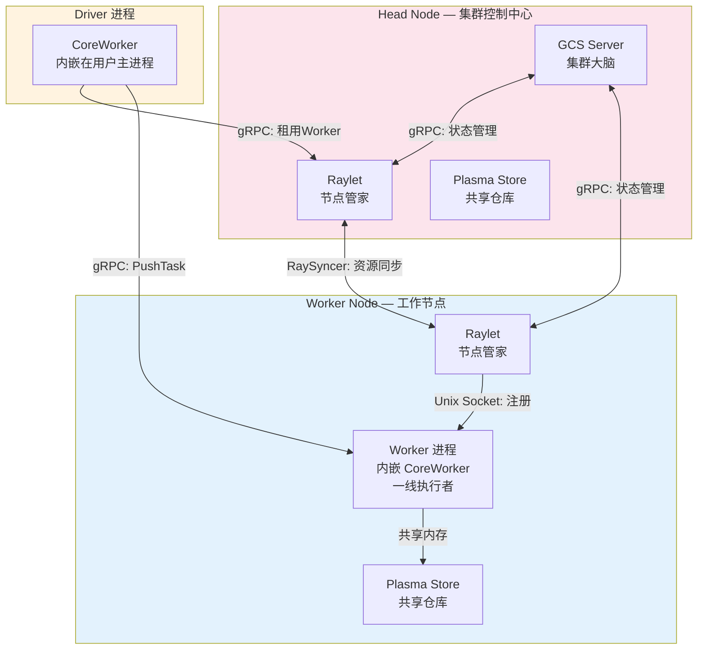
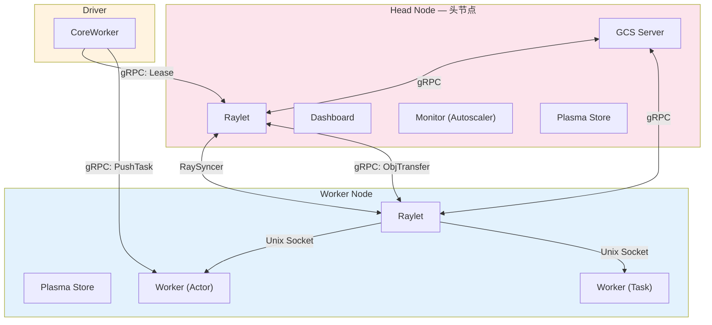
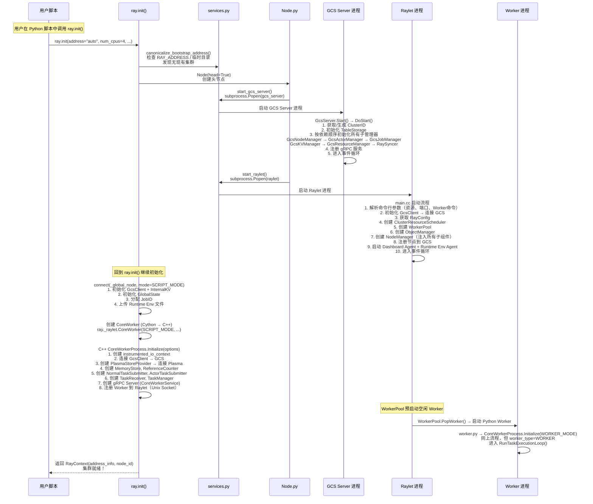
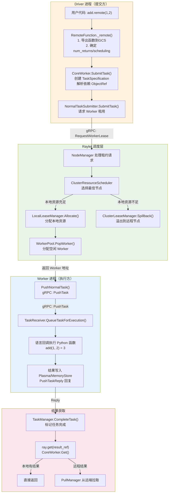
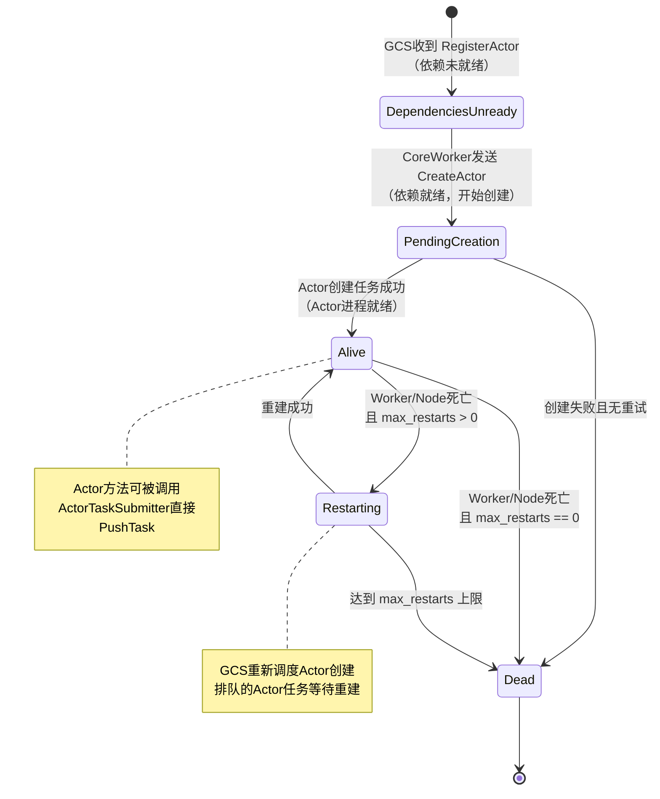
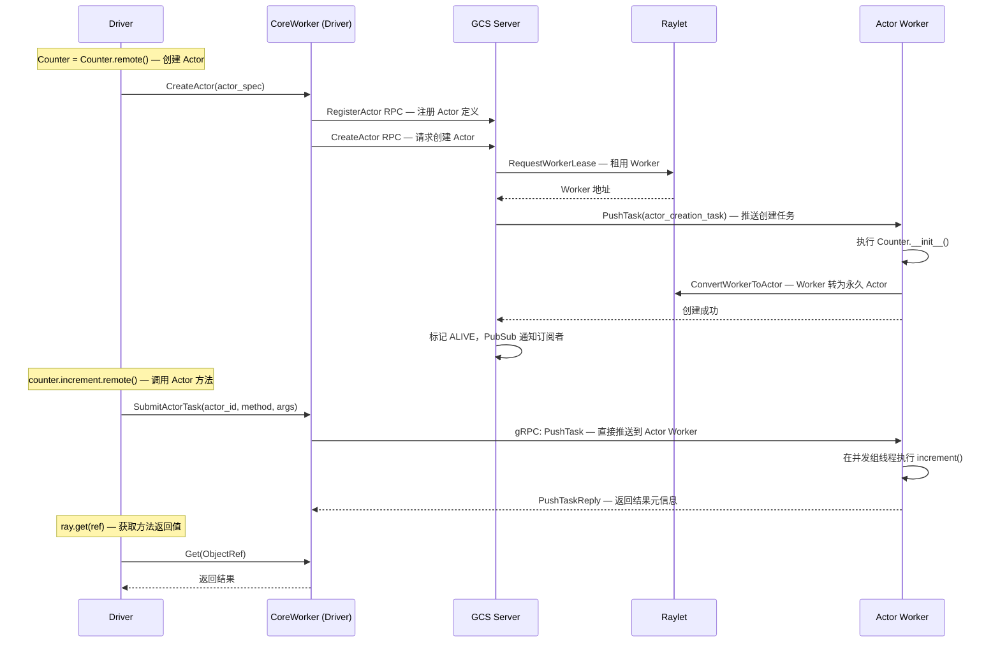

# Ray 核心运行时架构概览

> 本文档为 Ray 核心运行时的全局架构概览。与 [RDT 代码级深度解析](direct-transport/rdt-architecture-analysis.md) 形成互补：本文提供全局视角，RDT 文档提供局部深度。
> 推荐阅读顺序：先读本文档建立全局认知 → 再读 RDT 架构分析深入理解 Tensor 传输子系统。

---

## 本章导读

**总述**：Ray 是一个面向 AI 和通用分布式计算的开源统一框架。它的核心设计目标是让开发者能够用极简的 API 将单机 Python 程序无缝扩展到大规模集群。本章将从"鸟瞰"的视角，全面介绍 Ray 的四层架构设计、五大核心组件（GCS、Raylet、CoreWorker、Object Store、RPC 通信层）、集群组成与通信机制，并通过 `ray.init()` 的初始化流程和 `ray.remote()` 的任务执行流程追踪其完整运行路径。读完本章，你将建立起对 Ray 整体架构的全局认知，为后续深入各子系统（如 RDT 带外传输）打下坚实基础。

---

## 1.1 Ray 的四层架构设计

### 1.1.1 What：四层架构是什么？

Ray 的统一计算框架由四个层次组成，每一层面向不同的用户群体和使用场景：

```
┌─────────────────────────────────────────────────────────┐
│                  Ray AI Libraries（第四层）               │
│  ┌─────────┐ ┌─────────┐ ┌──────┐ ┌──────┐ ┌─────────┐ │
│  │Ray Data │ │Ray Train│ │ Tune │ │Serve │ │  RLlib  │ │
│  └─────────┘ └─────────┘ └──────┘ └──────┘ └─────────┘ │
├─────────────────────────────────────────────────────────┤
│                   Ray Core（第三层）                      │
│  ┌──────────────────────────────────────────────────┐   │
│  │  Tasks (远程函数)  │  Actors (有状态服务)         │   │
│  │  Objects (分布式对象) │  Placement Groups         │   │
│  └──────────────────────────────────────────────────┘   │
├─────────────────────────────────────────────────────────┤
│               CoreWorker 运行库（第二层）                 │
│  ┌──────────────────────────────────────────────────┐   │
│  │  任务提交/执行 │ 引用计数 │ 对象存取 │ Actor管理  │   │
│  └──────────────────────────────────────────────────┘   │
├─────────────────────────────────────────────────────────┤
│              Ray Clusters（第一层）                       │
│  ┌──────────────────────────────────────────────────┐   │
│  │  Head Node (GCS Server, Dashboard)               │   │
│  │  Worker Nodes (Raylet, Object Store, Workers)    │   │
│  │  Autoscaler (弹性伸缩)                            │   │
│  └──────────────────────────────────────────────────┘   │
└─────────────────────────────────────────────────────────┘
```

**第一层：Ray Clusters（集群基础设施层）**

这是整个系统的物理基础。一个 Ray 集群由一个 Head Node（头节点）和若干 Worker Node（工作节点）组成。头节点上运行着全局控制服务（GCS Server）和 Dashboard 等管理组件；每个工作节点上运行着 Raylet（节点管理器）、Object Store（对象存储）以及实际执行任务的 Worker 进程。集群可以是固定大小的，也可以根据应用需求通过 Autoscaler 自动弹性伸缩。

**第二层：CoreWorker 运行库（进程运行库层）**

这是 Ray 的进程级运行基础。每个 Worker 和 Driver 进程内部都嵌入了一个 CoreWorker 实例——它用 C++ 实现，通过 Cython 绑定暴露给 Python。CoreWorker 负责任务提交与执行、对象存取、引用计数、Actor 句柄管理等所有核心操作。它是连接上层 Python API 与下层集群基础设施的桥梁。

**第三层：Ray Core（核心计算原语层）**

这是 Ray 的编程模型核心。它提供了四个基本抽象：
- **Tasks**：无状态的远程函数调用，是并行计算的基本单位
- **Actors**：有状态的计算实体，可以持有和修改内部状态
- **Objects**：分布式共享对象，通过 ObjectRef（对象引用）进行访问
- **Placement Groups**：资源组管理，用于协调多个 Task/Actor 的放置

**第四层：Ray AI Libraries（AI 应用库层）**

构建在 Ray Core 之上的领域专用库，为常见的 ML 工作负载提供高级抽象：
- Ray Data：可伸缩的数据加载与转换
- Ray Train：分布式模型训练
- Ray Tune：超参数调优
- Ray Serve：在线模型服务
- RLlib：强化学习

### 1.1.2 Why：为什么采用四层架构？

四层架构的设计解决了分布式计算中的几个核心矛盾：

**矛盾一：通用性 vs 易用性**

分布式系统通常面临一个两难选择：要么提供非常底层的 API（如 MPI），灵活但难用；要么提供高度封装的 API（如 Spark），易用但不灵活。Ray 通过分层来同时满足两者：Core 层提供足够通用的原语，Libraries 层为特定场景提供开箱即用的体验。

**矛盾二：性能 vs 可扩展性**

底层的 Clusters 层和 CoreWorker 层使用 C++ 实现关键路径（GCS、Raylet、Object Store），保证了高性能。上层通过 Python 接口暴露功能，保证了可扩展性。这种"C++ 内核 + Python 外壳"的模式，让 Ray 既快又灵活。

**矛盾三：独立性 vs 统一性**

每一层都可以独立使用——你可以只用 Ray Core 来做通用分布式计算，也可以只用 Ray Serve 来做模型服务。但当你需要构建端到端的 ML Pipeline 时，四层之间又能无缝集成，这就是"统一框架"的含义。

### 1.1.3 How：四层如何协同工作？

让我们用一个具体的场景来说明四层如何协同：

```python
import ray
from ray import train
from ray.train.torch import TorchTrainer

# 第一层：初始化集群
ray.init()  # 连接到 Ray 集群，启动 GCS/Raylet 等进程

# 第二层：CoreWorker 运行库自动桥接 Python ↔ C++
# 第四层：使用 Ray Train 库
def train_func():
    # 第三层：Ray Core 自动管理 Task/Actor 分发和数据传输
    model = ...
    for epoch in range(10):
        train.report({"loss": loss})

trainer = TorchTrainer(
    train_func,
    scaling_config=train.ScalingConfig(num_workers=4, use_gpu=True)
)
result = trainer.fit()
```

在这个例子中：
- `ray.init()` 启动集群基础设施（第一层），建立与 GCS 的连接
- CoreWorker 运行库（第二层）通过 Cython 桥接 Python 调用到 C++ 核心
- Ray Core（第三层）的 Actor/Task 被 TorchTrainer 内部使用来创建训练 Worker 和协调训练步骤
- TorchTrainer 是 Ray Train 库（第四层），封装了分布式训练的复杂逻辑

---

## 1.2 核心组件介绍

### 1.2.1 全局视角：五大组件的关系

在深入每个组件之前，先从全局视角理解它们之间的关系：



五大组件各司其职：

| 组件 | 职责 | 类比 | 实现语言 |
|---|---|---|---|
| **GCS** | 全局元数据管理与协调 | 公司总部 | C++ |
| **Raylet** | 单节点资源与任务管理 | 分公司经理 | C++ |
| **CoreWorker** | 任务提交/执行引擎 | 一线员工 | C++ + Cython |
| **Object Store** | 共享内存对象存储 | 共享仓库 | C++ |
| **RPC 通信层** | gRPC 基础设施 | 通信网络 | C++ |

### 1.2.2 GCS（Global Control Service）—— 集群大脑

#### What：GCS 是什么？

GCS 是 Ray 集群的"大脑"，运行在头节点上，负责管理整个集群的全局状态。它是一个中心化的元数据服务，存储和管理所有集群级别的信息——从节点注册到 Actor 生命周期，从 Job 管理到内部 KV 存储。

从源码 `src/ray/gcs/gcs_server.h` 可以看到其核心定义：

```cpp
class GcsServer {
 public:
  GcsServer(const GcsServerConfig &config,
            const ray::gcs::GcsServerMetrics &metrics,
            instrumented_io_context &main_service);

  void Start();   // 启动 GCS 服务
  void Stop();    // 停止 GCS 服务
};
```

#### GCS 内部的核心子系统

```
GCS Server 内部结构
├── GcsNodeManager        → 节点注册、心跳、故障检测
├── GcsActorManager       → Actor 生命周期管理（状态机驱动）
│   └── GcsActorScheduler → Actor 创建调度（租用Worker → 推送创建任务）
├── GcsJobManager         → Job 作业管理
├── GcsWorkerManager      → Worker 进程管理
├── GcsResourceManager    → 集群资源视图管理（供 Autoscaler 使用）
├── GcsPlacementGroupManager → Placement Group 管理
│   └── GcsPGScheduler    → PG bundle 调度（在 Raylet 上预留资源）
├── GcsTaskManager        → 任务事件管理
├── GcsTableStorage       → 持久化存储（内存或 Redis）
├── GcsKVManager          → 内部 KV 存储（配置/集群ID持久化）
├── GcsPublisher          → 事件发布（PubSub）
├── GcsHealthCheckManager → 健康检查（心跳检测）
└── RuntimeEnvHandler     → Runtime Env 管理
```

#### Why：为什么需要 GCS？

在分布式系统中，需要一个"单一事实来源"（Single Source of Truth）来维护全局一致的状态。GCS 就扮演了这个角色。没有 GCS，各节点之间需要通过复杂的分布式一致性协议来达成共识，这会带来巨大的复杂性和性能开销。

GCS 的中心化设计带来的好处：
- **简化设计**：全局状态集中管理，避免分布式一致性问题
- **快速故障检测**：通过心跳机制快速发现节点故障
- **全局优化**：掌握全局资源视图，可以做出更优的调度决策
- **易于扩展**：新增元数据类型只需添加新的管理器

当然，中心化也意味着 GCS 是一个潜在的瓶颈和单点故障。Ray 通过以下方式缓解：GCS 只管理元数据（控制面），不参与数据传输（数据面）；GCS 可以配置 Redis 持久化实现高可用。

#### How：GCS 如何工作？

GCS 通过 gRPC 提供服务接口，各组件通过 `GcsClient` 与之通信。GCS 支持两种存储后端：

```cpp
enum class StorageType {
    UNKNOWN = 0,
    IN_MEMORY = 1,       // 内存存储（默认）
    REDIS_PERSIST = 2,   // Redis 持久化存储（生产环境推荐）
};
```

GCS 还实现了 PubSub 机制，当元数据发生变化时（如节点加入/离开、Actor 状态变化），GCS 会将事件广播给所有订阅者。这使得 CoreWorker 和 Raylet 能够实时感知集群状态变更，而不需要频繁轮询。

### 1.2.3 Raylet —— 节点管家

#### What：Raylet 是什么？

Raylet 是运行在每个节点上的核心守护进程，相当于每个节点的"管家"。它负责本节点的资源管理、任务调度和对象管理。一个 Raylet 实例包含两个核心子系统：NodeManager（调度和资源管理）和 ObjectManager（对象传输管理）。

从源码 `src/ray/raylet/node_manager.h` 可以看到其核心结构：

```cpp
class NodeManager : public rpc::NodeManagerServiceHandler,
                     public syncer::ReporterInterface,
                     public syncer::ReceiverInterface {
 public:
  NodeManager(
      instrumented_io_context &io_service,
      const NodeID &self_node_id,
      const NodeManagerConfig &config,
      gcs::GcsClient &gcs_client,
      ClusterResourceScheduler &cluster_resource_scheduler,
      LocalLeaseManagerInterface &local_lease_manager,
      ClusterLeaseManagerInterface &cluster_lease_manager,
      WorkerPoolInterface &worker_pool,
      // ... 更多依赖注入参数
  );
};
```

#### Raylet 内部的关键子系统

```
Raylet 内部结构
├── NodeManager              → 节点中央协调器（顶层类）
├── ClusterResourceScheduler → 集群资源调度器
│   ├── LocalResourceManager  → 本地资源管理
│   ├── ClusterResourceManager → 集群资源管理
│   └── CompositeSchedulingPolicy → 策略路由
│       ├── HybridSchedulingPolicy    → 默认混合策略
│       ├── SpreadSchedulingPolicy    → 均匀散布策略
│       ├── NodeAffinitySchedulingPolicy → 节点亲和策略
│       └── NodeLabelSchedulingPolicy    → 标签调度策略
├── ClusterLeaseManager     → 集群 Lease 管理（溢回调度）
├── LocalLeaseManager       → 本地 Lease 管理（分配本地Worker）
├── LeaseDependencyManager  → 任务依赖管理（等待对象变本地）
├── WorkerPool              → Worker 进程池（启动/注册/租用/回收）
├── ObjectManager           → 对象管理（跨节点 Pull/Push）
│   ├── PullManager          → 拉取管理（优先级：GET > WAIT > TASK）
│   ├── PushManager          → 推送管理（流量控制+分块传输）
│   └── ObjectBufferPool    → 对象缓冲区池
├── LocalObjectManager      → 本地对象管理（Pin/Spill/Free）
├── PlacementGroupResourceManager → PG 资源管理（bundle预留/提交）
├── WaitManager             → ray.wait() 管理
├── AgentManager            → 子进程管理（Dashboard Agent + Runtime Env Agent）
└── RaySyncer                → 集群资源视图同步（双向gRPC流）
```

#### Why：为什么需要 Raylet？

Raylet 的存在解决了一个关键的架构问题：**去中心化调度**。如果所有任务调度都由 GCS 集中处理，GCS 将成为瓶颈。Raylet 实现了"本地优先"的调度策略——大部分任务可以在本地完成调度和执行，只有在本地资源不足时才需要跨节点协调（溢回 Spillback）。

这种分布式调度架构使 Ray 能够达到极高的任务吞吐量（每秒百万级任务）。GCS 只需要管理元数据（哪些节点活着、哪些 Actor 存在），而实际的调度决策分散在每个 Raylet 上。

#### How：Raylet 如何工作？

Raylet 的核心工作流程是 **Lease（租约）机制**：

1. CoreWorker 提交任务时，先向本地 Raylet 请求一个 Worker Lease
2. Raylet 的 ClusterResourceScheduler 评估本地和远程节点的资源
3. 如果本地资源充足，分配本地 Worker 执行任务
4. 如果本地资源不足，将任务"溢出"（Spillback）到其他节点

### 1.2.4 CoreWorker —— 进程引擎核心

#### What：CoreWorker 是什么？

CoreWorker 是 Ray 的任务执行引擎，每个 Worker 进程（包括 Driver 进程）内部都运行着一个 CoreWorker 实例。它是连接 Python 用户代码和底层 C++ 基础设施的桥梁。

从 `src/ray/core_worker/core_worker.h` 可以看到其定义：

```cpp
/// The root class that contains all the core and language-independent
/// functionalities of the worker.
class CoreWorker : public std::enable_shared_from_this<CoreWorker> {
 public:
  // 任务提交
  std::vector<rpc::ObjectReference> SubmitTask(...);
  Status SubmitActorTask(...);

  // 对象操作
  Status Put(const RayObject &object, ...);
  Status Get(const std::vector<ObjectID> &ids, ...);

  // 执行循环
  void RunTaskExecutionLoop();
};
```

#### CoreWorker 的双重角色

CoreWorker 扮演着两个角色：

**1. 任务提交者（Driver/Submitter 角色）**
- 序列化函数和参数
- 构建 TaskSpecification
- 通过 NormalTaskSubmitter/ActorTaskSubmitter 提交任务
- 管理 ObjectRef 的引用计数

**2. 任务执行者（Worker/Executor 角色）**
- 接收来自其他 CoreWorker 推送的任务（通过 TaskReceiver）
- 反序列化函数和参数
- 执行用户代码（通过语言回调桥接到 Python）
- 存储计算结果到 Object Store

#### CoreWorker 内部的核心子系统

```
CoreWorker 内部结构
├── NormalTaskSubmitter    → 普通任务提交器（租用Worker → PushTask）
├── ActorTaskSubmitter     → Actor 任务提交器（直接PushTask到Actor）
├── TaskReceiver            → 任务接收与执行引擎
│   ├── NormalTaskExecutionQueue   → 普通任务执行队列
│   ├── OrderedActorTaskQueue     → Actor 顺序执行队列
│   └── ConcurrencyGroupManager  → 并发组线程池管理
├── TaskManager            → 任务状态追踪（完成/失败/重试）
├── ReferenceCounter       → 分布式引用计数（对象生命周期管理）
├── ActorManager           → Actor 句柄管理（ActorHandle 注册/查找）
├── ObjectRecoveryManager  → 对象恢复（丢失对象重建）
├── FutureResolver         → Future 解析（跨进程获取ObjectRef值）
├── CoreWorkerMemoryStore  → 进程内对象存储（小对象）
├── PlasmaStoreProvider    → Plasma 存储提供者（大对象）
├── CoreWorkerProcess      → 进程级生命周期管理
└── gRPC Server             → CoreWorkerService 服务端
```

#### Why：为什么需要 CoreWorker？

CoreWorker 的设计解决了 Ray **多语言支持**的关键问题。Ray 的核心逻辑（调度、对象管理、引用计数等）都实现在 C++ 的 CoreWorker 中，不同语言（Python、Java、C++）只需要实现一个薄薄的语言绑定层即可复用全部核心功能。

对于 Python 来说，这个绑定层是 `python/ray/_raylet.pyx`（Cython 实现），它将 Python 的函数调用转发给 C++ 的 CoreWorker。这意味着你在 Python 中调用的 `ray.get()`、`ray.put()`、`f.remote()` 等 API，最终都由 C++ CoreWorker 执行——Python 层只是一个薄薄的代理。

#### How：CoreWorker 如何工作？

CoreWorker 的核心是一个事件循环（event loop），基于 `instrumented_io_context`（封装了 Boost.Asio 的 `io_context`）。所有 I/O 操作（gRPC 请求、对象存取、引用计数通知）都通过异步回调在这个事件循环上处理。

对于 Driver 进程，CoreWorker 初始化后直接返回——Driver 运行自己的代码。对于 Worker 进程，CoreWorker 进入 `RunTaskExecutionLoop()`，阻塞等待并执行推送过来的任务。

### 1.2.5 Object Store —— 共享仓库

#### What：Object Store 是什么？

Object Store 是 Ray 的分布式共享内存系统，基于 Apache Arrow 项目的 Plasma 实现。它为同一节点上的所有 Worker 提供了一个高效的共享内存空间，使得对象可以在不同 Worker 之间零拷贝传输。跨节点的对象传输则由 ObjectManager 负责。

Object Store 分为两层：

```
Object Store 层次结构
├── CoreWorkerMemoryStore（进程内层）
│   → 小对象/内联对象/Future
│   → 键=ObjectID, 值=RayObject
│   → 极低延迟，无需共享内存
│
├── Plasma Store（节点级层）
│   ├── ObjectStore          → 共享内存对象管理
│   ├── PlasmaAllocator      → 内存分配器
│   ├── EvictionPolicy       → LRU 淘汰策略
│   ├── ObjLifecycleManager  → 对象生命周期管理
│   ├── CreateRequestQueue   → 创建请求队列
│   └── GetRequestQueue      → 获取请求队列
│
└── ObjectManager（跨节点层）
    ├── PullManager          → 对象拉取管理（优先级调度）
    ├── PushManager          → 对象推送管理（流量控制）
    ├── ObjectBufferPool     → 对象缓冲区池
    └── ObjectDirectory      → 对象位置目录（基于Owner订阅）
```

#### Why：为什么需要 Object Store？

在分布式计算中，数据传输往往是性能瓶颈。Object Store 通过以下方式解决这个问题：

- **共享内存零拷贝**：同一节点上的多个 Worker 可以直接读取同一块内存，无需复制
- **延迟获取**：对象只有在被使用时才会从远程节点传输（Pull-based）
- **自动溢出**：当内存不足时，对象可以溢出到磁盘或远程存储
- **所有权追踪**：通过引用计数自动管理对象的生命周期

Ray 根据对象大小使用不同的存储策略：

| 对象大小 | 存储位置 | 传输方式 | 性能特点 |
|---|---|---|---|
| 小对象（< 100KB） | CoreWorker MemoryStore | 内联在任务结果中 | 极低延迟 |
| 大对象（≥ 100KB） | Plasma 共享内存 | 通过共享内存或网络 | 零拷贝 |

小对象直接嵌入在 gRPC 消息中传输，避免了共享内存的额外开销。大对象则存储在 Plasma 中，通过共享内存实现零拷贝读取。

#### How：Object Store 如何工作？

**put 流程**：用户 `ray.put(obj)` → CoreWorker 序列化 → 小对象写入 MemoryStore / 大对象写入 Plasma → 注册到 ReferenceCounter 作为 Owner。

**get 流程**：用户 `ray.get(ref)` → CoreWorker 检查 → 本地 MemoryStore 直接返回（小对象） / Plasma 共享内存读取（大对象） / 触发 PullManager 从远程节点拉取（远程对象）。

**跨节点传输**：PullManager 发起 Pull 请求 → 远端 ObjectManager 从 Plasma 读出数据 → 分块 gRPC 传输 → 本地写入 Plasma → Seal 完成后可见。

### 1.2.6 RPC 通信层 —— 通信基础设施

Ray 的所有核心组件通过 gRPC 通信。RPC 通信层提供了通用服务端/客户端基础设施，支持认证、限流、指标采集、混沌测试。

关键基础设施类：
- `GrpcServer`：通用 gRPC 服务端，支持 CompletionQueue 异步处理和多服务注册
- `GrpcClient<GrpcService>`：通用 gRPC 客户端模板，支持异步 RPC 调用和客户端池
- `ClientCallManager`：管理出站 gRPC 调用，回调通过 io_context 投递回调用方
- `AuthenticationToken`：Token 认证（所有新 gRPC 端点必须支持认证）

Ray 定义了多个 gRPC 服务，对应不同的组件通信场景：

| 服务 | 服务端 | 关键 RPC | 用途 |
|---|---|---|---|
| `NodeManagerService` | Raylet | RequestWorkerLease, ReturnWorkerLease | Worker 租用/回收 |
| `CoreWorkerService` | CoreWorker | PushTask, GetObjectStatus, WaitForRefRemoved | 任务推送、引用通知 |
| `ObjectManagerService` | Raylet | PushObject, PullObject, FreeObjects | 跨节点对象传输 |
| `GcsService` | GCS | RegisterActor, CreateActor, InternalKVGet/Put | 全局状态管理 |
| `RaySyncerService` | GCS+Raylet | StartSync（双向流） | 集群资源同步 |

---

## 1.3 集群的组成与通信机制

### 1.3.1 集群拓扑结构

一个典型的 Ray 集群由以下部分组成：

**Head Node（头节点）**——集群控制中心，除了运行普通的 Raylet 和 Object Store 外，还额外运行：
- GCS Server：全局控制服务
- Dashboard：Web 监控界面
- Dashboard Agent：指标收集代理
- Autoscaler（可选）：自动伸缩控制器

**Worker Node（工作节点）**——每个工作节点运行：
- Raylet：节点管理器（包含本地调度器）
- Object Store：Plasma 共享内存对象存储
- Worker 进程：实际执行任务的进程，每个 Worker 内部有一个 CoreWorker

**Driver 进程**——用户的主程序进程（即调用 `ray.init()` 的进程）。Driver 也内嵌一个 CoreWorker，但它只提交任务，不接收和执行任务。



### 1.3.2 通信协议与机制

Ray 集群内部使用多种通信机制，各有其适用场景：

**1. gRPC —— 跨进程/跨节点控制通信**

gRPC 是 Ray 的主要 RPC 框架，用于所有的控制面通信：

```
gRPC 通信关系
├── CoreWorker ←→ GCS Server
│   ├── RegisterActor, CreateActor
│   ├── InternalKVGet/Put/Del
│   └── GcsSubscribe (PubSub 订阅)
├── CoreWorker ←→ Raylet
│   ├── RequestWorkerLease (租用Worker)
│   ├── ReturnWorkerLease (归还Worker)
│   └── PinObjectIDs (固定对象)
├── CoreWorker ←→ CoreWorker
│   ├── PushTask (推送任务)
│   ├── GetObjectStatus (查询对象状态)
│   └── WaitForRefRemoved (引用移除通知)
├── Raylet ←→ GCS Server
│   ├── RegisterNode (注册节点)
│   └── 资源上报
└── Raylet ←→ Raylet
    ├── ForwardTask (溢回转发)
    └── PushObject / PullObject (对象传输)
```

**2. 共享内存 —— 同节点数据传输**

同一节点上的 Worker 通过 Plasma 共享内存传输大对象，避免序列化和网络开销：

```
Worker 1 ──写入──→ Plasma Store ←──读取── Worker 2
                     (共享内存 /dev/shm)
```

**3. Unix Domain Socket —— 本地进程通信**

Worker 与本地 Raylet 之间使用 Unix Domain Socket 进行高效的本地进程通信，用于 Worker 注册、Wait、AsyncGet 等高频低延迟操作，避免 gRPC 的额外开销。

**4. RaySyncer —— 集群状态同步**

RaySyncer 是 Ray 的集群状态同步协议，使用 gRPC 双向流在各 Raylet 之间高效同步资源视图。Raylet 的 LocalResourceManager 实现 `syncer::ReporterInterface`，报告本地资源状态；Raylet 也实现 `syncer::ReceiverInterface`，消费其他节点的资源更新。这种设计使每个 Raylet 都能掌握全集群的资源视图，做出本地调度决策。

### 1.3.3 通信的设计哲学

Ray 的通信设计遵循几个关键原则：

**原则一：数据面与控制面分离**
- 控制面（任务调度、元数据）走 gRPC
- 数据面（对象传输）走共享内存或直接网络传输
- 这样可以分别优化两条路径——控制面需要可靠性，数据面需要吞吐量

**原则二：本地优先**
- 同节点通信优先使用共享内存（零拷贝）
- 任务优先在本地调度和执行
- 减少不必要的网络通信——只有溢回时才跨节点

**原则三：所有权驱动**
- 对象的创建者拥有对象的所有权
- 引用计数由所有者维护（分布式 GC）
- 这避免了需要全局一致性协议来管理对象生命周期

---

## 1.4 从 ray.init() 看集群初始化

### 1.4.1 ray.init() 的完整启动流程

让我们追踪 `ray.init()` 的完整执行路径，看看一个 Ray 集群是如何从零启动到就绪的：



这个启动流程的关键步骤可以概括为：

1. **Python 发现/创建集群**：检查 RAY_ADDRESS 环境变量和临时目录，判断是否连接已有集群或启动新集群
2. **启动 GCS Server**：通过 subprocess.Popen 启动 C++ 二进制，GCS 初始化所有子管理器
3. **启动 Raylet**：同样通过 subprocess 启动，Raylet 连接 GCS、创建所有子组件、注册节点
4. **创建 Driver CoreWorker**：通过 Cython 桥接创建 C++ CoreWorker，连接 GCS/Raylet/Plasma
5. **预启动 Worker**：Raylet 的 WorkerPool 预启动空闲 Python Worker，Worker 内嵌 CoreWorker 并进入任务执行循环

---

## 1.5 从 ray.remote() 看任务执行

### 1.5.1 示例代码

让我们通过一个最简单的例子来追踪 Ray 的完整任务执行流程：

```python
import ray

ray.init()  # 步骤1：初始化集群

@ray.remote  # 步骤2：定义远程函数
def add(a, b):
    return a + b

result_ref = add.remote(1, 2)  # 步骤3：提交远程任务

result = ray.get(result_ref)    # 步骤4：获取结果
print(result)  # 输出: 3
```

### 1.5.2 任务提交到执行的完整路径

当调用 `add.remote(1, 2)` 时，真正的分布式计算流程开始了：



**步骤3详解：`add.remote(1, 2)` 的提交流程**

1. `RemoteFunction._remote()` 首先导出函数到 GCS（如果是首次调用）
2. 序列化参数 `[1, 2]`，构建 `TaskSpecification`
3. 调用 `worker.core_worker.submit_task()` —— Cython 桥接到 C++
4. C++ CoreWorker 的 `NormalTaskSubmitter` 向 Raylet 请求 Worker Lease
5. Raylet 的 `ClusterResourceScheduler` 评估资源，本地分配或溢回
6. `WorkerPool.PopWorker()` 分配一个空闲 Worker
7. `NormalTaskSubmitter.PushNormalTask()` 通过 gRPC 推送任务到 Worker
8. Worker 的 `TaskReceiver` 接收任务，通过语言回调执行 `add(1, 2)`
9. 结果 `3` 写入 Plasma 或 MemoryStore，`PushTaskReply` 回复
10. `TaskManager` 标记任务完成，Driver 的 `ray.get()` 获取结果

---

## 1.6 Actor 的生命周期

### 1.6.1 Actor 状态机

Actor 的生命周期是一个严格定义的状态机，由 GCS 的 `GcsActorManager` 驱动：



**状态解释**：
- **DEPENDENCIES_UNREADY**：Actor 创建函数的依赖 ObjectRef 尚未就绪（比如需要先 ray.get() 某些参数）
- **PENDING_CREATION**：依赖就绪，GCS 开始调度 Actor 创建——向 Raylet 租用 Worker，推送创建任务
- **ALIVE**：Actor 创建成功，Worker 转为永久 Actor 进程，方法可以被远程调用
- **RESTARTING**：Actor 所在的 Worker/Node 死亡，GCS 尝试在其他节点重建
- **DEAD**：Actor 终止，不再可用

### 1.6.2 Actor 创建与调用流程



**关键设计点**：
- Actor 创建通过 GCS 调度——GCS 是 Actor 生命周期的唯一管理者
- Actor 方法调用**不经过 GCS**——CoreWorker 直接通过 gRPC PushTask 到 Actor Worker，实现亚毫秒延迟
- Actor 方法默认在主线程顺序执行（单线程模型），也可通过并发组在独立线程池执行
- Detached Actor（`lifetime="detached"`）不受 Owner 死亡影响，可以被其他 Job 发现和使用

---

## 1.7 对象管理与引用计数

### 1.7.1 What：分布式对象管理是什么？

Ray 的对象管理由两层存储 + 分布式引用计数 + 对象恢复机制三部分组成。

**两层存储**已经在 1.2.5 介绍过：MemoryStore（进程内小对象）+ Plasma（共享内存大对象）。

**分布式引用计数**是 Ray 对象生命周期管理的核心机制。每个 ObjectRef 都有一个"Owner"——创建它的进程。Owner 维护该对象的引用计数，包括：
- **本地引用**：Python 层的 ObjectRef 变量
- **借用引用**：ObjectRef 被序列化传递给其他进程时产生的引用

当所有引用都消失时，对象可以被安全地垃圾回收。

**对象恢复机制**则负责处理对象丢失的情况——当对象不在任何节点上时，通过重新执行创建任务（Lineage Reconstruction）来恢复。

### 1.7.2 Why：为什么需要分布式引用计数？

如果只依赖 Python 的本地引用计数，分布式场景下会出现问题：一个 Worker 持有的 ObjectRef 可能被序列化传给了另一个 Worker，但原 Worker 不知道对方是否还在使用。如果原 Worker 过早释放对象，远程 Worker 就会发现对象消失了。

Ray 的解决方案是**分布式引用计数协议**：
1. 当 ObjectRef 被传递给另一个进程时，原进程（Owner）记录一个"借用"（borrow）
2. 借用方通过 `WaitForRefRemoved` gRPC 连接通知 Owner："我还在用"
3. 当借用方的 Python 引用消失时，它通知 Owner："我不再用了"
4. 当 Owner 的本地引用和所有借用引用都消失时，Owner 释放对象

这种设计避免了全局一致性协议（如分布式 GC），将对象生命周期管理分散到各个 Owner，保持了高效和简洁。

### 1.7.3 How：引用计数如何工作？

```mermaid
flowchart TB
    subgraph PutFlow["ray.put() — 存入"]
        A1["ray.put(obj)"] --> A2["CoreWorker.Put() 序列化"]
        A2 -->|"小对象"| A3["MemoryStore.Put()"]
        A2 -->|"大对象"| A4["Plasma.Create() + Seal()"]
        A4 --> A5["RefCounter.AddOwnedObject()<br>注册为 Owner"]
    end

    subgraph RefCount["引用计数协议"]
        C1["Owner 进程"] --> C2["ReferenceCounter<br>local_ref + borrowers 列表"]
        C2 -->|"传递ObjectRef时"| C3["AddBorrower()<br>记录借用方地址"]
        C3 -->|"借用方使用完毕"| C4["借用方通知 Owner<br>RefRemoved"]
        C4 -->|"所有引用归零"| C5["Owner 释放对象<br>Delete + FreeObject"]
    end

    subgraph Recovery["对象恢复"]
        D1["Get() 发现对象不在本地"] --> D2["ObjectRecoveryManager"]
        D2 -->|"有其他副本"| D3["PinExistingCopy()<br>从其他节点获取"]
        D2 -->|"无副本"| D4["ReconstructObject()<br>重新执行创建任务"]
        D4 --> D5["递归恢复依赖对象<br>→ 结果写入 Plasma"]
    end

    style PutFlow fill:#fff3e0
    style RefCount fill:#e8f5e9
    style Recovery fill:#fce4ec
```



---

## 1.8 核心设计模式

Ray 的核心架构围绕几个关键设计模式构建。理解这些模式，就能理解 Ray 为什么是这样设计的。

### 1.8.1 Actor 模式

**核心机制**：状态封装在独立进程中，方法顺序执行，通过代理调用。

**Ray 实现**：`@ray.remote` 装饰类 → ActorClass → GCS 状态机管理生命周期 → ActorHandle 代理 → ActorTaskSubmitter 直接 PushTask。

**为什么选择 Actor 模式**：ML 工作负载天然需要有状态的实体（模型权重、环境状态、数据库连接）。Actor 提供了一种自然的方式来封装这些状态，同时保持方法调用的顺序性（避免并发竞争）。

### 1.8.2 Future/ObjectRef 模式

**核心机制**：延迟引用，值可能尚未计算，通过 `get()` 阻塞获取。

**Ray 实现**：`f.remote()` 返回 ObjectRef → `ray.get()` 阻塞等待 → TaskManager 追踪完成状态 → FutureResolver 跨进程解析。

**为什么选择 Future 模式**：分布式计算中，结果往往还在远端计算中。Future/ObjectRef 让调用方可以立即拿到一个引用继续工作，只在真正需要值时才阻塞等待，最大化并行度。

### 1.8.3 分布式调度模式（层级 + 溢回）

**核心机制**：本地优先调度，资源不足时溢回到远程节点。

**Ray 实现**：NormalTaskSubmitter → RequestWorkerLease → ClusterResourceScheduler（策略选择） → 本地分配或 Spillback → WorkerPool 提供 Worker。

**为什么选择层级调度**：集中式调度（所有请求都到 GCS）会成为瓶颈。Ray 的层级调度将大部分决策分散到每个 Raylet，GCS 只管理 Actor/PG 等需要全局协调的调度。

### 1.8.4 Pub-Sub 模式

**核心机制**：状态变更实时通知订阅者，长轮询 + 命令批处理。

**Ray 实现**：GcsPublisher 发布 Actor/Node/Job 状态 → GcsSubscriber 订阅 → CoreWorker/Raylet 收到通知后响应。

**为什么选择 Pub-Sub**：轮询 GCS 获取状态变更效率低。Pub-Sub 让状态变更主动推送，CoreWorker 可以即时感知 Actor 死亡、节点加入等事件，做出快速响应。

### 1.8.5 事件驱动模式

**核心机制**：所有 I/O 和 RPC 通过异步事件循环处理。

**Ray 实现**：Boost.Asio `instrumented_io_context` → gRPC CompletionQueue → PeriodicalRunner 定时任务 → 回调驱动。

**为什么选择事件驱动**：Ray 的每个组件都需要同时处理大量并发请求（gRPC RPC、对象传输、心跳等）。事件驱动模式让单个线程就能高效处理数千并发连接，避免了多线程的复杂性和开销。

### 1.8.6 Lease（租约）模式

**核心机制**：任务提交者向 Raylet 租用 Worker，租约到期归还。

**Ray 实现**：CoreWorker → RequestWorkerLease → Raylet 分配 Worker → CoreWorker 直接 PushTask → 任务完成 → ReturnWorkerLease。

**为什么选择 Lease 模式**：将调度决策（Raylet 选择哪个节点）和任务执行（CoreWorker 直接推送任务）解耦。Raylet 只负责"分配资源"，CoreWorker 只负责"执行任务"。空闲 Worker 可以被同一提交者复用，减少租用开销。

### 1.8.7 策略模式（调度策略）

**核心机制**：调度策略可插拔替换，通过 Composite 路由到不同实现。

**Ray 实现**：`CompositeSchedulingPolicy` → HybridSchedulingPolicy / SpreadSchedulingPolicy / NodeAffinitySchedulingPolicy / NodeLabelSchedulingPolicy。

**为什么选择策略模式**：不同场景需要不同调度策略——训练任务需要 GPU 亲和，Serve 部署需要节点散布，调试任务需要指定节点。策略模式让这些需求通过同一入口统一处理，保持架构简洁。

---

## 1.9 组件通信矩阵

所有核心组件间的 gRPC 通信关系总览：

| 源 → 目 | gRPC 服务 | 关键 RPC | 用途 |
|---|---|---|---|
| CoreWorker → Raylet | `NodeManagerService` | RequestWorkerLease, ReturnWorkerLease, PinObjectIDs | Worker 租用/回收/对象Pin |
| CoreWorker → GCS | `GcsService` | RegisterActor, CreateActor, InternalKVGet/Put, GcsSubscribe | Actor管理/KV/PubSub |
| CoreWorker → CoreWorker | `CoreWorkerService` | PushTask, GetObjectStatus, WaitForRefRemoved, CancelTask | 任务推送/引用通知 |
| Raylet → GCS | `GcsService` + `RaySyncerService` | RegisterNode, UpdateNodeResourceUsage, StartSync | 节点注册/资源同步 |
| Raylet → Raylet | `NodeManagerService` + `ObjectManagerService` | ForwardTask, PushObject, PullObject, FreeObjects | 溢回/对象传输 |
| GCS → Raylet | `NodeManagerService` | RequestWorkerLease, DrainNode, KillWorkersAtNode | Actor调度/节点排空 |

**非 gRPC 通信**：

| 通信方式 | 用途 | 说明 |
|---|---|---|
| Unix Domain Socket | Worker 注册、Wait、AsyncGet | 低延迟高频操作 |
| 共享内存 (Plasma) | 对象读写 | 零拷贝，同一节点跨进程 |

---

## 1.10 源码目录导航

理解了架构之后，让我们快速浏览源码的目录结构，方便后续深入学习：

```
ray/
├── python/ray/                    # Python 层
│   ├── __init__.py               # ray.init, ray.get, ray.put 等入口
│   ├── _raylet.pyx              # Cython 绑定层 (Python ↔ C++)
│   ├── remote_function.py       # RemoteFunction 实现
│   ├── actor.py                 # ActorClass 实现
│   ├── _private/
│   │   ├── worker.py            # Worker/Driver 初始化
│   │   ├── services.py          # 进程启动服务
│   │   ├── node.py              # Node 进程管理
│   │   ├── state.py             # 全局状态查询
│   │   └── runtime_env/         # Runtime Env 管理
│
├── src/ray/                      # C++ 核心层
│   ├── gcs/                     # GCS 全局控制服务
│   │   ├── gcs_server.h/.cc    # GCS 服务器主体
│   │   ├── gcs_node_manager.*  # 节点管理
│   │   ├── actor/              # Actor 管理 + 调度
│   │
│   ├── raylet/                  # Raylet 节点管理器
│   │   ├── node_manager.h/.cc  # NodeManager 主体
│   │   ├── worker_pool.h/.cc   # Worker 进程池
│   │   ├── scheduling/         # 调度系统
│   │   │   ├── cluster_resource_scheduler.*
│   │   │   ├── cluster_lease_manager.*
│   │   │   └── policy/         # 调度策略
│   │
│   ├── core_worker/             # CoreWorker 执行引擎
│   │   ├── core_worker.h/.cc   # CoreWorker 主体
│   │   ├── task_submission/     # 任务提交
│   │   ├── task_execution/      # 任务执行
│   │   ├── reference_counter.*  # 引用计数
│   │   ├── object_recovery_manager.* # 对象恢复
│   │   └── store_provider/      # 存储提供者
│   │
│   ├── object_manager/          # 对象管理器
│   │   ├── object_manager.*    # 跨节点对象管理
│   │   ├── pull_manager.*      # 拉取管理
│   │   ├── push_manager.*      # 推送管理
│   │   └── plasma/             # Plasma 对象存储
│   │
│   ├── protobuf/                # Protocol Buffers 定义
│   ├── rpc/                     # RPC 框架
│   ├── pubsub/                  # 发布订阅
│   ├── ray_syncer/              # 集群状态同步
│   └── design_docs/             # 设计文档
```

**推荐的源码阅读路径**：

入门路径（从 Python 到 C++）：
```
python/ray/remote_function.py    → 理解 @ray.remote
    ↓
python/ray/_raylet.pyx           → 理解 Python ↔ C++ 桥接
    ↓
src/ray/core_worker/core_worker.cc → 理解 C++ 核心逻辑
```

架构理解路径（横向对比各组件）：
```
src/ray/gcs/gcs_server.h         → 理解 GCS 职责
    ↓
src/ray/raylet/node_manager.h    → 理解 Raylet 职责
    ↓
src/ray/core_worker/core_worker.h → 理解 CoreWorker 职责
    ↓
src/ray/object_manager/           → 理解对象管理
```

---

## 本章总结

**总结**：本章从全局视角介绍了 Ray 核心运行时的整体架构。Ray 采用四层架构设计——Clusters 提供基础设施，CoreWorker 提供进程级运行库，Core 提供编程原语，Libraries 提供领域专用工具。五大核心组件（GCS、Raylet、CoreWorker、Object Store、RPC 通信层）通过 gRPC、共享内存、Unix Socket 和 RaySyncer 等通信机制紧密协作，共同实现了高效的分布式计算。通过追踪 `ray.init()` 的初始化流程和 `ray.remote()` 的任务执行路径，我们看到了从 Python 用户代码到 C++ 底层引擎的完整调用链。

**关键知识点回顾**：

| 知识点 | 核心概念 |
|---|---|
| **四层架构** | Clusters → CoreWorker → Core → Libraries，从基础设施到应用层 |
| **五大组件** | GCS（全局控制）、Raylet（节点管理）、CoreWorker（任务执行）、Object Store（对象存储）、RPC（通信基础设施） |
| **通信机制** | gRPC（控制面）、共享内存（数据面）、Unix Socket（本地高频）、RaySyncer（状态同步） |
| **设计模式** | Actor、Future/ObjectRef、分布式调度+溢回、Pub-Sub、事件驱动、Lease、策略模式 |
| **设计哲学** | 数据面与控制面分离、本地优先、所有权驱动 |
| **数据流** | Python → Cython → C++ CoreWorker → Raylet → Worker → Object Store |

---

## 附录：与 RDT 架构的关系

| 本文档覆盖 | RDT 文档覆盖 |
|---|---|
| Ray 四层架构（Clusters → Core → Libraries） | RDT 在 CoreWorker 层内的位置和类继承关系 |
| CoreWorker 整体职责和内部组件 | RDTManager、RDTStore、TensorTransportManager 的详细方法 |
| 任务提交/执行流程 | RDT 带外传输如何嵌入任务提交流程 |
| Actor 生命周期 | Actor 方法如何通过 RDT 传输 Tensor |
| 对象管理两层架构 | RDT 如何绕过对象存储直接传输 Tensor |
| gRPC 通信矩阵 | RDT 使用的传输后端（NCCL/NIXL/CUDA IPC） |

**阅读顺序建议**：先读本文档建立全局视角 → 再读 [RDT 架构分析](direct-transport/rdt-architecture-analysis.md) 深入理解 Tensor 传输子系统。