# Ray 核心运行时架构概览

> 本文档为 Ray 核心运行时的全局架构概览，覆盖 GCS、Raylet、CoreWorker、ObjectManager、RPC 通信层及初始化/运行流程。
> 与 [RDT 代码级深度解析](direct-transport/rdt-architecture-analysis.md) 形成互补：本文提供全局视角，RDT 文档提供局部深度。

---

## 1. 全局架构鸟瞰图

> Ray 集群由三类进程组成：**GCS Server**（集群控制中枢，运行在头节点）、**Raylet**（每节点代理）、**Worker/Driver**（用户代码执行进程）。它们通过 gRPC 和共享内存协同工作。

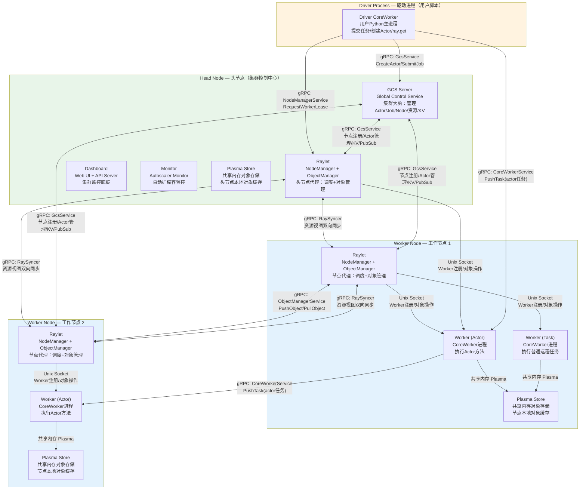

### 1.1 术语注释表

| 术语 | 说明 |
|---|---|
| **GCS Server** | Global Control Service，集群全局控制服务。运行在头节点，管理所有集群状态：节点信息、Actor生命周期、Job管理、Placement Group、资源报告、内部KV存储 |
| **Raylet** | 每节点代理进程。包含 NodeManager（调度+资源管理）和 ObjectManager（对象传输）。管理本地 Worker 进程池、任务调度、对象存储 |
| **CoreWorker** | 每进程运行库，嵌入在每个 Worker/Driver 进程中。提供任务提交、任务执行、对象存取、引用计数、Actor管理等核心功能 |
| **Plasma Store** | 共享内存对象存储（基于 `/dev/shm` 或 POSIX 共享内存）。同一节点上的进程可通过共享内存零拷贝访问对象 |
| **Worker** | 由 Raylet WorkerPool 管理的 Python/C++ 进程，执行远程任务或 Actor 方法 |
| **Driver** | 用户 Python 主进程（`ray.init()` 所在进程），内嵌 DRIVER 类型 CoreWorker |
| **Dashboard** | Ray Web 监控面板，提供集群状态可视化、日志查看、性能分析等功能 |
| **Monitor** | Autoscaler 监控进程，根据集群资源需求自动扩缩容 |
| **RaySyncer** | 集群资源视图同步服务，通过 gRPC 双向流在各 Raylet 间同步资源状态 |

---

## 2. 四层架构分层

> Ray 的架构可以清晰地划分为四层，从用户接口到集群控制逐层深入。层间通过明确的通信协议（gRPC、Unix Socket、共享内存）解耦。

```mermaid
graph TB
    subgraph L1["第1层：API 层 — 用户接口（Python）"]
        API_init["ray.init()<br>集群连接/启动"]
        API_remote["@ray.remote<br>远程函数/Actor定义"]
        API_get["ray.get() / ray.wait()<br>获取/等待远程结果"]
        API_actor["ActorClass.remote()<br>actor.method.remote()<br>Actor创建与调用"]
        API_put["ray.put()<br>本地对象存储"]
    end

    subgraph L2["第2层：CoreWorker 层 — 进程运行库（C++）"]
        CW_submit["TaskSubmitter<br>NormalTaskSubmitter / ActorTaskSubmitter<br>任务/Actor方法提交"]
        CW_exec["TaskReceiver<br>任务执行引擎<br>接收并执行PushTask"]
        CW_ref["ReferenceCounter<br>分布式引用计数<br>对象生命周期管理"]
        CW_obj["ObjectStore<br>MemoryStore + PlasmaStoreProvider<br>两层对象存取"]
        CW_actor_mgr["ActorManager<br>Actor句柄管理<br>ActorHandle追踪"]
        CW_recovery["ObjectRecoveryManager<br>对象恢复<br>丢失对象重建"]
    end

    subgraph L3["第3层：Raylet 层 — 节点代理（C++）"]
        RL_sched["ClusterResourceScheduler<br>集群资源调度器<br>跨节点调度决策"]
        RL_pool["WorkerPool<br>Worker进程池<br>启动/管理Worker"]
        RL_local["LocalLeaseManager + LocalObjectManager<br>本地租约/对象管理"]
        RL_lease["ClusterLeaseManager<br>集群租约管理<br>溢回调度"]
        RL_obj["ObjectManager<br>跨节点对象传输<br>Pull/Push管理"]
        RL_plasma["Plasma Store<br>共享内存对象存储<br>本地对象缓存"]
    end

    subgraph L4["第4层：GCS 层 — 集群控制（C++）"]
        GCS_actor["GcsActorManager<br>Actor生命周期管理<br>状态机驱动"]
        GCS_node["GcsNodeManager<br>节点注册/存活追踪"]
        GCS_job["GcsJobManager<br>Job管理"]
        GCS_pg["GcsPlacementGroupManager<br>放置组调度"]
        GCS_resource["GcsResourceManager<br>集群资源聚合"]
        GCS_kv["GcsKVManager<br>内部KV存储<br>配置/集群ID持久化"]
        GCS_pubsub["GcsPublisher<br>状态变更发布<br>Actor/Node/Job通知"]
    end

    L1 -->|"Cython桥接 _raylet.pyx<br>Python → C++ CoreWorker"| L2
    L2 -->|"gRPC: NodeManagerService<br>RequestWorkerLease 等<br>Unix Socket: Worker注册"| L3
    L2 -->|"gRPC: GcsService<br>CreateActor / InternalKV 等<br>GcsPubSub: 状态订阅"| L4
    L3 -->|"gRPC: GcsService<br>节点注册/资源报告<br>RaySyncer: 资源同步"| L4
    L3 -->|"gRPC: ObjectManagerService<br>跨节点对象传输"| L3

    style L1 fill:#fff3e0
    style L2 fill:#e3f2fd
    style L3 fill:#e8f5e9
    style L4 fill:#fce4ec
```

### 2.1 层间通信方式注释

| 源层 → 目层 | 通信方式 | 说明 |
|---|---|---|
| **API → CoreWorker** | Cython (`_raylet.pyx`) | Python 通过 Cython 编译模块调用 C++ CoreWorker API，如 `submit_task()`, `get()`, `put()` |
| **CoreWorker → Raylet** | gRPC + Unix Socket | gRPC 用于 Worker 租约请求、对象 Pin 等低频操作；Unix Socket 用于 Worker 注册、Wait 等高频低延迟操作 |
| **CoreWorker → GCS** | gRPC + PubSub | gRPC 用于 Actor 创建、KV 操作；PubSub 用于订阅 Actor 状态变更、Node 事件 |
| **CoreWorker → CoreWorker** | gRPC | `PushTask`（任务推送）、`GetObjectStatus`（Future 解析）、`WaitForRefRemoved`（引用计数协议） |
| **Raylet → GCS** | gRPC + RaySyncer | gRPC 用于节点注册、资源报告；RaySyncer 双向流用于集群资源视图同步 |
| **Raylet → Raylet** | gRPC (ObjectManager) | 跨节点对象传输（Push/Pull）和溢回调度（ForwardTask） |
| **CoreWorker → Plasma** | 共享内存 | 通过 Plasma Client 直接读写共享内存中的对象，零拷贝 |

---

## 3. 核心组件概览

> 每个核心组件的职责、关键类、源码位置和交互关系。

### 3.1 GCS Server — 集群大脑

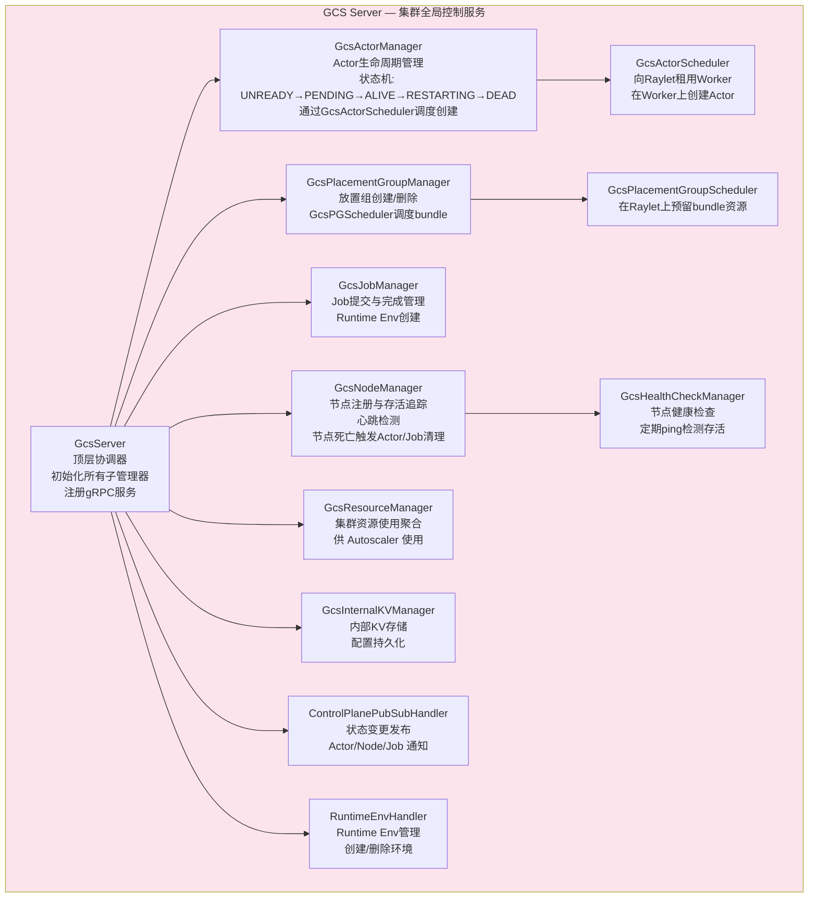

| 属性 | 说明 |
|---|---|
| **进程类型** | 独立 C++ 进程，运行在头节点 |
| **源码位置** | `src/ray/gcs/` |
| **关键类** | `GcsServer`（顶层）、`GcsActorManager`、`GcsNodeManager`、`GcsJobManager`、`GcsPlacementGroupManager`、`GcsResourceManager`、`GcsKVManager` |
| **职责** | 集群全局状态管理：节点注册/存活、Actor生命周期状态机、Job管理、放置组调度、资源聚合、KV存储、PubSub 状态发布 |
| **通信** | 接收 CoreWorker/Raylet 的 gRPC 请求；通过 GcsActorScheduler/GcsPGScheduler 向 Raylet 发送 Worker 租用/bundle 预留请求；通过 PubSub 向订阅者发布状态变更 |

---

### 3.2 Raylet — 节点管家

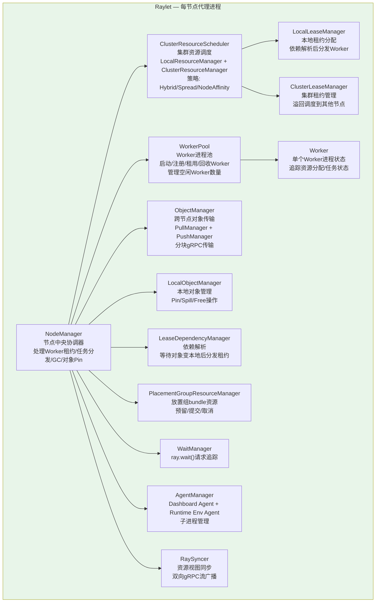

| 属性 | 说明 |
|---|---|
| **进程类型** | 独立 C++ 进程，每个节点一个 |
| **源码位置** | `src/ray/raylet/` |
| **关键类** | `NodeManager`（顶层）、`ClusterResourceScheduler`、`WorkerPool`、`ObjectManager`、`LocalObjectManager`、`LocalLeaseManager`、`ClusterLeaseManager` |
| **职责** | 节点级调度（接收 Worker 租约请求 → 本地调度或溢回到其他节点）、Worker 进程池管理、本地对象管理（Pin/Spill/Free）、资源视图同步 |
| **通信** | 接收 CoreWorker 的 gRPC/UnixSocket 请求（租用Worker、Pin对象）；接收 GCS 的 Actor 调度请求；通过 RaySyncer 与其他 Raylet 同步资源；通过 ObjectManager 与其他节点传输对象 |

---

### 3.3 CoreWorker — 进程运行库

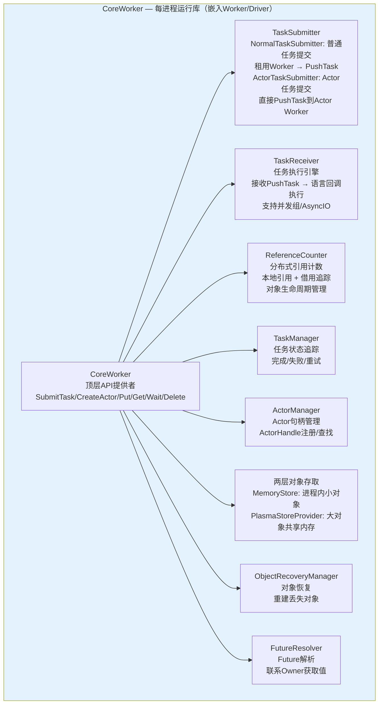

| 属性 | 说明 |
|---|---|
| **进程类型** | 嵌入式 C++ 库，运行在每个 Worker 和 Driver 进程内 |
| **源码位置** | `src/ray/core_worker/` |
| **关键类** | `CoreWorker`（顶层）、`NormalTaskSubmitter`、`ActorTaskSubmitter`、`TaskReceiver`、`ReferenceCounter`、`TaskManager`、`ActorManager`、`CoreWorkerMemoryStore`、`ObjectRecoveryManager` |
| **职责** | 任务提交（普通任务和 Actor 任务）、任务执行（接收 PushTask 并通过语言回调执行）、对象存取（两层存储）、引用计数（分布式 GC）、Actor 管理、对象恢复 |
| **通信** | 通过 gRPC 与 Raylet 交互（租用Worker）；通过 gRPC 与 GCS 交互（创建Actor、KV）；通过 gRPC 与其他 CoreWorker 交互（PushTask、GetObjectStatus）；通过共享内存与 Plasma 交互 |

---

### 3.4 ObjectManager + Plasma — 对象存储

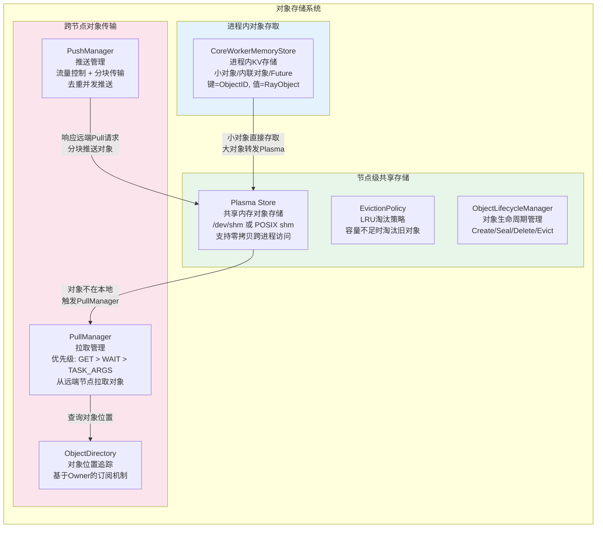

| 属性 | 说明 |
|---|---|
| **源码位置** | `src/ray/object_manager/`（ObjectManager）、`src/ray/object_manager/plasma/`（Plasma）、`src/ray/core_worker/store_provider/`（CoreWorker 存取层） |
| **关键类** | `ObjectManager`、`PullManager`、`PushManager`、`PlasmaStore`、`ObjectLifecycleManager`、`CoreWorkerMemoryStore`、`CoreWorkerPlasmaStoreProvider` |
| **职责** | 两层对象存储（进程内 + 共享内存）、跨节点对象传输（Pull/Push）、对象淘汰和恢复、Spill 到外部存储 |
| **通信** | CoreWorker 通过 Plasma Client 读写共享内存；ObjectManager 通过 gRPC 与远端 ObjectManager 传输数据；PullManager 通过 ObjectDirectory 查询对象位置 |

---

### 3.5 RPC 通信层 — gRPC 基础设施

| 属性 | 说明 |
|---|---|
| **源码位置** | `src/ray/rpc/`、`src/ray/protobuf/` |
| **关键类** | `GrpcServer`、`GrpcClient`、`ClientCallManager`、`ServerCallFactory`、`AuthenticationToken` |
| **职责** | 提供异步 gRPC 服务端/客户端基础设施，支持认证、限流、指标采集、混沌测试 |
| **关键 Proto 服务** | `NodeManagerService`（Raylet RPC）、`CoreWorkerService`（CoreWorker RPC）、`ObjectManagerService`（对象传输）、`GcsService`（GCS 多个子服务）、`RaySyncerService`（资源同步）、`PubsubService`（状态发布） |

---

## 4. 集群初始化启动时序图

> 从 `ray.init()` 到所有核心进程就绪的完整启动流程。

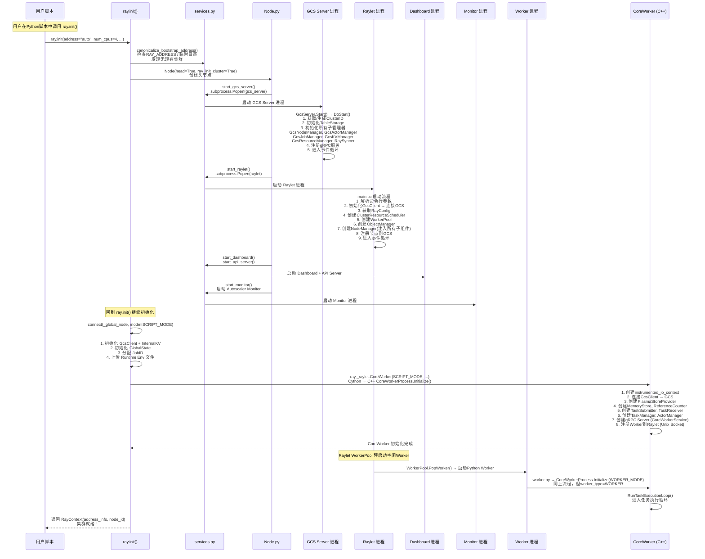

### 4.1 术语注释表

| 术语 | 说明 |
|---|---|
| **ray.init()** | Ray 初始化入口。可启动新集群（head=True）或连接已有集群（head=False）。返回 RayContext |
| **Node.py** | Python 端节点管理类。协调所有进程启动（GCS、Raylet、Dashboard、Monitor） |
| **services.py** | 进程启动服务。通过 `subprocess.Popen` 启动 C++ 二进制（gcs_server、raylet） |
| **GcsServer.Start()** | GCS 初始化入口。按依赖顺序初始化所有子管理器，注册 gRPC 服务 |
| **Raylet main.cc** | Raylet 启动入口。解析参数→连接GCS→创建子组件→注册节点→进入事件循环 |
| **CoreWorkerProcess.Initialize()** | C++ CoreWorker 初始化。创建所有内部组件（任务提交器、接收器、引用计数器等），连接 Raylet/GCS/Plasma |
| **RunTaskExecutionLoop()** | Worker 进程的主循环。阻塞等待并执行 Raylet/CoreWorker 推送的任务 |
| **SCRIPT_MODE / WORKER_MODE** | Worker 类型。SCRIPT_MODE=Driver（不进入任务循环），WORKER_MODE=执行者（进入任务循环） |

---

## 5. 任务执行流程图

> 一个 `@ray.remote` 函数从提交到返回结果的完整路径。

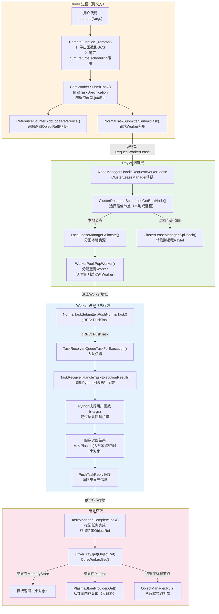

### 5.1 术语注释表

| 术语 | 说明 |
|---|---|
| **TaskSpecification** | 任务规格描述，包含函数ID、参数、资源需求、调度策略等，序列化为 protobuf |
| **NormalTaskSubmitter** | 普通任务提交器。向 Raylet 请求 Worker 租用，获得 Worker 地址后通过 gRPC PushTask 推送任务 |
| **RequestWorkerLease** | CoreWorker → Raylet 的 gRPC RPC。请求分配一个 Worker 来执行任务 |
| **ClusterResourceScheduler** | 集群资源调度器。根据调度策略（Hybrid/Spread/NodeAffinity）选择最佳节点 |
| **Spillback（溢回）** | 当本地节点资源不足时，将租约请求转发到资源充足的远程节点 |
| **WorkerPool.PopWorker()** | 从空闲 Worker 池中取出一个 Worker。若无空闲 Worker 则启动新进程 |
| **PushTask** | CoreWorker → CoreWorker 的 gRPC RPC。推送任务到 Worker 执行 |
| **TaskReceiver** | Worker 端任务接收器。接收 PushTask 请求，通过语言回调执行任务 |
| **ray.get()** | 获取 ObjectRef 的值。小对象从 MemoryStore 直接取；大对象从 Plasma 共享内存读；远程对象触发 Pull |
| **ObjectManager.Pull()** | 从远程节点拉取对象。通过 gRPC 向远端 ObjectManager 发送 Pull 请求 |

---

## 6. Actor 生命周期流程图

> Actor 从创建到销毁的完整生命周期，包括状态机和交互时序。

### 6.1 Actor 状态机

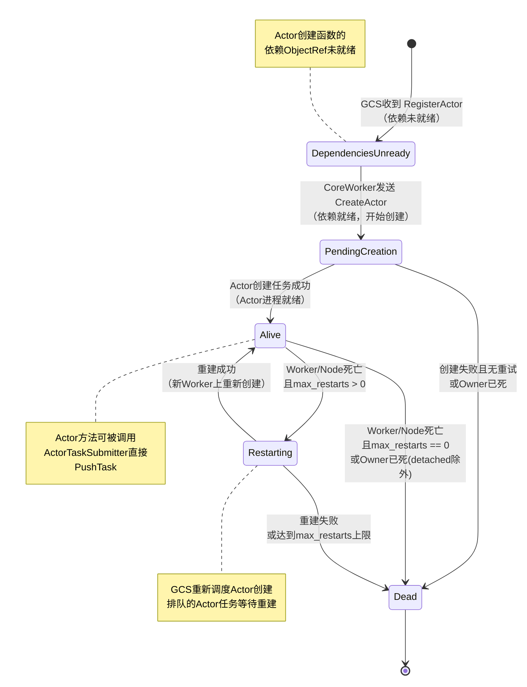

### 6.2 Actor 创建与调用时序图

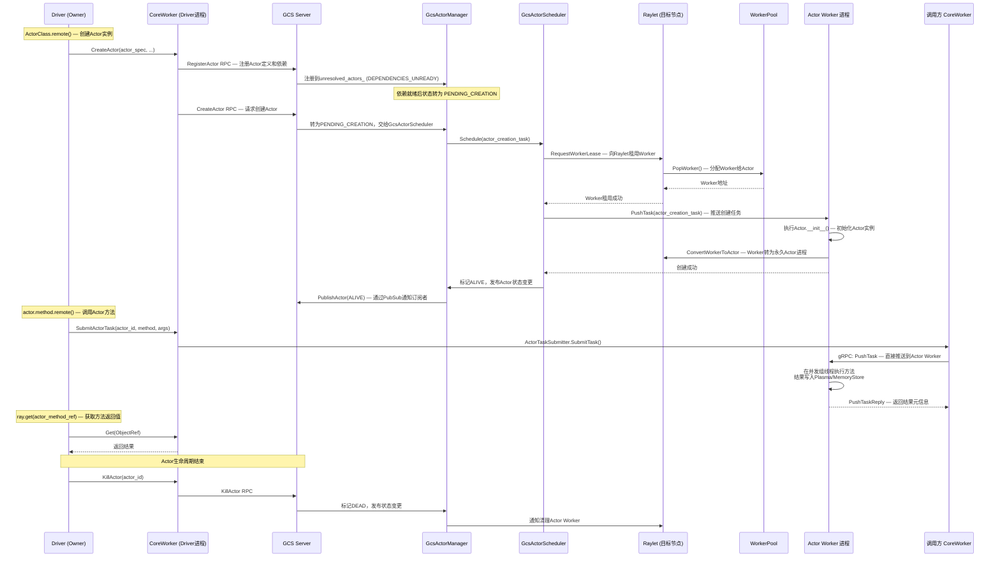

### 6.3 术语注释表

| 术语 | 说明 |
|---|---|
| **RegisterActor** | CoreWorker → GCS RPC。注册 Actor 定义（函数描述符、资源需求）和依赖 ObjectRef |
| **CreateActor** | CoreWorker → GCS RPC。请求 GCS 在集群中创建 Actor 实例 |
| **GcsActorScheduler** | GCS 内部的 Actor 调度器。向 Raylet 租用 Worker，在 Worker 上推送 Actor 创建任务 |
| **ConvertWorkerToActor** | Raylet 将临时 Worker 转为永久 Actor 进程。此后 Worker 不会被回收 |
| **ActorTaskSubmitter** | CoreWorker 内的 Actor 任务提交器。维护每个 Actor 的提交队列和 RPC 连接 |
| **并发组 (ConcurrencyGroup)** | Actor 方法的并发执行隔离。不同并发组在不同线程池执行，默认方法在主线程顺序执行 |
| **Detached Actor** | 独立 Actor，Owner 死亡后不自动销毁，可被其他 Job 发现和使用 |
| **max_restarts** | Actor 最大重启次数。Worker/Node 死亡后 GCS 尝试重建，超过次数则标记 DEAD |

---

## 7. 对象管理与引用计数

> Ray 的对象存储采用两层架构，配合分布式引用计数实现自动垃圾回收。

```mermaid
flowchart TB
    subgraph PutFlow["ray.put() — 存入对象"]
        A1["用户: ray.put(obj)"] --> A2["CoreWorker.Put()<br>序列化对象"]
        A2 -->|"小对象 (<100KB)"| A3["MemoryStore.Put()<br>存入进程内KV存储<br>零拷贝引用"]
        A2 -->|"大对象 (≥100KB)"| A4["PlasmaStoreProvider.Create()<br>写入Plasma共享内存<br>Seal后可见"]
        A4 --> A5["ReferenceCounter.AddOwnedObject()<br>注册为Owner<br>追踪引用生命周期"]
    end

    subgraph GetFlow["ray.get() — 获取对象"]
        B1["用户: ray.get(ref)"] --> B2["CoreWorker.Get()<br>检查引用类型"]
        B2 -->|"本地MemoryStore"| B3["MemoryStore.Get()<br>直接返回"]
        B2 -->|"本地Plasma"| B4["PlasmaStoreProvider.Get()<br>从共享内存读取"]
        B2 -->|"远程对象"| B5["ObjectRecoveryManager<br>或 PullManager<br>拉取到本地后再Get"]
    end

    subgraph RefCount["分布式引用计数机制"]
        C1["Owner进程<br>追踪所有引用者"] --> C2["ReferenceCounter<br>local_ref_count: 本地Python引用<br>borrowers: 借用方列表"]
        C2 -->|"引用传递时"| C3["AddBorrower()<br>记录借用方地址<br>通知借用方: WaitForRefRemoved"]
        C3 -->|"借用方使用完毕"| C4["借用方通知Owner<br>RefRemoved消息"]
        C4 -->|"所有引用归零"| C5["Owner释放对象<br>DeleteFromPlasma/MemoryStore<br>通知Raylet FreeObject"]
    end

    subgraph ObjRecovery["对象恢复机制"]
        D1["对象丢失检测<br>Get()发现对象不在本地"] --> D2["ObjectRecoveryManager.Recover()<br>1. 查询全局目录找其他副本<br>2. 若有副本: PinExistingCopy<br>3. 若无副本: 重建"]
        D3["重建: 重新执行创建任务<br>ReconstructObject()<br>递归恢复依赖对象"] --> D4["结果写入Plasma<br>恢复完成"]
    end

    style PutFlow fill:#fff3e0
    style GetFlow fill:#e3f2fd
    style RefCount fill:#e8f5e9
    style ObjRecovery fill:#fce4ec
```

### 7.1 术语注释表

| 术语 | 说明 |
|---|---|
| **MemoryStore** | 进程内对象存储。存储小对象和内联对象，键为 ObjectID，值为 RayObject。支持异步回调 |
| **Plasma Store** | 共享内存对象存储。基于 `/dev/shm`，支持同一节点上进程零拷贝共享。LRU 淘汰策略 |
| **ReferenceCounter** | 分布式引用计数器。追踪本地引用（Python refcount）和借用引用（其他进程持有的 ObjectRef） |
| **Owner** | ObjectRef 的持有方进程。负责管理对象生命周期，当所有引用归零时释放对象 |
| **Borrower** | 借用方进程。通过任务参数或 Actor 方法获得 ObjectRef，使用完毕后通知 Owner |
| **WaitForRefRemoved** | CoreWorker → Owner 的 gRPC RPC。借用方订阅引用移除通知，Owner 在引用归零时发送通知 |
| **ObjectRecoveryManager** | 对象恢复管理器。检测对象丢失后尝试从其他节点获取副本或通过重新执行任务重建 |
| **PinExistingCopy** | 在全局对象目录中找到现有副本，请求该节点 Pin（锁定）对象防止淘汰 |
| **ReconstructObject** | 重新执行创建该对象的任务（lineage reconstruction），依赖 ReferenceCounter 的 lineage pinning |

---

## 8. 设计模式概览

> Ray 的核心架构围绕几个关键设计模式构建。

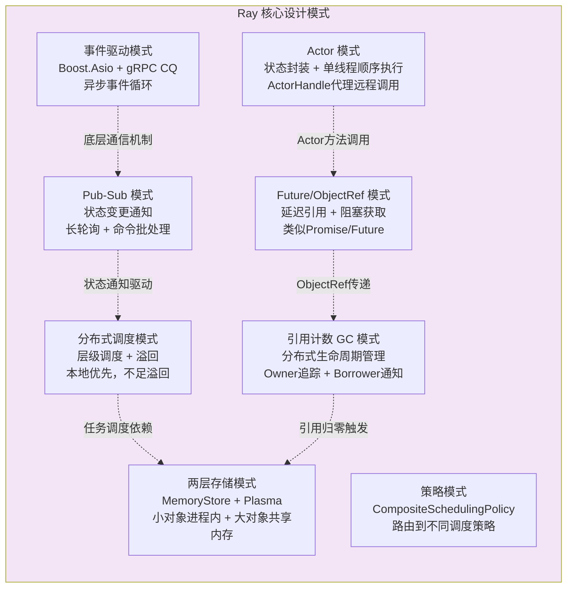

### 8.1 设计模式详解

| 模式 | 核心机制 | Ray 实现 |
|---|---|---|
| **Actor 模式** | 状态封装在独立进程中，方法顺序执行，通过代理调用 | `@ray.remote` 装饰类 → ActorClass → GCS 状态机管理生命周期 → ActorHandle 代理 → ActorTaskSubmitter 直接 PushTask |
| **Future/ObjectRef 模式** | 延迟引用，值可能尚未计算，通过 `get()` 阻塞获取 | `f.remote()` 返回 ObjectRef → `ray.get()` 阻塞等待 → TaskManager 追踪完成状态 → FutureResolver 跨进程解析 |
| **分布式调度模式** | 层级调度：本地优先调度，资源不足时溢回到远程节点 | NormalTaskSubmitter → RequestWorkerLease → ClusterResourceScheduler（策略选择） → 本地分配或 Spillback → WorkerPool 提供 Worker |
| **两层存储模式** | 小对象存进程内 MemoryStore，大对象存 Plasma 共享内存 | CoreWorker.Put() → 按大小分流 → MemoryStore（<100KB）或 Plasma（≥100KB） → Get() 从对应层读取 |
| **引用计数 GC 模式** | Owner 追踪所有引用者（本地 + 借用方），引用归零时释放 | ReferenceCounter 追踪 local_ref_count + borrowers → WaitForRefRemoved 订阅 → 归零后 Delete + FreeObject |
| **Pub-Sub 模式** | 状态变更实时通知订阅者，长轮询 + 命令批处理 | GcsPublisher 发布 Actor/Node/Job 状态 → GcsSubscriber 订阅 → CoreWorker/Raylet 收到通知后响应 |
| **事件驱动模式** | 所有 I/O 和 RPC 通过异步事件循环处理 | Boost.Asio `instrumented_io_context` → gRPC CompletionQueue → PeriodicalRunner 定时任务 → 回调驱动 |
| **策略模式** | 调度策略可插拔替换 | CompositeSchedulingPolicy → HybridSchedulingPolicy / SpreadSchedulingPolicy / NodeAffinitySchedulingPolicy 等 |

---

## 9. 组件通信矩阵

> Ray 所有核心组件间的 gRPC 通信关系总览。

### 9.1 gRPC 服务总览

| gRPC 服务 | 服务端进程 | 主要 RPC 方法 | 用途 |
|---|---|---|---|
| **NodeManagerService** | Raylet | `RequestWorkerLease`, `ReturnWorkerLease`, `CancelWorkerLease`, `PinObjectIDs`, `GetNodeStats` | Worker 租用/回收、对象 Pin、节点统计 |
| **CoreWorkerService** | CoreWorker (每进程) | `PushTask`, `GetObjectStatus`, `WaitForRefRemoved`, `PlasmaObjectReady`, `ReportGeneratorItemReturns` | 任务推送、Future 解析、引用计数通知 |
| **ObjectManagerService** | Raylet (ObjectManager) | `PushObject`, `PullObject`, `FreeObjects` | 跨节点对象传输 |
| **ActorInfoGcsService** | GCS | `RegisterActor`, `CreateActor`, `GetActorInfo`, `KillActor` | Actor 注册/创建/查询/杀死 |
| **JobInfoGcsService** | GCS | `AddJob`, `MarkJobFinished`, `GetAllJobInfo` | Job 提交/完成/查询 |
| **NodeInfoGcsService** | GCS | `RegisterNode`, `GetAllNodeInfo` | 节点注册/查询 |
| **InternalKVService** | GCS | `InternalKVGet`, `InternalKVPut`, `InternalKVDel` | 内部 KV 存取 |
| **PubsubGcsService** | GCS | `GcsPublish`, `GcsSubscribe` | 状态发布订阅 |
| **RaySyncerService** | GCS + Raylet | `StartSync` (双向流) | 资源视图同步 |

### 9.2 通信矩阵图

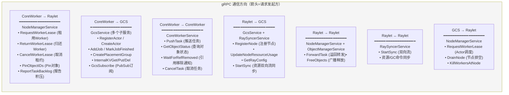

### 9.3 Unix Socket 通信

| 通信方向 | 用途 | 说明 |
|---|---|---|
| **CoreWorker → Raylet (Unix Socket)** | Worker 注册、Wait、AsyncGet | 低延迟高频操作，避免 gRPC 开销。Worker 进程启动后通过 Unix Socket 注册到本地 Raylet |
| **CoreWorker → Plasma (共享内存)** | 对象读写 | 通过 Plasma Client 直接在 `/dev/shm` 上读写对象，零拷贝无需 IPC |

---

## 附录：与 RDT 架构的关系

> 本文档覆盖 Ray 核心运行时的全局架构。RDT（Ray Direct Transport）是 CoreWorker 层内的一个子系统，负责 Actor 间 Tensor 的带外传输。

| 本文档覆盖 | RDT 文档覆盖 |
|---|---|
| Ray 四层架构（API → CoreWorker → Raylet → GCS） | RDT 在 CoreWorker 层内的位置和类继承关系 |
| CoreWorker 整体职责和组件 | RDTManager、RDTStore、TensorTransportManager 的详细方法 |
| 任务提交/执行流程 | RDT 带外传输如何嵌入任务提交流程 |
| Actor 生命周期 | Actor 方法如何通过 RDT 传输 Tensor |
| 对象管理两层架构 | RDT 如何绕过对象存储直接传输 Tensor |
| gRPC 通信矩阵 | RDT 使用的传输后端（NCCL/NIXL/CUDA IPC） |

**阅读顺序建议**：先读本文档建立全局视角 → 再读 [RDT 架构分析](direct-transport/rdt-architecture-analysis.md) 深入理解 Tensor 传输子系统。